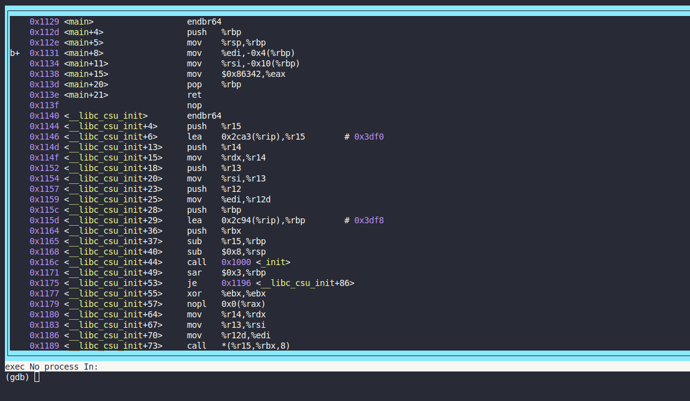
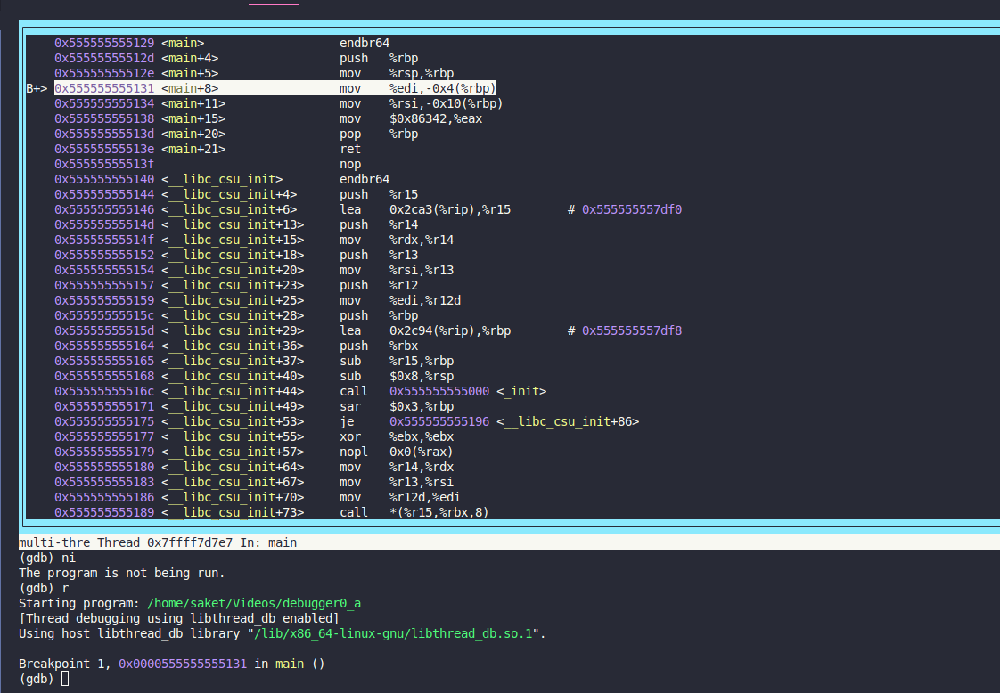
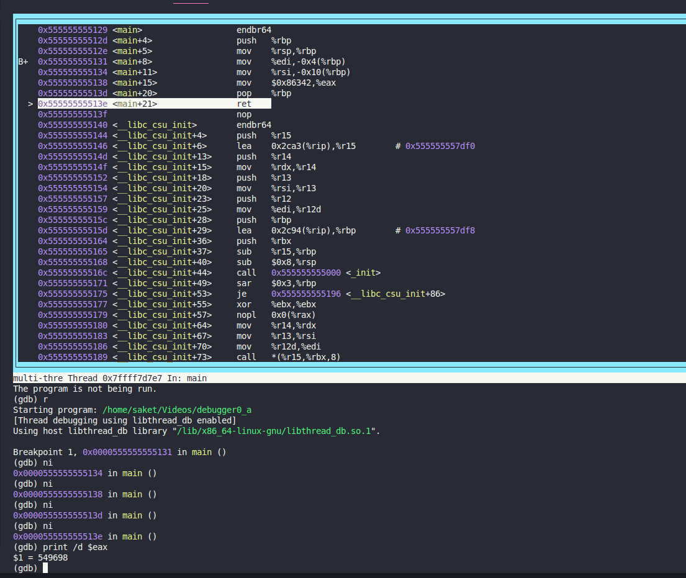

### GDB baby step 1

#Medium #Reverse_Engineering #picoGym #Exclusive #x86_64

Author: LT 'syreal' Jones

#### Description

Can you figure out what is in the `eax` register at the end of the `main` function? Put your answer in the picoCTF flag format: `picoCTF{n}` where `n` is the contents of the `eax` register in the decimal number base. If the answer was `0x11` your flag would be `picoCTF{17}`.Disassemble [this](https://artifacts.picoctf.net/c/512/debugger0_a).

##### Solution:
1st method 

```css

┌─[✔]──[alpha@speed:🐧]──[~/Videos]:
└──╼ $ gdb ./debugger0_a -q
Reading symbols from ./debugger0_a...
(No debugging symbols found in ./debugger0_a)
(gdb) info functions
All defined functions:

Non-debugging symbols:
0x0000000000001000  _init
0x0000000000001030  __cxa_finalize@plt
0x0000000000001040  _start
0x0000000000001070  deregister_tm_clones
0x00000000000010a0  register_tm_clones
0x00000000000010e0  __do_global_dtors_aux
0x0000000000001120  frame_dummy
0x0000000000001129  main
0x0000000000001140  __libc_csu_init
0x00000000000011b0  __libc_csu_fini
0x00000000000011b8  _fini
(gdb) disassemble main
Dump of assembler code for function main:
   0x0000000000001129 <+0>:     endbr64 
   0x000000000000112d <+4>:     push   %rbp
   0x000000000000112e <+5>:     mov    %rsp,%rbp
   0x0000000000001131 <+8>:     mov    %edi,-0x4(%rbp)
   0x0000000000001134 <+11>:    mov    %rsi,-0x10(%rbp)
   0x0000000000001138 <+15>:    mov    $0x86342,%eax
   0x000000000000113d <+20>:    pop    %rbp
   0x000000000000113e <+21>:    ret    
End of assembler dump.
(gdb) show disassembly-flavor
The disassembly flavor is "att".
(gdb) set disassembly-flavor intel
(gdb) disassemble main
Dump of assembler code for function main:
   0x0000000000001129 <+0>:     endbr64 
   0x000000000000112d <+4>:     push   rbp
   0x000000000000112e <+5>:     mov    rbp,rsp
   0x0000000000001131 <+8>:     mov    DWORD PTR [rbp-0x4],edi
   0x0000000000001134 <+11>:    mov    QWORD PTR [rbp-0x10],rsi
   0x0000000000001138 <+15>:    mov    eax,0x86342
   0x000000000000113d <+20>:    pop    rbp
   0x000000000000113e <+21>:    ret    
End of assembler dump.
(gdb) print 0x86342
$1 = 549698
(gdb) exit
```

```python
>>> print(int(0x86342))
549698
>>> 
```

2nd method

```css
┌─[✔]──[alpha@speed:🐧]──[~/Videos]:
└──╼ $ gdb ./debugger0_a -q
Reading symbols from ./debugger0_a...
(No debugging symbols found in ./debugger0_a)
(gdb) info functions
All defined functions:

Non-debugging symbols:
0x0000000000001000  _init
0x0000000000001030  __cxa_finalize@plt
0x0000000000001040  _start
0x0000000000001070  deregister_tm_clones
0x00000000000010a0  register_tm_clones
0x00000000000010e0  __do_global_dtors_aux
0x0000000000001120  frame_dummy
0x0000000000001129  main
0x0000000000001140  __libc_csu_init
0x00000000000011b0  __libc_csu_fini
0x00000000000011b8  _fini
(gdb) disassemble main
Dump of assembler code for function main:
   0x0000000000001129 <+0>:     endbr64 
   0x000000000000112d <+4>:     push   %rbp
   0x000000000000112e <+5>:     mov    %rsp,%rbp
   0x0000000000001131 <+8>:     mov    %edi,-0x4(%rbp)
   0x0000000000001134 <+11>:    mov    %rsi,-0x10(%rbp)
   0x0000000000001138 <+15>:    mov    $0x86342,%eax
   0x000000000000113d <+20>:    pop    %rbp
   0x000000000000113e <+21>:    ret    
End of assembler dump.
(gdb) b main
Breakpoint 1 at 0x1131
(gdb)layout asm
```








method 3 (terminal copy paste)

```css

┌─[✔]──[alpha@speed:🐧]──[~/Videos]:
└──╼ $ gdb ./debugger0_a -q
Reading symbols from ./debugger0_a...
(No debugging symbols found in ./debugger0_a)
(gdb) disas main
Dump of assembler code for function main:
   0x0000000000001129 <+0>:     endbr64 
   0x000000000000112d <+4>:     push   %rbp
   0x000000000000112e <+5>:     mov    %rsp,%rbp
   0x0000000000001131 <+8>:     mov    %edi,-0x4(%rbp)
   0x0000000000001134 <+11>:    mov    %rsi,-0x10(%rbp)
   0x0000000000001138 <+15>:    mov    $0x86342,%eax
   0x000000000000113d <+20>:    pop    %rbp
   0x000000000000113e <+21>:    ret    
End of assembler dump.
(gdb) b main
Breakpoint 1 at 0x1131
(gdb) layout asm

```

this is layout asm section 
note: this section can't be copy using mouse shift and mouse then you able to copy
```css
┌──────────────────────────────────────────────────────────────────────────────────────────────┐
│    0x1129 <main>                   endbr64                                                   │
│    0x112d <main+4>                 push   %rbp                                               │
│    0x112e <main+5>                 mov    %rsp,%rbp                                          │
│b+  0x1131 <main+8>                 mov    %edi,-0x4(%rbp)                                    │
│    0x1134 <main+11>                mov    %rsi,-0x10(%rbp)                                   │
│    0x1138 <main+15>                mov    $0x86342,%eax                                      │
│    0x113d <main+20>                pop    %rbp                                               │
│    0x113e <main+21>                ret                                                       │
│    0x113f                          nop                                                       │
│    0x1140 <__libc_csu_init>        endbr64                                                   │
│    0x1144 <__libc_csu_init+4>      push   %r15                                               │
│    0x1146 <__libc_csu_init+6>      lea    0x2ca3(%rip),%r15        # 0x3df0                  │
│    0x114d <__libc_csu_init+13>     push   %r14                                               │
│    0x114f <__libc_csu_init+15>     mov    %rdx,%r14                                          │
│    0x1152 <__libc_csu_init+18>     push   %r13                                               │
│    0x1154 <__libc_csu_init+20>     mov    %rsi,%r13                                          │
│    0x1157 <__libc_csu_init+23>     push   %r12                                               │
│    0x1159 <__libc_csu_init+25>     mov    %edi,%r12d                                         │
│    0x115c <__libc_csu_init+28>     push   %rbp                                               │
└──────────────────────────────────────────────────────────────────────────────────────────────┘
exec No process In:                                                                L??   PC: ?? 
(gdb) 

```

after running 
```css
┌──────────────────────────────────────────────────────────────────────────────────────────────┐
│    0x555555555129 <main>                   endbr64                                           │
│    0x55555555512d <main+4>                 push   %rbp                                       │
│    0x55555555512e <main+5>                 mov    %rsp,%rbp                                  │
│B+> 0x555555555131 <main+8>                 mov    %edi,-0x4(%rbp)                            │
│    0x555555555134 <main+11>                mov    %rsi,-0x10(%rbp)                           │
│    0x555555555138 <main+15>                mov    $0x86342,%eax                              │
│    0x55555555513d <main+20>                pop    %rbp                                       │
│    0x55555555513e <main+21>                ret                                               │
│    0x55555555513f                          nop                                               │
│    0x555555555140 <__libc_csu_init>        endbr64                                           │
│    0x555555555144 <__libc_csu_init+4>      push   %r15                                       │
│    0x555555555146 <__libc_csu_init+6>      lea    0x2ca3(%rip),%r15        # 0x555555557df0  │
│    0x55555555514d <__libc_csu_init+13>     push   %r14                                       │
│    0x55555555514f <__libc_csu_init+15>     mov    %rdx,%r14                                  │
│    0x555555555152 <__libc_csu_init+18>     push   %r13                                       │
│    0x555555555154 <__libc_csu_init+20>     mov    %rsi,%r13                                  │
│    0x555555555157 <__libc_csu_init+23>     push   %r12                                       │
│    0x555555555159 <__libc_csu_init+25>     mov    %edi,%r12d                                 │
│    0x55555555515c <__libc_csu_init+28>     push   %rbp                                       │
└──────────────────────────────────────────────────────────────────────────────────────────────┘
multi-thre Thread 0x7ffff7d7e7 In: main                                L??   PC: 0x555555555131 
(gdb) r
Starting program: /home/saket/Videos/debugger0_a
[Thread debugging using libthread_db enabled]
Using host libthread_db library "/lib/x86_64-linux-gnu/libthread_db.so.1".

Breakpoint 1, 0x0000555555555131 in main ()
(gdb) 
```

using ni command 

```css
┌──────────────────────────────────────────────────────────────────────────────────────────────┐
│    0x555555555129 <main>                   endbr64                                           │
│    0x55555555512d <main+4>                 push   %rbp                                       │
│    0x55555555512e <main+5>                 mov    %rsp,%rbp                                  │
│B+  0x555555555131 <main+8>                 mov    %edi,-0x4(%rbp)                            │
│    0x555555555134 <main+11>                mov    %rsi,-0x10(%rbp)                           │
│    0x555555555138 <main+15>                mov    $0x86342,%eax                              │
│    0x55555555513d <main+20>                pop    %rbp                                       │
│  > 0x55555555513e <main+21>                ret                                               │
│    0x55555555513f                          nop                                               │
│    0x555555555140 <__libc_csu_init>        endbr64                                           │
│    0x555555555144 <__libc_csu_init+4>      push   %r15                                       │
│    0x555555555146 <__libc_csu_init+6>      lea    0x2ca3(%rip),%r15        # 0x555555557df0  │
│    0x55555555514d <__libc_csu_init+13>     push   %r14                                       │
│    0x55555555514f <__libc_csu_init+15>     mov    %rdx,%r14                                  │
│    0x555555555152 <__libc_csu_init+18>     push   %r13                                       │
│    0x555555555154 <__libc_csu_init+20>     mov    %rsi,%r13                                  │
│    0x555555555157 <__libc_csu_init+23>     push   %r12                                       │
│    0x555555555159 <__libc_csu_init+25>     mov    %edi,%r12d                                 │
│    0x55555555515c <__libc_csu_init+28>     push   %rbp                                       │
└──────────────────────────────────────────────────────────────────────────────────────────────┘
multi-thre Thread 0x7ffff7d7e7 In: main                                L??   PC: 0x55555555513e 
(gdb) ni
0x0000555555555138 in main ()
(gdb) ni
0x000055555555513d in main ()
(gdb) ni
0x000055555555513e in main ()
(gdb) print /d $eax
$1 = 549698
(gdb) print 0x86342
$2 = 549698
(gdb) 
```


--------


using Ida this is main function code and value of eax is 549695

```css
; Attributes: bp-based frame

; int __fastcall main(int argc, const char **argv, const char **envp)
public main
main proc near

var_10= qword ptr -10h
var_4= dword ptr -4

; __unwind {
endbr64
push    rbp
mov     rbp, rsp
mov     [rbp+var_4], edi
mov     [rbp+var_10], rsi
mov     eax, 549698
pop     rbp
retn
; } // starts at 1129
main endp

```

using Ghidra 
```css
                             **************************************************************
                             *                          FUNCTION                          *
                             **************************************************************
                             undefined main()
             undefined         AL:1           <RETURN>
             undefined4        Stack[-0xc]:4  local_c                                 XREF[1]:     00101131(W)  
             undefined8        Stack[-0x18]:8 local_18                                XREF[1]:     00101134(W)  
                             main                                            XREF[4]:     Entry Point(*), 
                                                                                          _start:00101061(*), 00102028, 
                                                                                          001020b8(*)  
        00101129 f3 0f 1e fa     ENDBR64
        0010112d 55              PUSH       RBP
        0010112e 48 89 e5        MOV        RBP,RSP
        00101131 89 7d fc        MOV        dword ptr [RBP + local_c],EDI
        00101134 48 89 75 f0     MOV        qword ptr [RBP + local_18],RSI
        00101138 b8 42 63        MOV        EAX,0x86342
                 08 00
        0010113d 5d              POP        RBP
        0010113e c3              RET
        0010113f 90              ??         90h

```

right click on 0x86342 and convert to decimal  it will be `549698`

```css
picoCTF{549698}
```
