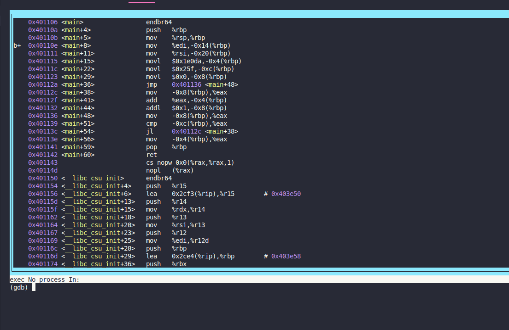
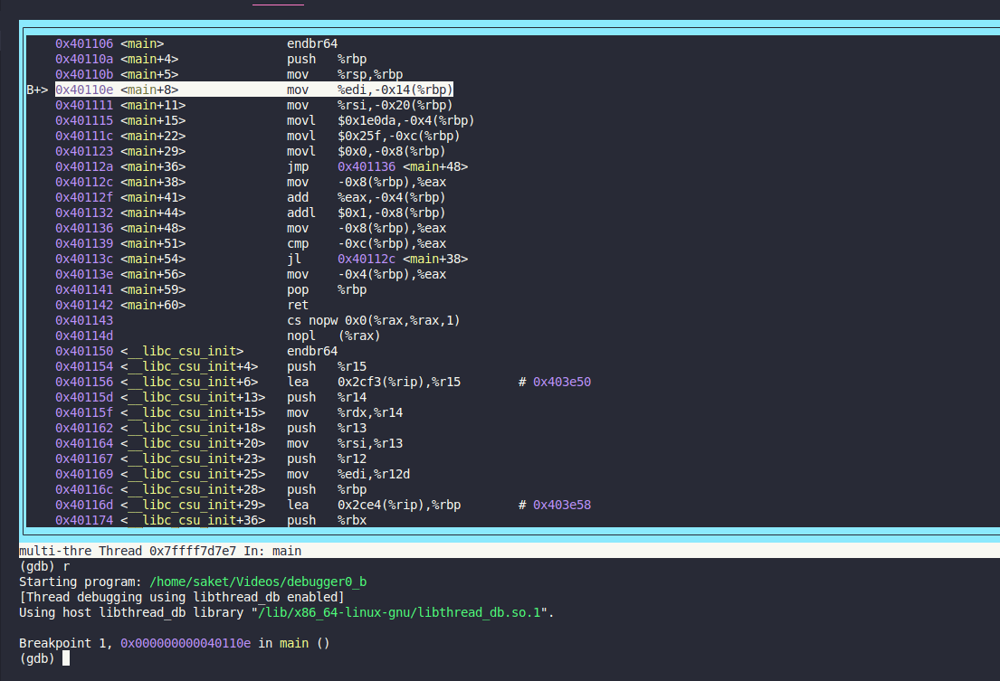
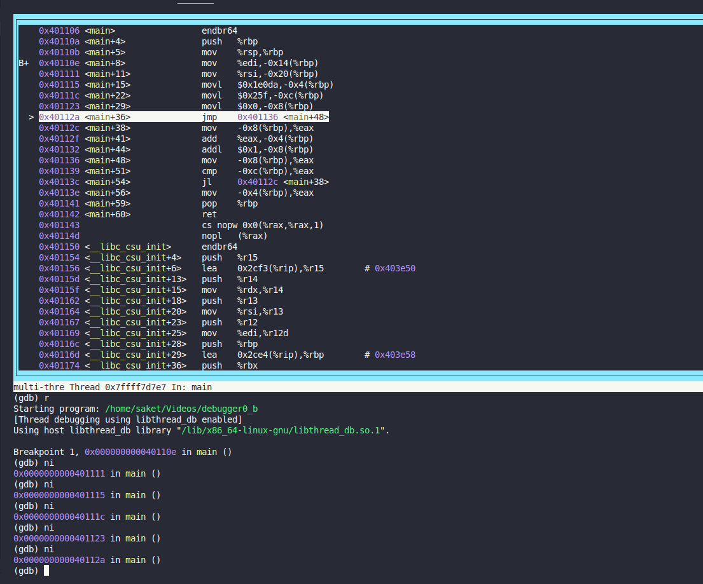
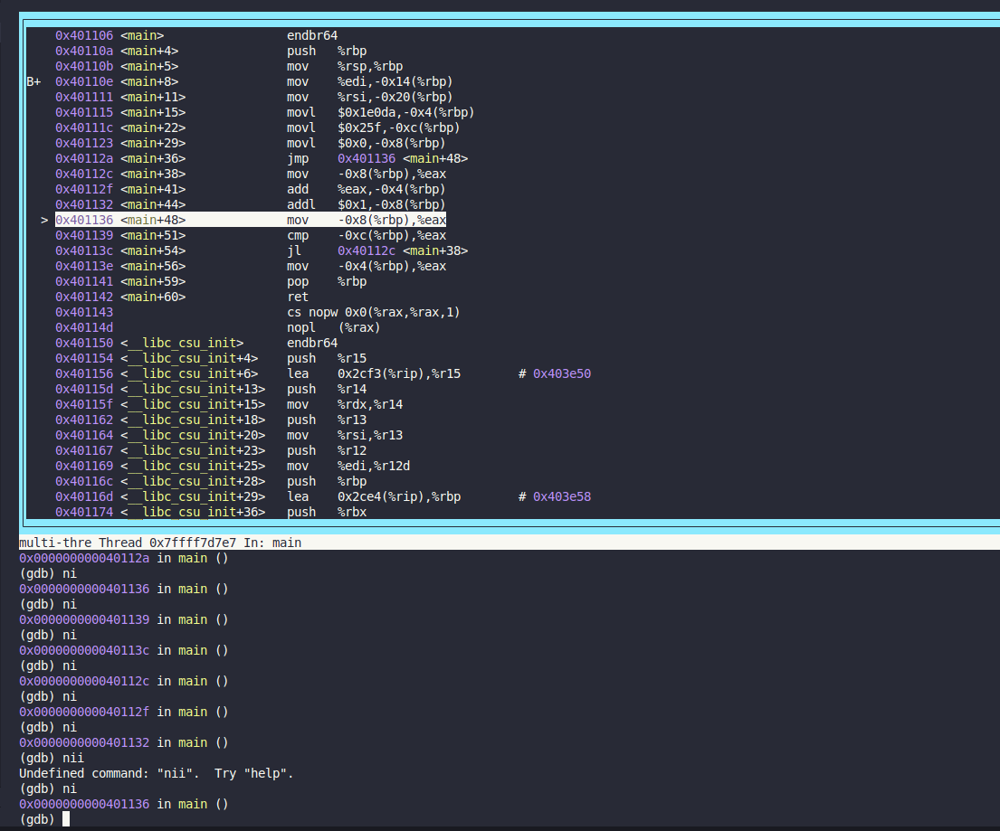
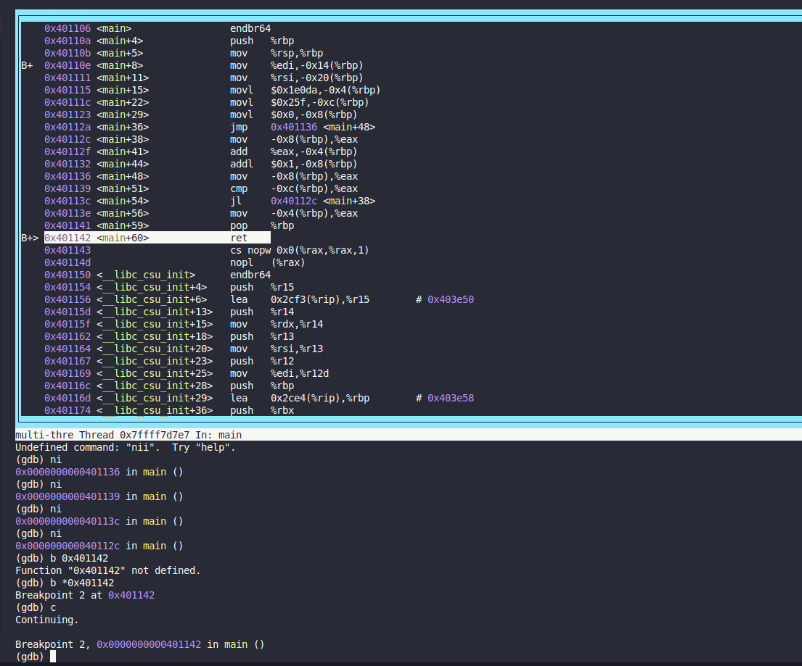
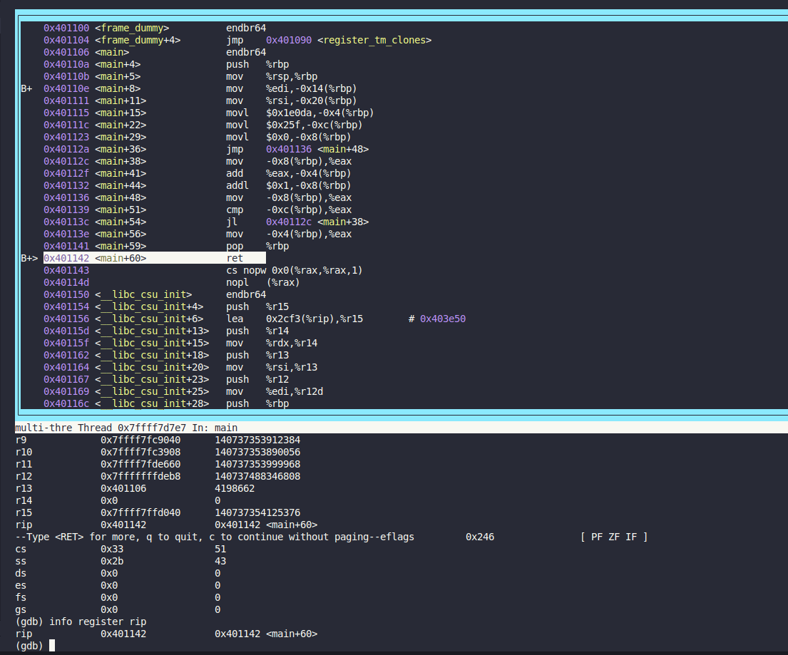

### GDB baby step 2

#Medium #Reverse_Engineering #picoGym #Exclusive #x86_64

Author: LT 'syreal' Jones

#### Description

Can you figure out what is in the `eax` register at the end of the `main` function? Put your answer in the picoCTF flag format: `picoCTF{n}` where `n` is the contents of the `eax` register in the decimal number base. If the answer was `0x11` your flag would be `picoCTF{17}`.Debug [this](https://artifacts.picoctf.net/c/520/debugger0_b).

##### Solution:

```css
(gdb) info functions
All defined functions:

Non-debugging symbols:
0x0000000000401000  _init
0x0000000000401020  _start
0x0000000000401050  _dl_relocate_static_pie
0x0000000000401060  deregister_tm_clones
0x0000000000401090  register_tm_clones
0x00000000004010d0  __do_global_dtors_aux
0x0000000000401100  frame_dummy
0x0000000000401106  main
0x0000000000401150  __libc_csu_init
0x00000000004011c0  __libc_csu_fini
0x00000000004011c8  _fini
(gdb) b main
Breakpoint 1 at 0x40110e
(gdb) layout asm

```

layout asm (TUI window)


press run (r in terminal)



type ni
and observe the code


press ni you will notice jl statement is in loop


we need another breakpoint to get $eax value
to get eax value we need to take breakpoint on `ret`


type c for continue debugging and stop at another breakpoint 


type info register


type info register rip to get eax value


```css
─[✔]──[alpha@speed:🚀]──[~/Videos]:
└──╼ $ gdb ./debugger0_b -q
Reading symbols from ./debugger0_b...
(No debugging symbols found in ./debugger0_b)
(gdb) disassemble main
Dump of assembler code for function main:
   0x0000000000401106 <+0>:     endbr64 
   0x000000000040110a <+4>:     push   %rbp
   0x000000000040110b <+5>:     mov    %rsp,%rbp
   0x000000000040110e <+8>:     mov    %edi,-0x14(%rbp)
   0x0000000000401111 <+11>:    mov    %rsi,-0x20(%rbp)
   0x0000000000401115 <+15>:    movl   $0x1e0da,-0x4(%rbp)
   0x000000000040111c <+22>:    movl   $0x25f,-0xc(%rbp)
   0x0000000000401123 <+29>:    movl   $0x0,-0x8(%rbp)
   0x000000000040112a <+36>:    jmp    0x401136 <main+48>
   0x000000000040112c <+38>:    mov    -0x8(%rbp),%eax
   0x000000000040112f <+41>:    add    %eax,-0x4(%rbp)
   0x0000000000401132 <+44>:    addl   $0x1,-0x8(%rbp)
   0x0000000000401136 <+48>:    mov    -0x8(%rbp),%eax
   0x0000000000401139 <+51>:    cmp    -0xc(%rbp),%eax
   0x000000000040113c <+54>:    jl     0x40112c <main+38>
   0x000000000040113e <+56>:    mov    -0x4(%rbp),%eax
   0x0000000000401141 <+59>:    pop    %rbp
   0x0000000000401142 <+60>:    ret    
End of assembler dump.
(gdb) b main
Breakpoint 1 at 0x40110e
(gdb) layout asm
```

```css
┌───────────────────────────────────────────────────────────────────────────────────┐
│    0x401106 <main>                 endbr64                                        │
│    0x40110a <main+4>               push   %rbp                                    │
│    0x40110b <main+5>               mov    %rsp,%rbp                               │
│b+  0x40110e <main+8>               mov    %edi,-0x14(%rbp)                        │
│    0x401111 <main+11>              mov    %rsi,-0x20(%rbp)                        │
│    0x401115 <main+15>              movl   $0x1e0da,-0x4(%rbp)                     │
│    0x40111c <main+22>              movl   $0x25f,-0xc(%rbp)                       │
│    0x401123 <main+29>              movl   $0x0,-0x8(%rbp)                         │
│    0x40112a <main+36>              jmp    0x401136 <main+48>                      │
│    0x40112c <main+38>              mov    -0x8(%rbp),%eax                         │
│    0x40112f <main+41>              add    %eax,-0x4(%rbp)                         │
│    0x401132 <main+44>              addl   $0x1,-0x8(%rbp)                         │
│    0x401136 <main+48>              mov    -0x8(%rbp),%eax                         │
│    0x401139 <main+51>              cmp    -0xc(%rbp),%eax                         │
│    0x40113c <main+54>              jl     0x40112c <main+38>                      │
│    0x40113e <main+56>              mov    -0x4(%rbp),%eax                         │
│    0x401141 <main+59>              pop    %rbp                                    │
│    0x401142 <main+60>              ret                                            │
│    0x401143                        cs nopw 0x0(%rax,%rax,1)                       │
│    0x40114d                        nopl   (%rax)                                  │
│    0x401150 <__libc_csu_init>      endbr64                                        │
│    0x401154 <__libc_csu_init+4>    push   %r15                                    │
│    0x401156 <__libc_csu_init+6>    lea    0x2cf3(%rip),%r15        # 0x403e50     │
│    0x40115d <__libc_csu_init+13>   push   %r14                                    │
│    0x40115f <__libc_csu_init+15>   mov    %rdx,%r14                               │
│    0x401162 <__libc_csu_init+18>   push   %r13                                    │
│    0x401164 <__libc_csu_init+20>   mov    %rsi,%r13                               │
│    0x401167 <__libc_csu_init+23>   push   %r12                                    │
│    0x401169 <__libc_csu_init+25>   mov    %edi,%r12d                              │
│    0x40116c <__libc_csu_init+28>   push   %rbp                                    │
│    0x40116d <__libc_csu_init+29>   lea    0x2ce4(%rip),%rbp        # 0x403e58     │
│    0x401174 <__libc_csu_init+36>   push   %rbx                                    │
└───────────────────────────────────────────────────────────────────────────────────┘
exec No process In:                                                     L??   PC: ?? 
(gdb) 
```

```css
┌───────────────────────────────────────────────────────────────────────────────────┐
│    0x401106 <main>                 endbr64                                        │
│    0x40110a <main+4>               push   %rbp                                    │
│    0x40110b <main+5>               mov    %rsp,%rbp                               │
│B+> 0x40110e <main+8>               mov    %edi,-0x14(%rbp)                        │
│    0x401111 <main+11>              mov    %rsi,-0x20(%rbp)                        │
│    0x401115 <main+15>              movl   $0x1e0da,-0x4(%rbp)                     │
│    0x40111c <main+22>              movl   $0x25f,-0xc(%rbp)                       │
│    0x401123 <main+29>              movl   $0x0,-0x8(%rbp)                         │
│    0x40112a <main+36>              jmp    0x401136 <main+48>                      │
│    0x40112c <main+38>              mov    -0x8(%rbp),%eax                         │
│    0x40112f <main+41>              add    %eax,-0x4(%rbp)                         │
│    0x401132 <main+44>              addl   $0x1,-0x8(%rbp)                         │
│    0x401136 <main+48>              mov    -0x8(%rbp),%eax                         │
│    0x401139 <main+51>              cmp    -0xc(%rbp),%eax                         │
│    0x40113c <main+54>              jl     0x40112c <main+38>                      │
│    0x40113e <main+56>              mov    -0x4(%rbp),%eax                         │
│    0x401141 <main+59>              pop    %rbp                                    │
│    0x401142 <main+60>              ret                                            │
│    0x401143                        cs nopw 0x0(%rax,%rax,1)                       │
│    0x40114d                        nopl   (%rax)                                  │
│    0x401150 <__libc_csu_init>      endbr64                                        │
│    0x401154 <__libc_csu_init+4>    push   %r15                                    │
│    0x401156 <__libc_csu_init+6>    lea    0x2cf3(%rip),%r15        # 0x403e50     │
│    0x40115d <__libc_csu_init+13>   push   %r14                                    │
│    0x40115f <__libc_csu_init+15>   mov    %rdx,%r14                               │
│    0x401162 <__libc_csu_init+18>   push   %r13                                    │
│    0x401164 <__libc_csu_init+20>   mov    %rsi,%r13                               │
│    0x401167 <__libc_csu_init+23>   push   %r12                                    │
│    0x401169 <__libc_csu_init+25>   mov    %edi,%r12d                              │
│    0x40116c <__libc_csu_init+28>   push   %rbp                                    │
│    0x40116d <__libc_csu_init+29>   lea    0x2ce4(%rip),%rbp        # 0x403e58     │
│    0x401174 <__libc_csu_init+36>   push   %rbx                                    │
└───────────────────────────────────────────────────────────────────────────────────┘
multi-thre Thread 0x7ffff7d7e7 In: main                           L??   PC: 0x40110e 
(gdb) r
Starting program: /home/saket/Videos/debugger0_b
[Thread debugging using libthread_db enabled]
Using host libthread_db library "/lib/x86_64-linux-gnu/libthread_db.so.1".

Breakpoint 1, 0x000000000040110e in main ()
(gdb) 

```

```css
┌───────────────────────────────────────────────────────────────────────────────────┐
│    0x401106 <main>                 endbr64                                        │
│    0x40110a <main+4>               push   %rbp                                    │
│    0x40110b <main+5>               mov    %rsp,%rbp                               │
│B+> 0x40110e <main+8>               mov    %edi,-0x14(%rbp)                        │
│    0x401111 <main+11>              mov    %rsi,-0x20(%rbp)                        │
│    0x401115 <main+15>              movl   $0x1e0da,-0x4(%rbp)                     │
│    0x40111c <main+22>              movl   $0x25f,-0xc(%rbp)                       │
│    0x401123 <main+29>              movl   $0x0,-0x8(%rbp)                         │
│    0x40112a <main+36>              jmp    0x401136 <main+48>                      │
│    0x40112c <main+38>              mov    -0x8(%rbp),%eax                         │
│    0x40112f <main+41>              add    %eax,-0x4(%rbp)                         │
│    0x401132 <main+44>              addl   $0x1,-0x8(%rbp)                         │
│    0x401136 <main+48>              mov    -0x8(%rbp),%eax                         │
│    0x401139 <main+51>              cmp    -0xc(%rbp),%eax                         │
│    0x40113c <main+54>              jl     0x40112c <main+38>                      │
│    0x40113e <main+56>              mov    -0x4(%rbp),%eax                         │
│    0x401141 <main+59>              pop    %rbp                                    │
│b+  0x401142 <main+60>              ret                                            │
│    0x401143                        cs nopw 0x0(%rax,%rax,1)                       │
│    0x40114d                        nopl   (%rax)                                  │
│    0x401150 <__libc_csu_init>      endbr64                                        │
│    0x401154 <__libc_csu_init+4>    push   %r15                                    │
│    0x401156 <__libc_csu_init+6>    lea    0x2cf3(%rip),%r15        # 0x403e50     │
│    0x40115d <__libc_csu_init+13>   push   %r14                                    │
│    0x40115f <__libc_csu_init+15>   mov    %rdx,%r14                               │
│    0x401162 <__libc_csu_init+18>   push   %r13                                    │
│    0x401164 <__libc_csu_init+20>   mov    %rsi,%r13                               │
│    0x401167 <__libc_csu_init+23>   push   %r12                                    │
│    0x401169 <__libc_csu_init+25>   mov    %edi,%r12d                              │
│    0x40116c <__libc_csu_init+28>   push   %rbp                                    │
│    0x40116d <__libc_csu_init+29>   lea    0x2ce4(%rip),%rbp        # 0x403e58     │
│    0x401174 <__libc_csu_init+36>   push   %rbx                                    │
└───────────────────────────────────────────────────────────────────────────────────┘
multi-thre Thread 0x7ffff7d7e7 In: main                           L??   PC: 0x40110e 
(gdb) r
Starting program: /home/saket/Videos/debugger0_b
[Thread debugging using libthread_db enabled]
Using host libthread_db library "/lib/x86_64-linux-gnu/libthread_db.so.1".

Breakpoint 1, 0x000000000040110e in main ()
(gdb) b * 0x401142
Breakpoint 2 at 0x401142
(gdb) 
```

```css
┌───────────────────────────────────────────────────────────────────────────────────┐
│    0x401106 <main>                 endbr64                                        │
│    0x40110a <main+4>               push   %rbp                                    │
│    0x40110b <main+5>               mov    %rsp,%rbp                               │
│B+  0x40110e <main+8>               mov    %edi,-0x14(%rbp)                        │
│    0x401111 <main+11>              mov    %rsi,-0x20(%rbp)                        │
│    0x401115 <main+15>              movl   $0x1e0da,-0x4(%rbp)                     │
│    0x40111c <main+22>              movl   $0x25f,-0xc(%rbp)                       │
│    0x401123 <main+29>              movl   $0x0,-0x8(%rbp)                         │
│    0x40112a <main+36>              jmp    0x401136 <main+48>                      │
│    0x40112c <main+38>              mov    -0x8(%rbp),%eax                         │
│    0x40112f <main+41>              add    %eax,-0x4(%rbp)                         │
│    0x401132 <main+44>              addl   $0x1,-0x8(%rbp)                         │
│    0x401136 <main+48>              mov    -0x8(%rbp),%eax                         │
│    0x401139 <main+51>              cmp    -0xc(%rbp),%eax                         │
│    0x40113c <main+54>              jl     0x40112c <main+38>                      │
│    0x40113e <main+56>              mov    -0x4(%rbp),%eax                         │
│    0x401141 <main+59>              pop    %rbp                                    │
│B+> 0x401142 <main+60>              ret                                            │
│    0x401143                        cs nopw 0x0(%rax,%rax,1)                       │
│    0x40114d                        nopl   (%rax)                                  │
│    0x401150 <__libc_csu_init>      endbr64                                        │
│    0x401154 <__libc_csu_init+4>    push   %r15                                    │
│    0x401156 <__libc_csu_init+6>    lea    0x2cf3(%rip),%r15        # 0x403e50     │
│    0x40115d <__libc_csu_init+13>   push   %r14                                    │
│    0x40115f <__libc_csu_init+15>   mov    %rdx,%r14                               │
│    0x401162 <__libc_csu_init+18>   push   %r13                                    │
│    0x401164 <__libc_csu_init+20>   mov    %rsi,%r13                               │
│    0x401167 <__libc_csu_init+23>   push   %r12                                    │
│    0x401169 <__libc_csu_init+25>   mov    %edi,%r12d                              │
│    0x40116c <__libc_csu_init+28>   push   %rbp                                    │
│    0x40116d <__libc_csu_init+29>   lea    0x2ce4(%rip),%rbp        # 0x403e58     │
│    0x401174 <__libc_csu_init+36>   push   %rbx                                    │
└───────────────────────────────────────────────────────────────────────────────────┘
multi-thre Thread 0x7ffff7d7e7 In: main                           L??   PC: 0x401142 
(gdb) r
Starting program: /home/saket/Videos/debugger0_b
[Thread debugging using libthread_db enabled]
Using host libthread_db library "/lib/x86_64-linux-gnu/libthread_db.so.1".

Breakpoint 1, 0x000000000040110e in main ()
(gdb) b * 0x401142
Breakpoint 2 at 0x401142
(gdb) c
Continuing.

Breakpoint 2, 0x0000000000401142 in main ()
(gdb) 
```

```css
┌───────────────────────────────────────────────────────────────────────────────────┐
│    0x401106 <main>                 endbr64                                        │
│    0x40110a <main+4>               push   %rbp                                    │
│    0x40110b <main+5>               mov    %rsp,%rbp                               │
│B+  0x40110e <main+8>               mov    %edi,-0x14(%rbp)                        │
│    0x401111 <main+11>              mov    %rsi,-0x20(%rbp)                        │
│    0x401115 <main+15>              movl   $0x1e0da,-0x4(%rbp)                     │
│    0x40111c <main+22>              movl   $0x25f,-0xc(%rbp)                       │
│    0x401123 <main+29>              movl   $0x0,-0x8(%rbp)                         │
│    0x40112a <main+36>              jmp    0x401136 <main+48>                      │
│    0x40112c <main+38>              mov    -0x8(%rbp),%eax                         │
│    0x40112f <main+41>              add    %eax,-0x4(%rbp)                         │
│    0x401132 <main+44>              addl   $0x1,-0x8(%rbp)                         │
│    0x401136 <main+48>              mov    -0x8(%rbp),%eax                         │
│    0x401139 <main+51>              cmp    -0xc(%rbp),%eax                         │
│    0x40113c <main+54>              jl     0x40112c <main+38>                      │
│    0x40113e <main+56>              mov    -0x4(%rbp),%eax                         │
│    0x401141 <main+59>              pop    %rbp                                    │
│B+> 0x401142 <main+60>              ret                                            │
│    0x401143                        cs nopw 0x0(%rax,%rax,1)                       │
│    0x40114d                        nopl   (%rax)                                  │
│    0x401150 <__libc_csu_init>      endbr64                                        │
│    0x401154 <__libc_csu_init+4>    push   %r15                                    │
│    0x401156 <__libc_csu_init+6>    lea    0x2cf3(%rip),%r15        # 0x403e50     │
│    0x40115d <__libc_csu_init+13>   push   %r14                                    │
│    0x40115f <__libc_csu_init+15>   mov    %rdx,%r14                               │
│    0x401162 <__libc_csu_init+18>   push   %r13                                    │
│    0x401164 <__libc_csu_init+20>   mov    %rsi,%r13                               │
│    0x401167 <__libc_csu_init+23>   push   %r12                                    │
│    0x401169 <__libc_csu_init+25>   mov    %edi,%r12d                              │
│    0x40116c <__libc_csu_init+28>   push   %rbp                                    │
│    0x40116d <__libc_csu_init+29>   lea    0x2ce4(%rip),%rbp        # 0x403e58     │
│    0x401174 <__libc_csu_init+36>   push   %rbx                                    │
└───────────────────────────────────────────────────────────────────────────────────┘
multi-thre Thread 0x7ffff7d7e7 In: main                           L??   PC: 0x401142 
(gdb) r
Starting program: /home/saket/Videos/debugger0_b
[Thread debugging using libthread_db enabled]
Using host libthread_db library "/lib/x86_64-linux-gnu/libthread_db.so.1".

Breakpoint 1, 0x000000000040110e in main ()
(gdb) b * 0x401142
Breakpoint 2 at 0x401142
(gdb) c
Continuing.

Breakpoint 2, 0x0000000000401142 in main ()
(gdb) print /d $eax
$1 = 307019
(gdb) info register rip
rip            0x401142            0x401142 <main+60>
(gdb) print $eax
$2 = 307019
(gdb) 
```

flag is `picoCTF{307019}`
