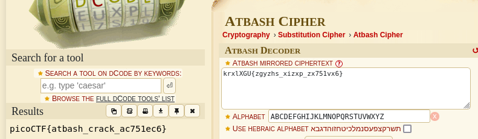

### HideToSee

#Medium #Cryptography #picoCTF2023

Author: Sunday Jacob Nwanyim

#### Description

How about some hide and seek heh?Look at this image [here](https://artifacts.picoctf.net/c/236/atbash.jpg).

##### Solution:

```css    
┌──(kali㉿kali)-[~/Downloads/pico_ctf_lab]
└─$ steghide extract -sf atbash.jpg
Enter passphrase: 
wrote extracted data to "encrypted.txt".    
┌──(kali㉿kali)-[~/Downloads/pico_ctf_lab]
└─$ cat encrypted.txt 
krxlXGU{zgyzhs_xizxp_zx751vx6}  
```

enter passphrase since we don't have so simply press enter
The name of the file `atbash.jpg` - is a hint to encoding algorithm being used for flag.



flag is `picoCTF{atbash_crack_ac751ec6}`