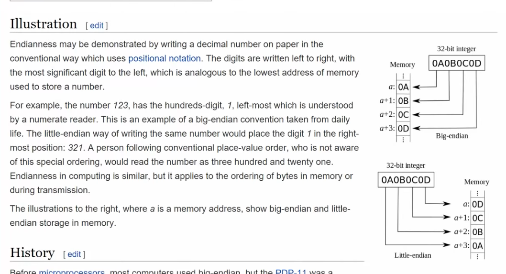
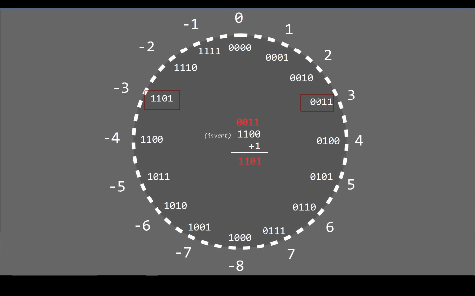
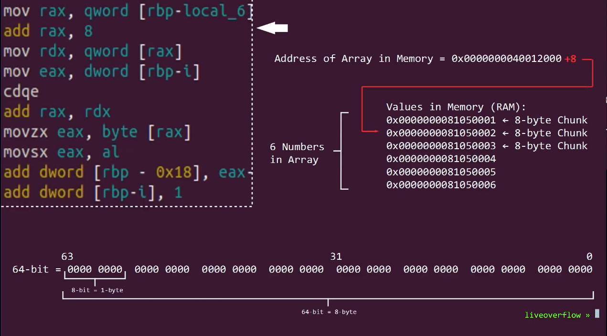

```css
┌─[✔]──[alpha@speed:🍓]──[~]:
└──╼ $ python3
Python 3.10.12 (main, Jan 17 2025, 14:35:34) [GCC 11.4.0] on linux
Type "help", "copyright", "credits" or "license" for more information.
>>> int("1111",2)
15
>>> for i in ["0000000", "00000010", "01010101", "11110010", "11111111"]:
...     print("{0} | {1:3} | {2:2x}".format(i, int(i, 2), int(i, 2)))
... 
0000000 |   0 |  0
00000010 |   2 |  2
01010101 |  85 | 55
11110010 | 242 | f2
11111111 | 255 | ff
>>> 

```

```python
for i in ["0000000", "00000010", "01010101", "11110010", "11111111"]:
    print("{0} | {1:3} | {2:2x}".format(i, int(i, 2), int(i, 2)))

```

```css
>>> bin(123)
'0b1111011'
>>> hex(123)
'0x7b'
>>> int('0b1111011',2)
123
>>> hex(int('0b1111011',2))
'0x7b'
>>> "\x41\xffABCD"
'AÿABCD'

Note => \x41 is hex for 'A' (0x41 = 'A' in ASCII).
\xFF is ÿ (Latin-1 character for 0xFF).
"ABCD" remains as normal text.
```

```css
>>> codecs.encode(b"\x41\xffABCD",'hex')
b'41ff41424344'
```

```python
import codecs
data = b"\x41\xffABCD"  # Use a bytes object
print(codecs.encode(data, 'hex'))

```

```css
>>> import struct
>>> struct.unpack("I", b"ABCD")
(1145258561,)
>>> >>> struct.unpack("I", b"ABCD")[0]
1145258561
```

```python
import struct
print(struct.unpack("I", b"ABCD"))  # `b"ABCD"` is now a bytes object
```

```css
(1145258561,)  # Decimal representation of "ABCD" in little-endian order

```

The **comma (`(1145258561,)`)** appears because `struct.unpack()` **always returns a tuple**. Even if there's only one value, it still wraps it in a tuple.

---

### **📌 How to Remove the Comma**

If you only want the integer value without the tuple, **extract the first element** like this:

```python
import struct
value = struct.unpack("I", b"ABCD")[0]  # Get the first (and only) element
print(value)
```

🔹 **Output (without the comma):**

```
1145258561
```

---

### **📌 What Else Can We Add?**

You can **unpack multiple values at once** if the data is larger. For example:

#### **🔹 Example 1: Unpacking Two Integers**

```python
data = b"ABCDEFGH"  # 8 bytes
print(struct.unpack("II", data))  # Unpack two 4-byte integers
```

🔹 **Output:**

```
(1145258561, 1212630597)
```

Explanation:

- `"ABCD"` → `1145258561`
- `"EFGH"` → `1212630597`

---

#### **🔹 Example 2: Using Different Format Specifiers**

You can change the **format string** to unpack different types:

```python
data = b"ABCD"
print(struct.unpack("H2s", data))  # H = 2-byte int, 2s = 2-byte string
```

🔹 **Output:**

```
(16961, b"CD")
```

Explanation:

- `"AB"` → `16961` (16-bit integer)
- `"CD"` → `b"CD"` (2-byte string)

---

### **📌 Final Notes**

|Format Code|Data Type|Size|
|---|---|---|
|`"I"`|4-byte (32-bit) unsigned integer|4 bytes|
|`"H"`|2-byte (16-bit) unsigned integer|2 bytes|
|`"B"`|1-byte (8-bit) unsigned integer|1 byte|
|`"2s"`|Fixed-length 2-byte string|2 bytes|




```css
>>> hex(struct.unpack("I", b"ABCD")[0])
'0x44434241' => Little-Endian
>>> hex(struct.unpack(">I", b"ABCD")[0])
'0x41424344' => Big-Endian
>>>

```

```css
>>> struct.pack("I", 0x41424344)
b'DCBA'
>>> struct.pack("I", 0x41500000)
b'\x00\x00PA'
>>> 

```








### **🔹 Understanding `struct.pack("I", 0x41500000)`**

Let's break it down step by step. You already understand why `b'DCBA'` is stored in **little-endian**, so let's analyze `0x41500000`.

---

## **1️⃣ What is `0x41500000` in Hex?**

The hexadecimal value **`0x41500000`** is a **32-bit integer**.

### **🖥 Memory Representation in Little-Endian**

Since `struct.pack("I", value)` **stores integers in little-endian order**, we need to **split `0x41500000` into individual bytes**.

1. Convert `0x41500000` into **byte groups (in big-endian order first)**:
    
    ```
    0x41500000 →  41   50   00   00
    ```
    
2. Since your system is **little-endian**, it **reverses the bytes** in memory:
    
    ```
    00   00   50   41
    ```
    

---

## **2️⃣ Why Does the Output Look Like `b'\x00\x00PA'`?**

Let's compare the **memory order** and the **actual output**:

|**Memory Address**|**Stored Byte**|**ASCII Representation**|
|---|---|---|
|0x1000|`00`|`\x00` (null byte)|
|0x1001|`00`|`\x00` (null byte)|
|0x1002|`50`|`'P'`|
|0x1003|`41`|`'A'`|

### **🔹 Final `struct.pack("I", 0x41500000)` Output**

- **`b'\x00\x00PA'`** is the byte string representation.
- `\x00` represents **null bytes** (`00` in hex).
- `'P'` is **ASCII character** for `0x50`.
- `'A'` is **ASCII character** for `0x41`.

---

## **3️⃣ Why Does This Happen?**

Since little-endian **reverses the bytes**, the **most significant bytes (`41 50`) move to the end**, while the **least significant bytes (`00 00`) move to the beginning**.

So:

```
0x41500000 (big-endian) → 00 00 50 41 (little-endian)
```

Which results in:

```
b'\x00\x00PA'
```

---

## **4️⃣ Let's Test Another Example**

What if we pack `0x11223344`?

```python
import struct

value = 0x11223344
packed = struct.pack("I", value)
print(packed)
```

### **Expected Output (on Little-Endian System)**

```
b'D3"\x11'
```

### **Explanation**

- `0x11223344` (Big-Endian Order) → `11 22 33 44`
- **Stored in Little-Endian** → `44 33 22 11`
- **Output Representation** → `b'D3"\x11'`

---

## **5️⃣ Summary**

|**Value (Hex)**|**Big-Endian Order**|**Stored in Little-Endian**|**Packed Output (`struct.pack`)**|
|---|---|---|---|
|`0x41424344`|`41 42 43 44`|`44 43 42 41`|`b'DCBA'`|
|`0x41500000`|`41 50 00 00`|`00 00 50 41`|`b'\x00\x00PA'`|
|`0x11223344`|`11 22 33 44`|`44 33 22 11`|`b'D3"\x11'`|

---

### **💡 Key Takeaway**

- **Little-endian reverses bytes** when storing multi-byte values.
- **Null bytes (`\x00`) appear at the beginning** if the number has leading zeroes in little-endian format.
- **Readable ASCII characters remain unchanged** but are repositioned due to endianness.

Hope this clears it up! 🚀 Let me know if you need more examples!