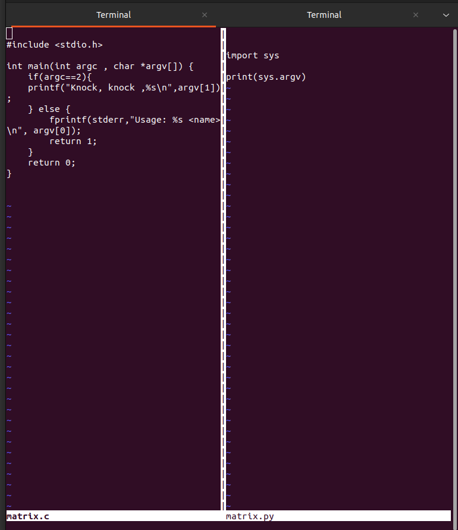
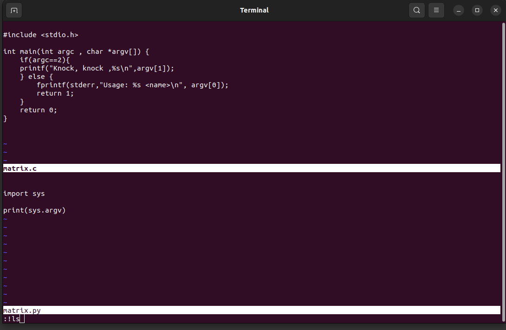
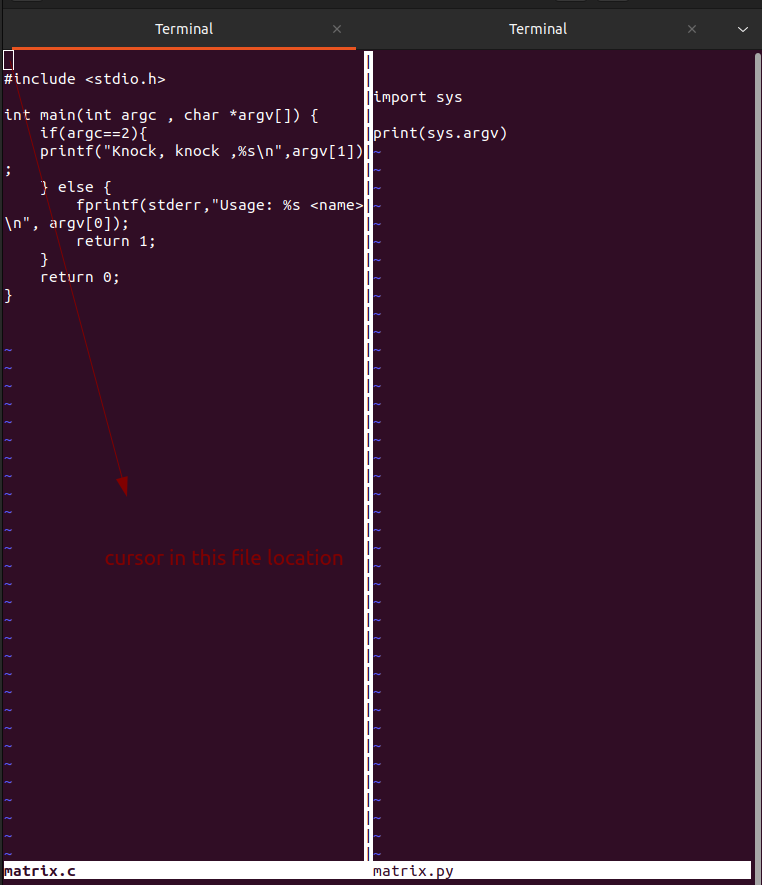

# Writing a simple Program in Python - bin 0x03

```css
┌─[✔]──[alpha@speed:🚀]──[~/Public/share_file/liveoverflow]:
└──╼ $ file /usr/bin/py
py3clean           py3versions        pydoc3.10          pygettext3.10      python3.10         python3-config     
py3compile         pydoc3             pygettext3         python3            python3.10-config  

┌─[✔]──[alpha@speed:🚀]──[~/Public/share_file/liveoverflow]:
└──╼ $ file /usr/bin/python3.10
/usr/bin/python3.10: ELF 64-bit LSB pie executable, x86-64, version 1 (SYSV), dynamically linked, interpreter /lib64/ld-linux-x86-64.so.2, BuildID[sha1]=73b08a69e26c98ab954638c67d1b51895dcfec54, for GNU/Linux 3.2.0, stripped
```

```css
┌─[✔]──[alpha@speed:🚀]──[~/Public/share_file/liveoverflow]:
└──╼ $ vi -O matrix.c matrix.py
```



```css
┌─[✔]──[alpha@speed:🚀]──[~/Public/share_file/liveoverflow]:
└──╼ $ vi -o matrix.c matrix.py
```



only difference is  small `o` and capital `O`
`-o` vi in horizontal mode
`-O` vi in vertical mode
**Note**: `!ls` when you press enter , it will print `ls` command 

```css
┌─[✔]──[alpha@speed:🐧]──[~/Public/share_file/liveoverflow]:
└──╼ $ vi -o matrix.c matrix.py 
2 files to edit

matrix	matrix.c  matrix.py

Press ENTER or type command to continue

```

press enter for continue it will back to again two window mode of vi horizontally

```css
:!python3 matrix.py  => it will print matrix.py code
```

```css
┌─[✔]──[alpha@speed:🐧]──[~/Public/share_file/liveoverflow]:
└──╼ $ vi -o matrix.c matrix.py 
2 files to edit

matrix	matrix.c  matrix.py

Press ENTER or type command to continue
['matrix.py']

Press ENTER or type command to continue
```




to *switch cursor* from one file to another use `ctrl + w` two times


Note to exit from both file use `!qa` => quit all
`!python3 % ` => `%` will point the current location where your cursor pointer is 
like if it is on `matrix.py` then `!python3 %` will treat as `!python3 matrix.py` it will run without error
but if your cursor on `matrix.c` and then you will type `!python3 %` it will treat as `!python3 matrix.c` it will give error

```css
input
:!python3 % this is somgkjg  fjjf    fhfhh     

output
['matrix.py', 'this', 'is', 'somgkjg', 'fjjf', 'fhfhh']


input
:!python3 % this is "hello how are you"   ehhe    ehh     to much space

output
['matrix.py', 'this', 'is', 'hello how are you', 'ehhe', 'ehh', 'to', 'much', 'space']

```


```css
:set expandtab shiftwidth=4 softtabstop=4
```

python2 code 
```python
import sys
if len(sys.argv)==2:
    print("Knock, Knock, {0}".format(sys.argv[1]))
else:
    sys.stderr.write("Usage: {0} <name>\n".format(sys.argv[0]))
```

output

```css
┌─[✔]──[alpha@speed:🍇]──[~/Public/share_file/liveoverflow]:
└──╼ $ python3 matrix.py 
Usage: matrix.py <name>

┌─[✔]──[alpha@speed:🍇]──[~/Public/share_file/liveoverflow]:
└──╼ $ python3 matrix.py hello
Knock, Knock, hello
```

python3 code is 

```python
import sys

if len(sys.argv) == 2:
    print(f"Knock, Knock, {sys.argv[1]}")
else:
    sys.stderr.write(f"Usage: {sys.argv[0]} <name>\n")
```

```python
#!/usr/bin/python3.10
import sys

if len(sys.argv) == 2:
    print(f"Knock, Knock, {sys.argv[1]}")
else:
    sys.stderr.write(f"Usage: {sys.argv[0]} <name>\n")
```

A **shebang** (`#!`) is a special sequence at the beginning of a script file that tells the system which interpreter to use to execute the script.


```css
┌─[✔]──[alpha@speed:🍑]──[~/Public/share_file/liveoverflow]:
└──╼ $ chmod +x matrix.py 

┌─[✔]──[alpha@speed:🚀]──[~/Public/share_file/liveoverflow]:
└──╼ $ ./matrix.py 
Usage: ./matrix.py <name>

┌─[✔]──[alpha@speed:🍇]──[~/Public/share_file/liveoverflow]:
└──╼ $ ./matrix.py hrll
Knock, Knock, hrll
```

```python
#!/usr/bin/env python3
import sys

if len(sys.argv) == 2:
    print(f"Knock, Knock, {sys.argv[1]}")
else:
    sys.stderr.write(f"Usage: {sys.argv[0]} <name>\n")
```

The difference between:

1. **`#!/usr/bin/env python3`**
2. **`#!/usr/bin/python3.10`**

is how they locate and execute Python.

---

### **1. `#!/usr/bin/env python3` (Recommended)**

- Uses the `env` command to find **`python3`** in the user's `PATH`.
- More **portable** across different systems.
- Works even if Python is installed in a **non-standard location**.
- If multiple versions exist, it runs the **first `python3` found in `PATH`**.

✅ **Best for general use and portability**  
🔹 Example: If `python3` is installed in `/usr/local/bin/python3`, it will still work.

---

### **2. `#!/usr/bin/python3.10`**

- **Hardcodes** the interpreter path (`/usr/bin/python3.10`).
- Ensures the script runs specifically with **Python 3.10**.
- Fails if **Python 3.10 is missing** or installed elsewhere.

✅ **Best when you need a specific Python version**  
🔹 Example: If a script requires **Python 3.10 features**, this guarantees it.

---

### **Which One Should You Use?**

- Use **`#!/usr/bin/env python3`** for general scripts to **ensure compatibility**.
- Use **`#!/usr/bin/python3.10`** if you require a **specific Python version** (e.g., for compatibility in production).
