```css
#include <string.h>
#include <stdio.h>

int main(int argc, char *argv[]) {
        if(argc==2) {
                printf("Checking License: %s\n", argv[1]);
                int sum = 0;
                for (int i = 0; i < strlen(argv[1]); i++) {
                        sum+= (int)argv[1][i];
                }
                printf("Value is %d\n",sum);
                if(strcmp(argv[1], "AAAA-Z10N-42-OK")==0) {
                        printf("Access Granted!\n");
                } else {
                        printf("WRONG!\n");
                }
        } else {
                printf("Usage: <key>\n");
        }
        return 0;
}

```

```css
#include <string.h>
#include <stdio.h>

int main(int argc, char *argv[]) {
        if(argc==2) {
                printf("Checking License: %s\n", argv[1]);
                int sum = 0;
                for (int i = 0; i < strlen(argv[1]); i++) {
                        sum+= (int)argv[1][i];
                }
                if(sum==916) {
                        printf("Access Granted!\n");
                } else {
                        printf("WRONG!\n");
                }
        } else {
                printf("Usage: <key>\n");
        }
        return 0;
}

```

```css
┌──(kali㉿kali)-[~/Downloads/pico_ctf_lab/liveoverflow_youtube/0x07_0x08_uncrackable_crackme]± ● master
└─$ radare2 ./license_2
WARN: Relocs has not been applied. Please use `-e bin.relocs.apply=true` or `-e bin.cache=true` next time
[0x004004d0]> aaa
INFO: Analyze all flags starting with sym. and entry0 (aa)
INFO: Analyze imports (af@@@i)
INFO: Analyze entrypoint (af@ entry0)
INFO: Analyze symbols (af@@@s)
INFO: Analyze all functions arguments/locals (afva@@@F)
INFO: Analyze function calls (aac)
INFO: Analyze len bytes of instructions for references (aar)
INFO: Finding and parsing C++ vtables (avrr)
INFO: Analyzing methods (af @@ method.*)
INFO: Recovering local variables (afva@@@F)
INFO: Type matching analysis for all functions (aaft)
INFO: Propagate noreturn information (aanr)
INFO: Use -AA or aaaa to perform additional experimental analysis
[0x004004d0]> s main
[0x004005bd]> pdf
            ; ICOD XREF from entry0 @ 0x4004ed(r)
┌ 188: int main (uint32_t argc, char **argv);
│ `- args(rdi, rsi) vars(4:sp[0x1c..0x38])
│           0x004005bd      55             push rbp
│           0x004005be      4889e5         mov rbp, rsp
│           0x004005c1      53             push rbx
│           0x004005c2      4883ec28       sub rsp, 0x28
│           0x004005c6      897ddc         mov dword [var_24h], edi    ; argc
│           0x004005c9      488975d0       mov qword [s], rsi          ; argv
│           0x004005cd      837ddc02       cmp dword [var_24h], 2
│       ┌─< 0x004005d1      0f858c000000   jne 0x400663
│       │   0x004005d7      488b45d0       mov rax, qword [s]
│       │   0x004005db      4883c008       add rax, 8
│       │   0x004005df      488b00         mov rax, qword [rax]
│       │   0x004005e2      4889c6         mov rsi, rax
│       │   0x004005e5      bf04074000     mov edi, str.Checking_License:__s_n ; 0x400704 ; "Checking License: %s\n" ; const char *format
│       │   0x004005ea      b800000000     mov eax, 0
│       │   0x004005ef      e8acfeffff     call sym.imp.printf         ; int printf(const char *format)
│       │   0x004005f4      c745e80000..   mov dword [var_18h], 0
│       │   0x004005fb      c745ec0000..   mov dword [var_14h], 0
│      ┌──< 0x00400602      eb20           jmp 0x400624
│      ││   ; CODE XREF from main @ 0x400640(x)
│     ┌───> 0x00400604      488b45d0       mov rax, qword [s]
│     ╎││   0x00400608      4883c008       add rax, 8
│     ╎││   0x0040060c      488b10         mov rdx, qword [rax]
│     ╎││   0x0040060f      8b45ec         mov eax, dword [var_14h]
│     ╎││   0x00400612      4898           cdqe
│     ╎││   0x00400614      4801d0         add rax, rdx
│     ╎││   0x00400617      0fb600         movzx eax, byte [rax]
│     ╎││   0x0040061a      0fbec0         movsx eax, al
│     ╎││   0x0040061d      0145e8         add dword [var_18h], eax
│     ╎││   0x00400620      8345ec01       add dword [var_14h], 1
│     ╎││   ; CODE XREF from main @ 0x400602(x)
│     ╎└──> 0x00400624      8b45ec         mov eax, dword [var_14h]
│     ╎ │   0x00400627      4863d8         movsxd rbx, eax
│     ╎ │   0x0040062a      488b45d0       mov rax, qword [s]
│     ╎ │   0x0040062e      4883c008       add rax, 8
│     ╎ │   0x00400632      488b00         mov rax, qword [rax]
│     ╎ │   0x00400635      4889c7         mov rdi, rax                ; const char *s
│     ╎ │   0x00400638      e853feffff     call sym.imp.strlen         ; size_t strlen(const char *s)
│     ╎ │   0x0040063d      4839c3         cmp rbx, rax
│     └───< 0x00400640      72c2           jb 0x400604
│       │   0x00400642      817de89403..   cmp dword [var_18h], 0x394
│      ┌──< 0x00400649      750c           jne 0x400657
│      ││   0x0040064b      bf1a074000     mov edi, str.Access_Granted_ ; 0x40071a ; "Access Granted!" ; const char *s
│      ││   0x00400650      e82bfeffff     call sym.imp.puts           ; int puts(const char *s)
│     ┌───< 0x00400655      eb16           jmp 0x40066d
│     │││   ; CODE XREF from main @ 0x400649(x)
│     │└──> 0x00400657      bf2a074000     mov edi, str.WRONG_         ; 0x40072a ; "WRONG!" ; const char *s
│     │ │   0x0040065c      e81ffeffff     call sym.imp.puts           ; int puts(const char *s)
│     │┌──< 0x00400661      eb0a           jmp 0x40066d
│     │││   ; CODE XREF from main @ 0x4005d1(x)
│     ││└─> 0x00400663      bf31074000     mov edi, str.Usage:__key_   ; 0x400731 ; "Usage: <key>" ; const char *s
│     ││    0x00400668      e813feffff     call sym.imp.puts           ; int puts(const char *s)
│     ││    ; CODE XREFS from main @ 0x400655(x), 0x400661(x)
│     └└──> 0x0040066d      b800000000     mov eax, 0
│           0x00400672      4883c428       add rsp, 0x28
│           0x00400676      5b             pop rbx
│           0x00400677      5d             pop rbp
└           0x00400678      c3             ret
[0x004005bd]> 

```

```css
└─$ python3
Python 3.12.8 (main, Feb  1 2025, 21:32:22) [GCC 14.2.0] on linux
Type "help", "copyright", "credits" or "license" for more information.
>>> 0x394
916
>>> 

```

```css
[0x004005bd]> ood AAAA-WRONG-KEY
INFO: File dbg:///home/kali/Downloads/pico_ctf_lab/liveoverflow_youtube/0x07_0x08_uncrackable_crackme/license_2 AAAA-WRONG-KEY reopened in read-write mode
WARN: Relocs has not been applied. Please use `-e bin.relocs.apply=true` or `-e bin.cache=true` next time
3208
[0x7fecc31b4b00]> dc
Checking License: AAAA-WRONG-KEY
WRONG!
(3208) Process exited with status=0x0
[0x7fecc30593c5]> 

```

```css
[0x7fecc30593c5]> db 0x00400649
[0x7fecc30593c5]> ood
(3208) Process terminated with status 0
INFO: ==> Process finished
INFO: File dbg:///home/kali/Downloads/pico_ctf_lab/liveoverflow_youtube/0x07_0x08_uncrackable_crackme/license_2 reopened in read-write mode
WARN: Relocs has not been applied. Please use `-e bin.relocs.apply=true` or `-e bin.cache=true` next time
4835
[0x7f4e647f1b00]> dc
Usage: <key>
(4835) Process exited with status=0x0
[0x7f4e646963c5]> ood AAAA-WRONG-KEY
(4835) Process terminated with status 0
INFO: ==> Process finished
INFO: File dbg:///home/kali/Downloads/pico_ctf_lab/liveoverflow_youtube/0x07_0x08_uncrackable_crackme/license_2 AAAA-WRONG-KEY reopened in read-write mode
WARN: Relocs has not been applied. Please use `-e bin.relocs.apply=true` or `-e bin.cache=true` next time
5330
[0x7fb5519a1b00]> dc
Checking License: AAAA-WRONG-KEY
INFO: hit breakpoint at: 0x400649

```

```css
[0x7fb5519a1b00]> dc
Checking License: AAAA-WRONG-KEY
INFO: hit breakpoint at: 0x400649
[0x00400649]> dr
rax = 0x0000000e
rbx = 0x0000000e
rcx = 0x00000000
rdx = 0x7ffd24a2516c
r8 = 0x7fb551951ac0
r9 = 0x00000004
r10 = 0x00000003
r11 = 0x7fb5518d1bc0
r12 = 0x00000000
r13 = 0x7ffd24a23df0
r14 = 0x7fb5519bb000
r15 = 0x00000000
rsi = 0x154262a0
rdi = 0x7ffd24a2516c
rsp = 0x7ffd24a23c90
rbp = 0x7ffd24a23cc0
rip = 0x00400649
rflags = 0x00000202
orax = 0xffffffffffffffff
```

```css
[0x00400649]> dr
rax = 0x0000000e
rbx = 0x0000000e
rcx = 0x00000000
rdx = 0x7ffd24a2516c
r8 = 0x7fb551951ac0
r9 = 0x00000004
r10 = 0x00000003
r11 = 0x7fb5518d1bc0
r12 = 0x00000000
r13 = 0x7ffd24a23df0
r14 = 0x7fb5519bb000
r15 = 0x00000000
rsi = 0x154262a0
rdi = 0x7ffd24a2516c
rsp = 0x7ffd24a23c90
rbp = 0x7ffd24a23cc0
rip = 0x00400649
rflags = 0x00000202
orax = 0xffffffffffffffff
[0x00400649]> dr rip=0x0040064b
0x00400649 -> 0x0040064b
[0x00400649]> dr
rax = 0x0000000e
rbx = 0x0000000e
rcx = 0x00000000
rdx = 0x7ffd24a2516c
r8 = 0x7fb551951ac0
r9 = 0x00000004
r10 = 0x00000003
r11 = 0x7fb5518d1bc0
r12 = 0x00000000
r13 = 0x7ffd24a23df0
r14 = 0x7fb5519bb000
r15 = 0x00000000
rsi = 0x154262a0
rdi = 0x7ffd24a2516c
rsp = 0x7ffd24a23c90
rbp = 0x7ffd24a23cc0
rip = 0x0040064b
rflags = 0x00000202
orax = 0xffffffffffffffff
[0x00400649]> dc
Access Granted!
(5330) Process exited with status=0x0

```


```css
0x004005bd]> afv
arg uint32_t argc @ rdi
arg char ** argv @ rsi
var int64_t var_14h @ rbp-0x14
var uint32_t var_18h @ rbp-0x18
var uint32_t var_24h @ rbp-0x24
var char ** s @ rbp-0x30
[0x004005bd]> afvn var_
var_24h   var_18h   var_14h   
[0x004005bd]> afvn var_14h i
ERROR: Cant find var by name

```


```css


Address of Array in Memory = 0x0000000040012000

Values in Memory (RAM):
						____________________________________________
						|		0x0000000081050001     8-byte Chunk
						|		
						|		0x0000000081050002     8-byte Chunk
						|		
						|		0x0000000081050003     8-byte Chunk
6 Numbers in Array =>	|							
						|		0x0000000081050004     8-byte Chunk
						|		
						|		0x0000000081050005     8-byte Chunk
						|		
						|		0x0000000081050006     8-byte Chunk
						|____________________________________________


			63                                      31                                    0
64-bit   => 0000 0000 0000 0000 0000 0000 0000 0000 0000 0000 0000 0000 0000 0000 0000 0000
		    _________ _________ _________ _________ _________ _________ _________ _________
	8-byte =  8-bit
			_______________________________________________________________________________

```

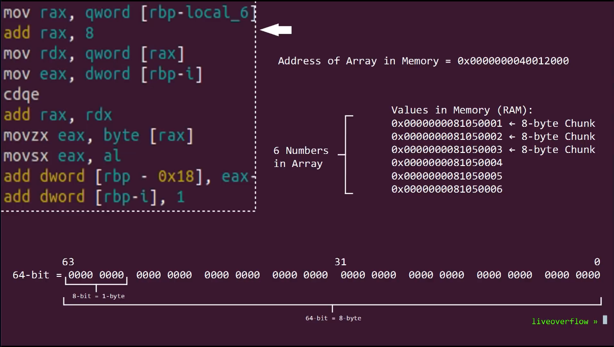


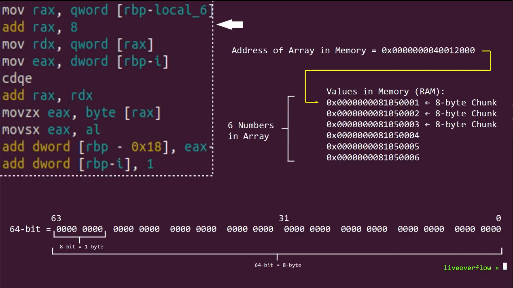


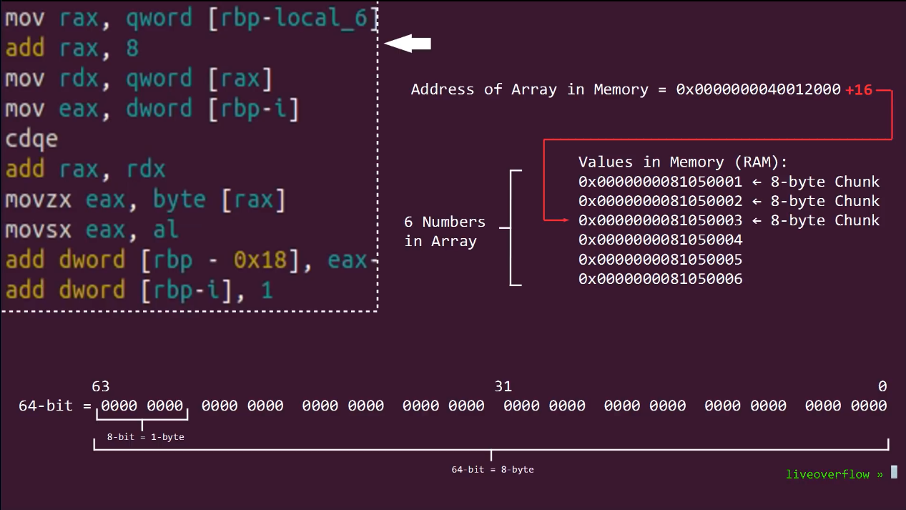


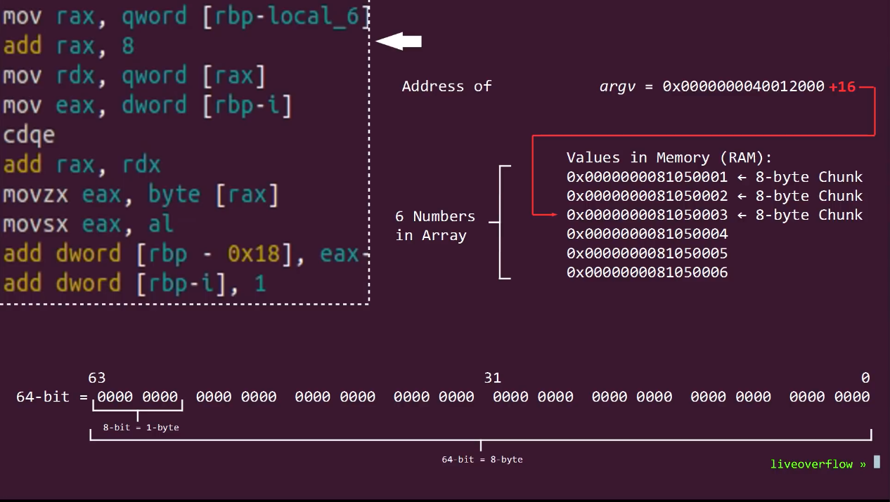

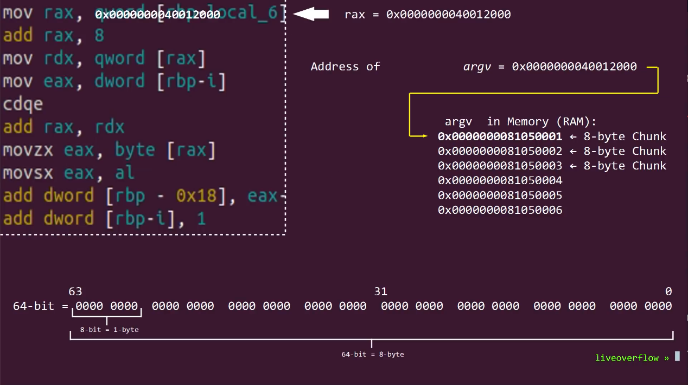


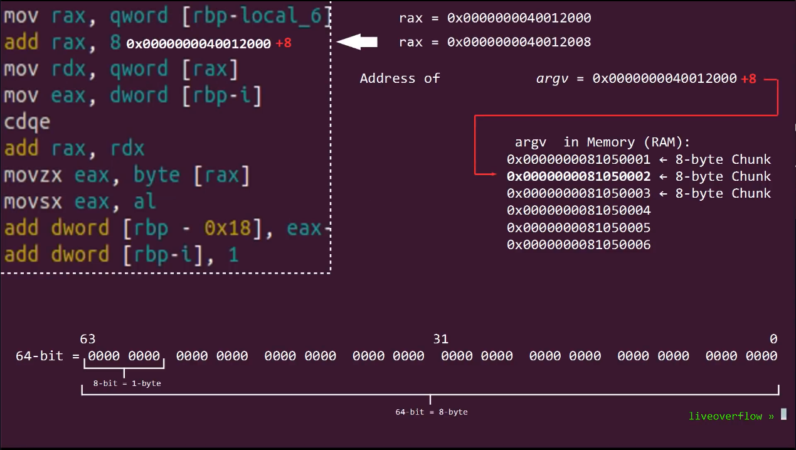


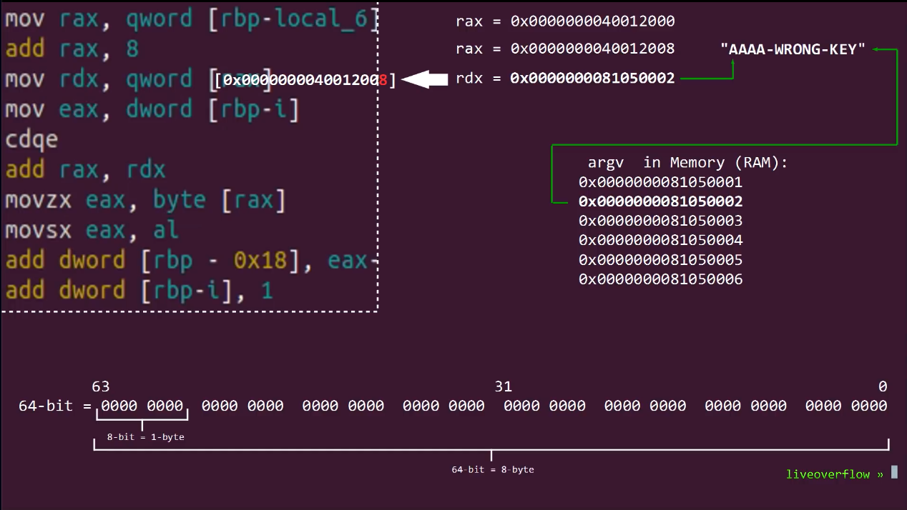


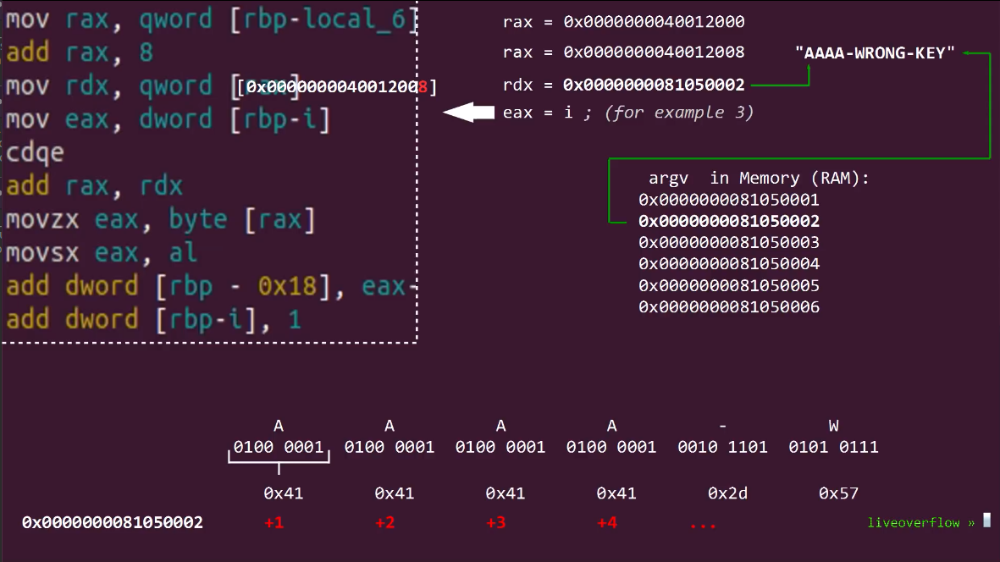


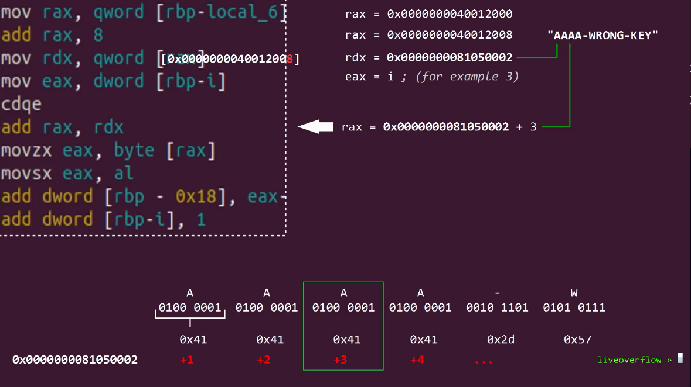

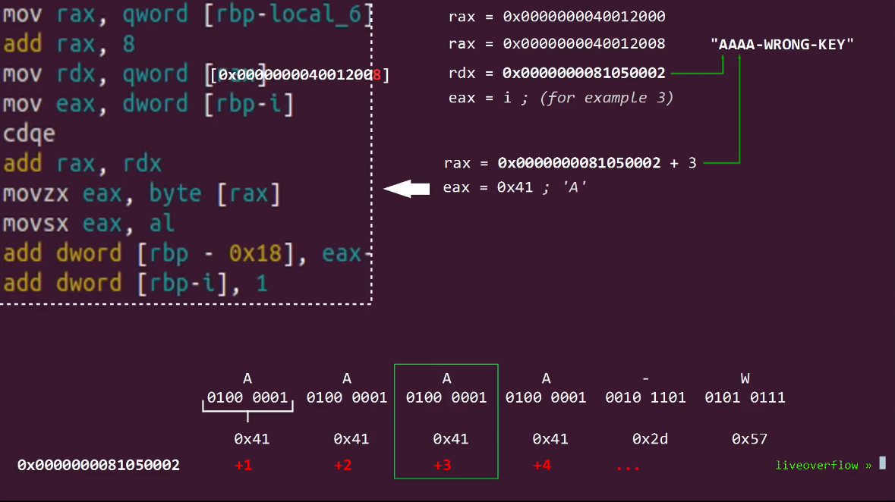


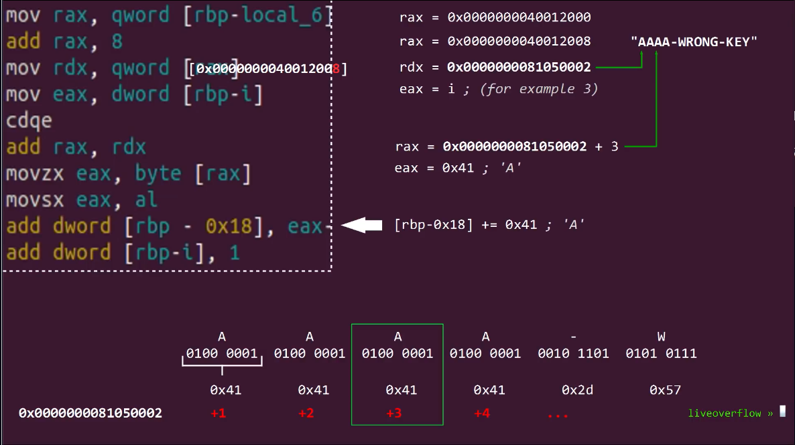


```css
> db 0x0040061d
> ood ABCD
(30116) Process terminated with status 0
INFO: ==> Process finished
INFO: File dbg:///home/kali/Downloads/pico_ctf_lab/liveoverflow_youtube/0x07_0x08_uncrackable_crackme/license_2 ABCD reopened in read-write mode
WARN: Relocs has not been applied. Please use `-e bin.relocs.apply=true` or `-e bin.cache=true` next time
31249
> V!

```

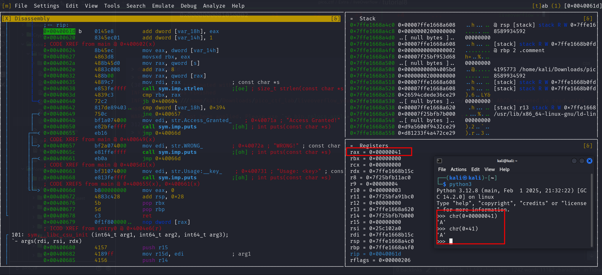


enter `:dc` press enter  again
```css
> dc
INFO: hit breakpoint at: 0x40061d
>  [=> press enter ]

```

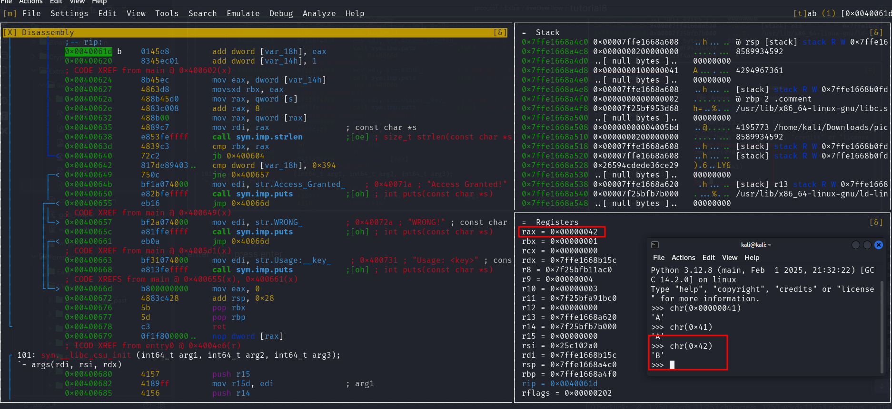

```python
import random
import sys

def check_key(key):
    char_sum = sum(ord(c) for c in key)  # More Pythonic sum calculation
    sys.stdout.write(f"{char_sum:3} | {key}      \r")
    sys.stdout.flush()
    return char_sum

key = ""
while True:
    key += random.choice("abcdefghijklmnopqrstuvwxyzABCDEFGHIJKLMNOPQRSTUVWXYZ0123456789-_")
    s = check_key(key)
    if s > 916:
        key = ""
    elif s == 916:
        print(f"Found valid key: {key}")
        break  # Ensuring the loop stops once a valid key is found

```

generate 5 keys
```python
import random
import sys

def check_key(key):
    char_sum = sum(ord(c) for c in key)  # More Pythonic sum calculation
    sys.stdout.write(f"{char_sum:3} | {key}      \r")
    sys.stdout.flush()
    return char_sum

valid_keys = 0
while valid_keys < 5:  # Stop after finding 5 valid keys
    key = ""  # Reset key on each attempt
    while True:
        key += random.choice("abcdefghijklmnopqrstuvwxyzABCDEFGHIJKLMNOPQRSTUVWXYZ0123456789-_")
        s = check_key(key)
        if s > 916:
            break  # Reset key if sum exceeds 916
        elif s == 916:
            print(f"\nFound valid key #{valid_keys + 1}: {key}")
            valid_keys += 1
            break  # Move to the next key search

```

```css
─[✔]──[alpha@speed:🍇]──[~/Public/share_file/liveoverflow/liveoverflow_youtube/0x07_0x08_uncrackable_crackme]± ● master:
└──╼ $ python3 keygen1.py 
916 | fvNmxDpkf            
Found valid key #1: fvNmxDpkf
916 | EuXG3uAZ10OH       
Found valid key #2: EuXG3uAZ10OH
916 | NnMqp1X7Mg6        
Found valid key #3: NnMqp1X7Mg6
916 | tBNBU8Paf1E4        
Found valid key #4: tBNBU8Paf1E4
916 | ThA9mu2cqv         
Found valid key #5: ThA9mu2cqv

┌─[✔]──[alpha@speed:🐧]──[~/Public/share_file/liveoverflow/liveoverflow_youtube/0x07_0x08_uncrackable_crackme]± ● master:
└──╼ $ ./license_2 NnMqp1X7Mg6
Checking License: NnMqp1X7Mg6
Access Granted!

┌─[✔]──[alpha@speed:🐧]──[~/Public/share_file/liveoverflow/liveoverflow_youtube/0x07_0x08_uncrackable_crackme]± ● master:
└──╼ $ 

```