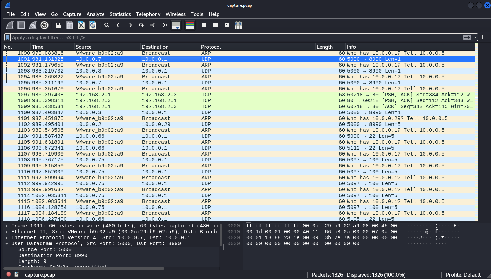
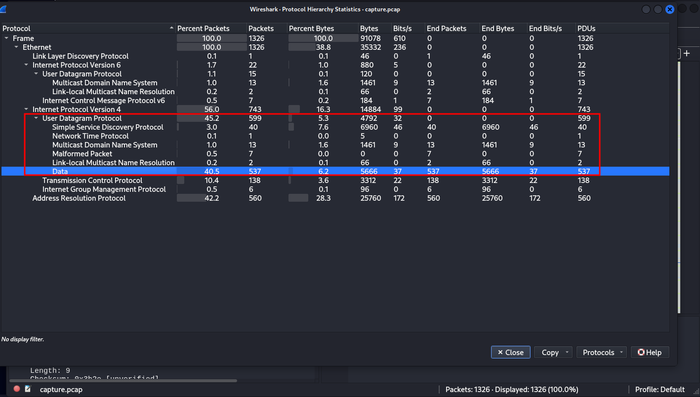
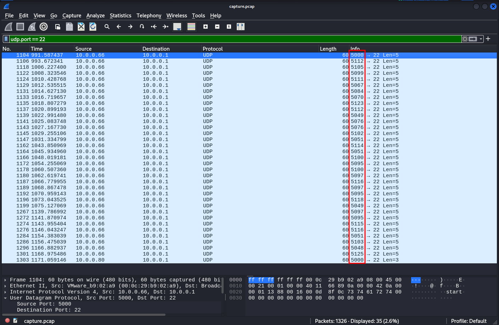

### shark on wire 2

#Medium #forensics #picoCTF2019 
Author: Danny

#### Description

We found this [packet capture](https://jupiter.challenges.picoctf.org/static/b506393b6f9d53b94011df000c534759/capture.pcap). Recover the flag that was pilfered from the network.

##### Solution
open file into wireshark



protocol hierarchy



filter by udp after analyzing lot of different source port address goes to destination address 22
so filter udp by port 22



go to view => name resolution => transport layer


```css
5112 => 112 => p  
5105 => 105 => i  
5099 => 099 => c  
5111 => 111 => o  
5067 => 067 => C  
5084 => 084 => T  
5070 => 070 => F  
5123 => 123 => {  
5112 => 112 => p  
5049 => 049 => 1  
5076 => 076 => L
5076 => 076 => L 
5102 => 102 => f  
5051 => 051 => 3  
5114 => 114 => r  
5051 => 051 => 3  
5100 => 100 => d  
5095 => 095 => _  
5100 => 100 => d  
5097 => 097 => a  
5116 => 116 => t  
5097 => 097 => a  
5095 => 095 => _  
5118 => 118 => v  
5049 => 049 => 1  
5097 => 097 => a  
5095 => 095 => _  
5115 => 115 => s  
5116 => 116 => t  
5051 => 051 => 3  
5103 => 103 => g  
5048 => 048 => 0  
5125 => 125 => }  
```

flag is `picoCTF{p1LLf3r3d_data_v1a_st3g0}`

python code to solve this problem easily 

```python
# pip install scapy
from scapy.all import *

flag = ""

packets = rdpcap('capture.pcap')
for packet in packets:
    # if the packet is a UDP packet going to point 22
    if UDP in packet and packet[UDP].dport == 22:
        flag += chr(packet[UDP].sport - 5000)
print("Flag: {}".format(flag))
```

```css
┌──(myenv)─(kali㉿kali)-[~/Downloads/pico_ctf_lab]
└─$ python3 test.py                                                                                               
Flag: picoCTF{p1LLf3r3d_data_v1a_st3g0}   
```

another code 

```python
from scapy.all import *

flag = ""

packets = rdpcap("capture.pcap")
for packet in packets:
    if UDP in packet and packet[UDP].dport == 22:
        ascii_value = packet[UDP].sport - 5000
        if 32 <= ascii_value <= 126:  # Ensure printable ASCII
            flag += chr(ascii_value)

print("Flag:", flag)
```