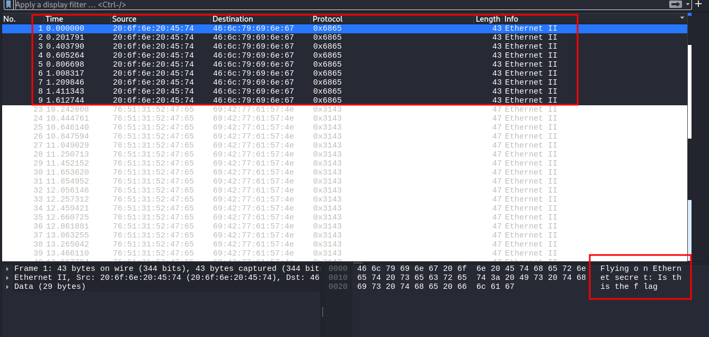
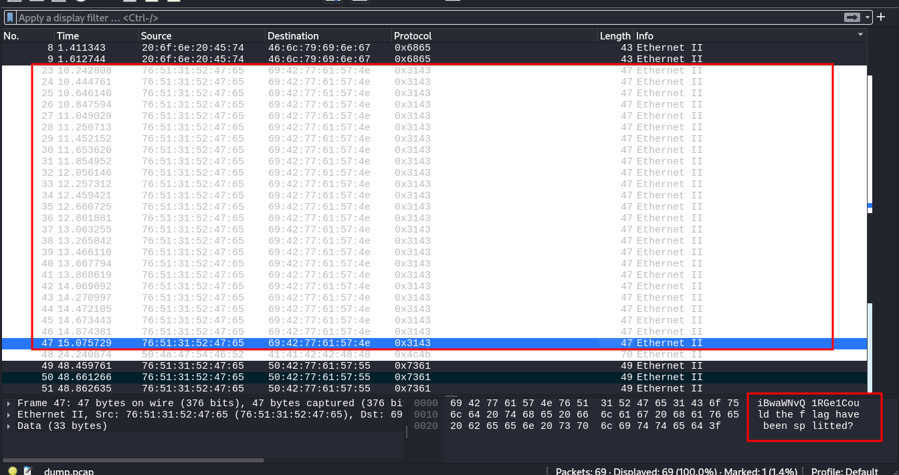
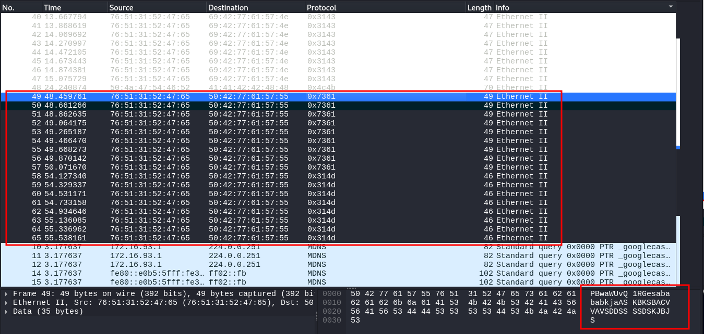
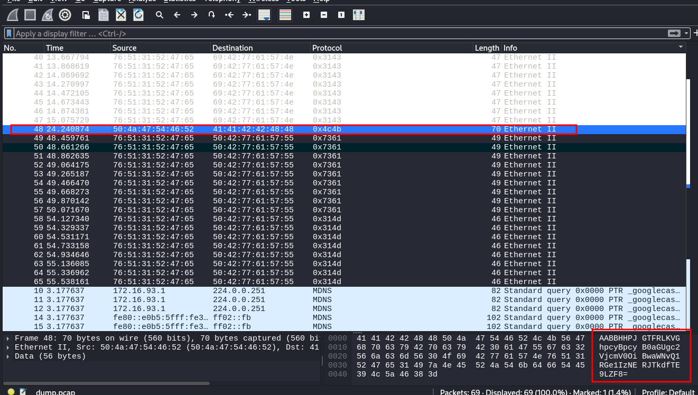
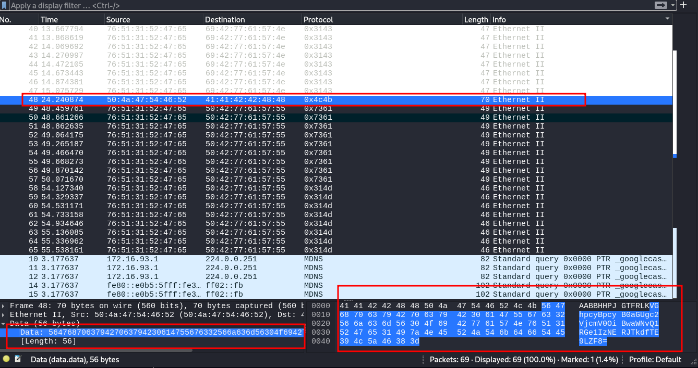

### FindAndOpen
#Medium #forensics #picoCT2023 
Author: Mubarak Mikail

#### Description

Someone might have hidden the password in the trace file. Find the key to unlock [this file](https://artifacts.picoctf.net/c/492/flag.zip). [This tracefile](https://artifacts.picoctf.net/c/492/dump.pcap) might be good to analyze.

##### Solution:
from 1 to 9 we have same data



from 23 to 47 we have same data



from 48 to 65 we have same data



only No. 48 with time 24.240874 have different data



we need data only



```css
564768706379427063794230614755676332566a636d56304f69427761574e76513152476531497a4e45524a546b64665445394c5a46383d
```

```css
convert to hex to char 
┌──(kali㉿kali)-[~]
└─$ python3        
Python 3.12.8 (main, Jan 11 2025, 09:42:09) [GCC 14.2.0] on linux
Type "help", "copyright", "credits" or "license" for more information.
>>> bytes.fromhex("564768706379427063794230614755676332566a636d56304f69427761574e76513152476531497a4e45524a546b64665445394c5a46383d"
... )
b'VGhpcyBpcyB0aGUgc2VjcmV0OiBwaWNvQ1RGe1IzNERJTkdfTE9LZF8='


convert from base64
┌──(kali㉿kali)-[~]
└─$ echo "VGhpcyBpcyB0aGUgc2VjcmV0OiBwaWNvQ1RGe1IzNERJTkdfTE9LZF8" | base64 -d                             
This is the secret: picoCTF{R34DING_LOKd_ 

```

flag password is `picoCTF{R34DING_LOKd_`

```css
┌──(kali㉿kali)-[~/Downloads/pico_ctf_lab]
└─$ unzip flag.zip -d flag_zip 
Archive:  flag.zip
[flag.zip] flag password: 
 extracting: flag_zip/flag           

┌──(kali㉿kali)-[~/Downloads/pico_ctf_lab]
└─$ cat flag_zip/flag 
picoCTF{R34DING_LOKd_fil56_succ3ss_cbf2ebf6}

```

final flag is `picoCTF{R34DING_LOKd_fil56_succ3ss_cbf2ebf6}`

