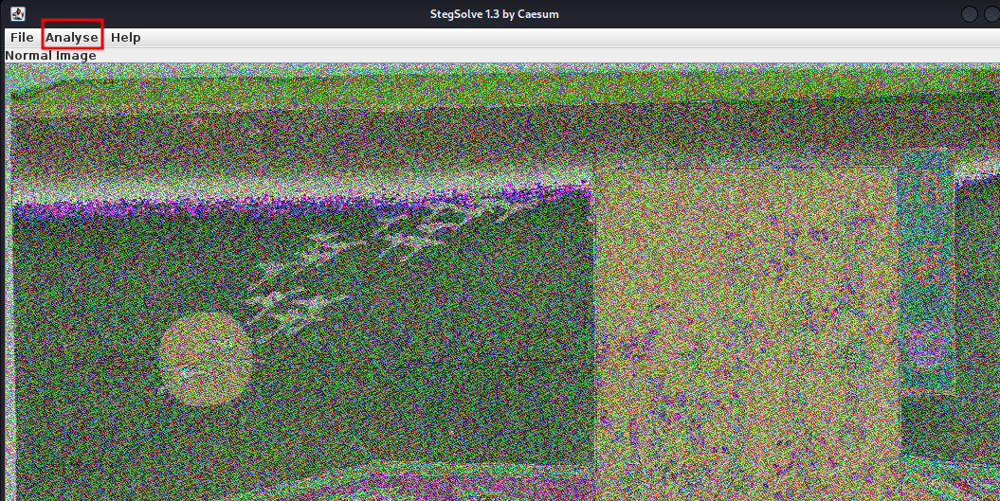
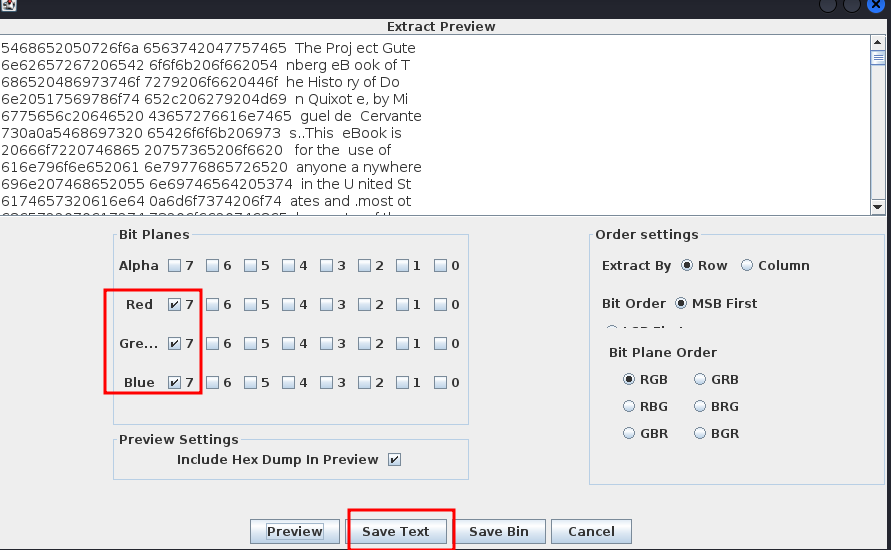
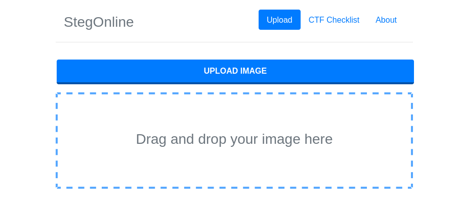
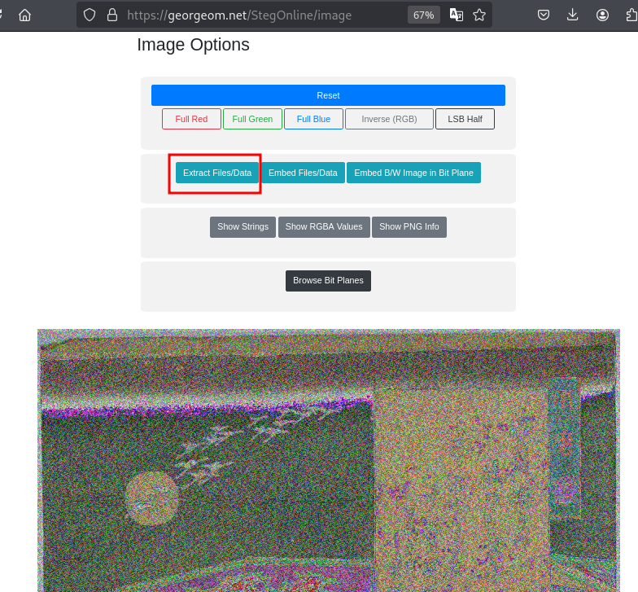
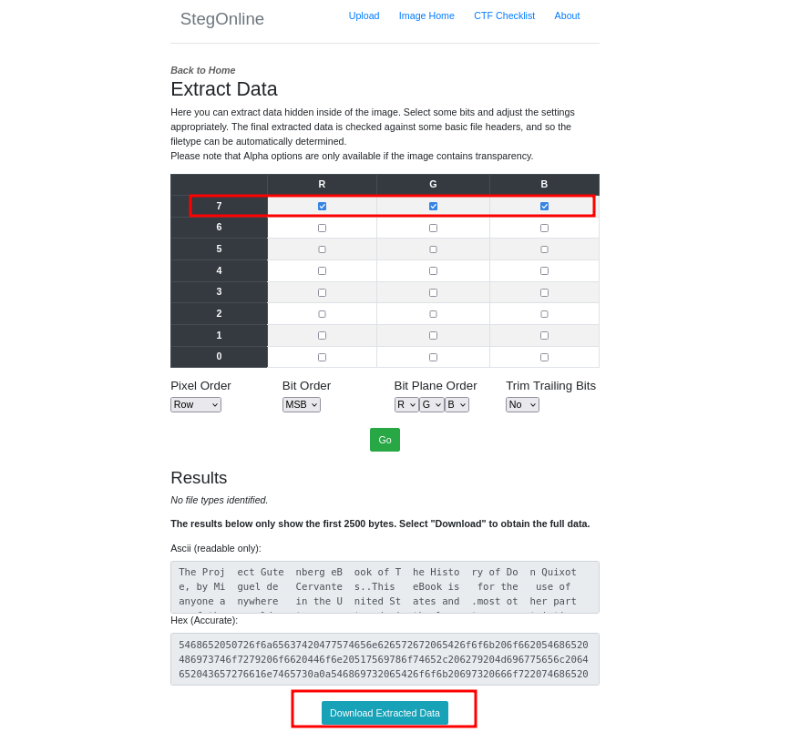

### MSB
#metadata #forensics #picoCTF2023 #steganography
Author: LT 'syreal' Jones

#### Description

This image passes LSB statistical analysis, but we can't help but think there must be something to the visual artifacts present in this image... Download the image [here](https://artifacts.picoctf.net/c/304/Ninja-and-Prince-Genji-Ukiyoe-Utagawa-Kunisada.flag.png)

##### Solution:
Tools used here is `stegsolve.jar`

Run this command `java -jar stegsolve.jar` into terminal then open picture into the program then go to analyse Data extract click on R G B (7 7 7 ) bit planes then preview save as any text name ans search "pico"






```css
220a7069636f4354 467b31355f793075  ".picoCT F{15_y0u
725f71756535375f 7175317830373163  r_que57_ qu1x071c
5f30725f68337230 31635f6565336362  _0r_h3r0 1c_ee3cb
3464387d0a0a2254 686f752068617374  4d8}.."T hou hast
```

`picoCTF{15_y0ur_que57_qu1x071c_0r_h3r01c_ee3cb4d8}`

2nd method online tools






one you download data you will get dot det file open into text editor and search "pico"

flag is `picoCTF{15_y0ur_que57_qu1x071c_0r_h3r01c_ee3cb4d8}`

