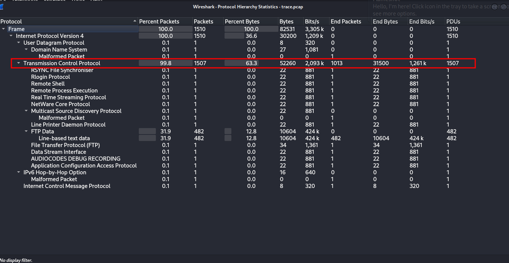
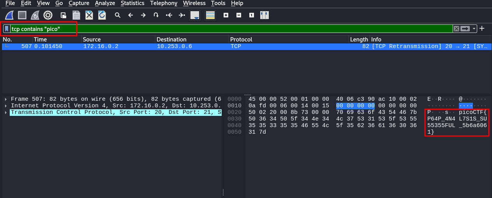

### PcapPoisoning

#Medium #Forensics #picoCTF2023 #pcap

Author: Mubarak Mikail

#### Description

How about some hide and seek heh?Download this [file](https://artifacts.picoctf.net/c/375/trace.pcap) and find the flag.

##### Solution:
 load the pcap file to wireshark
 now go to `statistics` => `Protocol Hierarchy`
 


you will notice TCP protocol is most exchanged packets
Using the filter feature `tcp contains "pico"`
for more information go to `help` => `manual page` => `filter packet` and read about `contains`



```css
0000   45 00 00 52 00 01 00 00 40 06 c3 90 ac 10 00 02   E..R....@.......
0010   0a fd 00 06 00 14 00 15 00 00 00 00 00 00 00 00   ................
0020   50 02 20 00 8b 73 00 00 70 69 63 6f 43 54 46 7b   P. ..s..picoCTF{
0030   50 36 34 50 5f 34 4e 34 4c 37 53 31 53 5f 53 55   P64P_4N4L7S1S_SU
0040   35 35 33 35 35 46 55 4c 5f 35 62 36 61 36 30 36   55355FUL_5b6a606
0050   31 7d                                             1}

```

select the flag on right click you will get lot of option just choose copy as printable text `picoCTF{P64P_4N4L7S1S_SU55355FUL_5b6a6061}` 

2nd Method 

```css
┌──(kali㉿kali)-[/media/sf_Public/share_file]
└─$ strings trace.pcap| grep "pico"
picoCTF{P64P_4N4L7S1S_SU55355FUL_5b6a6061}

```