### Dear Diary

Author: syreal
#Medium #forensics #picoCTF2024 #disk #browser_web_shell 
#### Description

If you can find the flag on this disk image, we can close the case for good! Download the disk image [here](https://artifacts.picoctf.net/c_titan/63/disk.flag.img.gz).

##### Solution:
```css
using gzip extract the file
gzip -dk disk.flag.img.gz  
```

To get more information about this image, we can start with file analysis.

```css
┌──(kali㉿kali)-[~/Downloads/testdisk]
└─$ file disk.flag.img                  
disk.flag.img: DOS/MBR boot sector; partition 1 : ID=0x83, active, start-CHS (0x0,32,33), end-CHS (0x26,94,56), startsector 2048, 614400 sectors; partition 2 : ID=0x82, start-CHS (0x26,94,57), end-CHS (0x47,1,58), startsector 616448, 524288 sectors; partition 3 : ID=0x83, start-CHS (0x47,1,59), end-CHS (0x82,138,8), startsector 1140736, 956416 sectors

```

*mmls* **displays the layout of the partitions in a volume system**, which include partition tables and disk labels.

```css
┌──(kali㉿kali)-[~/Downloads/testdisk]
└─$ mmls disk.flag.img
DOS Partition Table
Offset Sector: 0
Units are in 512-byte sectors

      Slot      Start        End          Length       Description
000:  Meta      0000000000   0000000000   0000000001   Primary Table (#0)
001:  -------   0000000000   0000002047   0000002048   Unallocated
002:  000:000   0000002048   0000616447   0000614400   Linux (0x83)
003:  000:001   0000616448   0001140735   0000524288   Linux Swap / Solaris x86 (0x82)
004:  000:002   0001140736   0002097151   0000956416   Linux (0x83)

```

The given file is disk.flag.img, so I use autopsy to analyse it.

`step 1:  how to start autopsy`

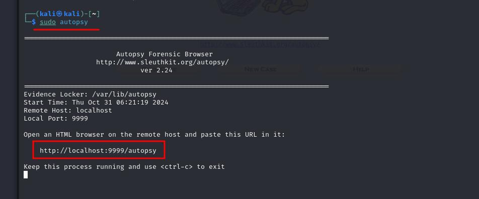


`step 2: open the link in browser of autopsy`

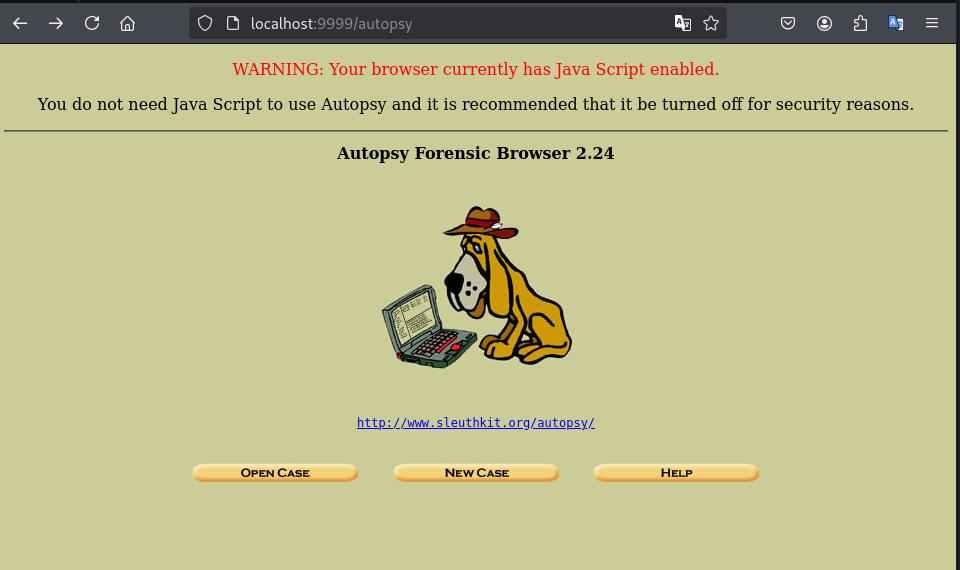

`step 3: click on New Case`

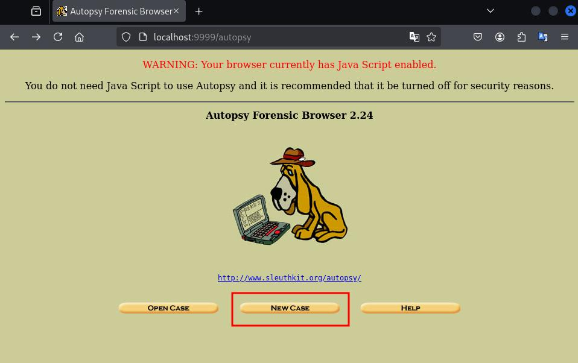


`step 4: Create case name and description ` 

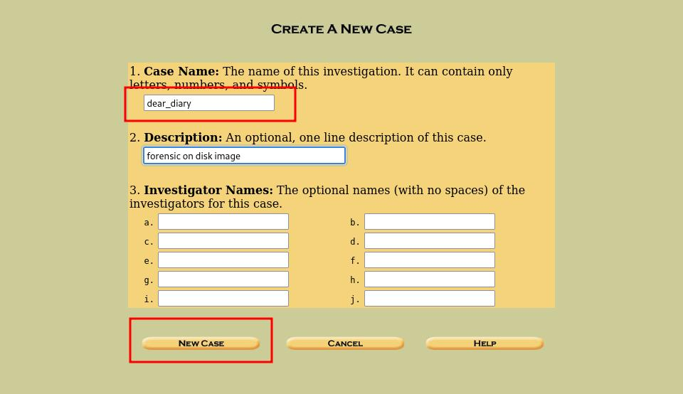


`step 5: Click on Add Host for adding host`

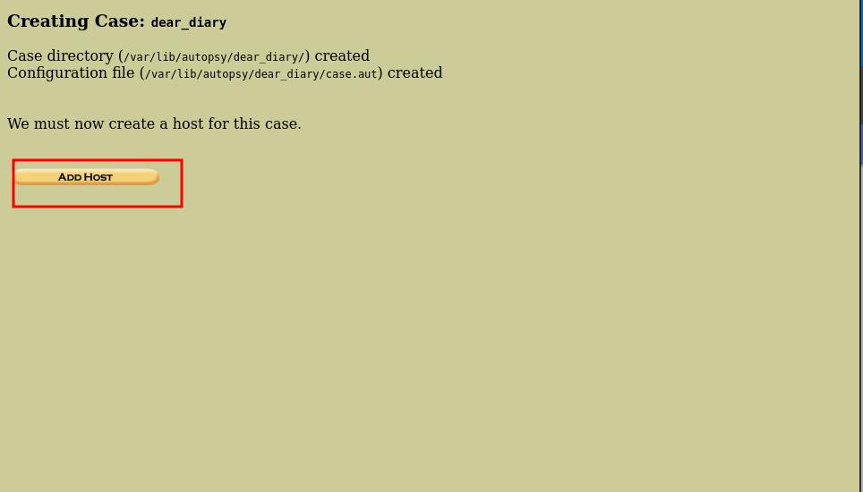

`step 6: Give host Name and description and click on add Host`

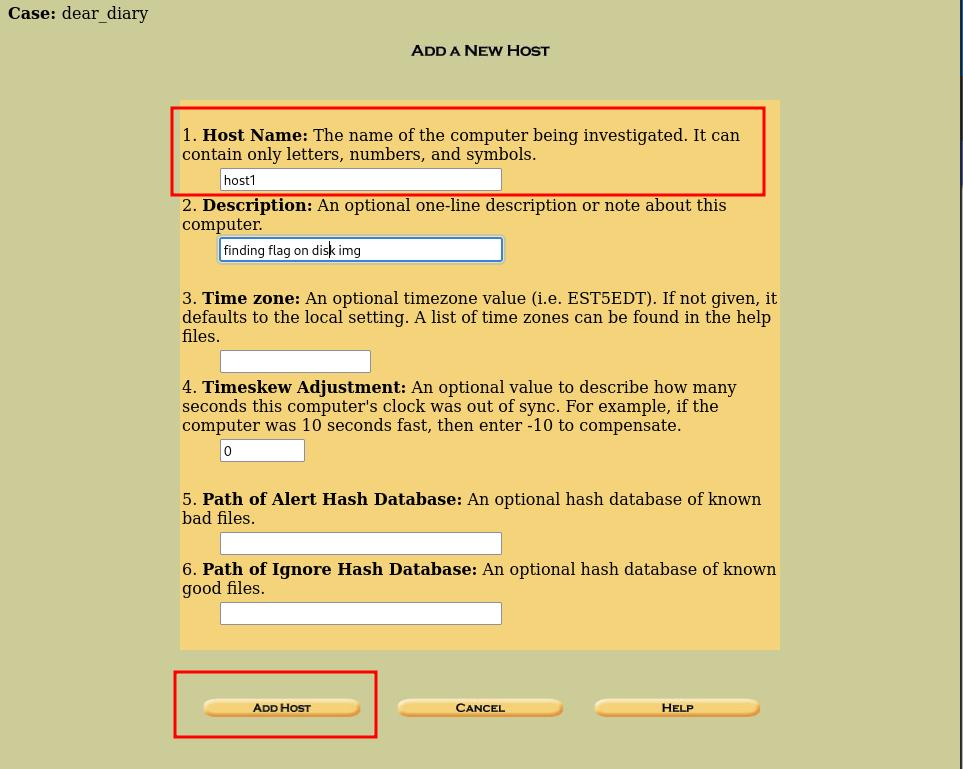

`step 7: After adding Host click on Add image`

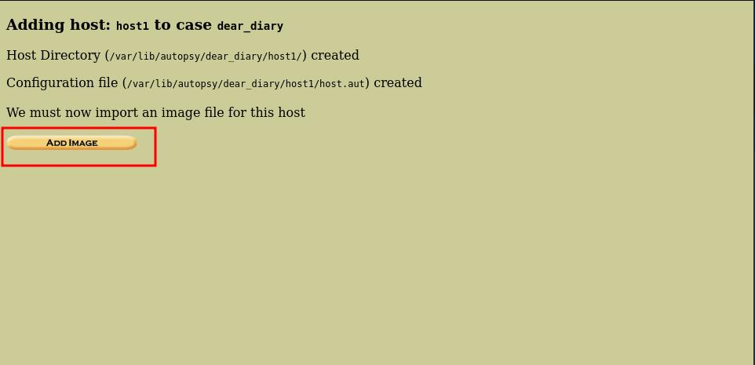

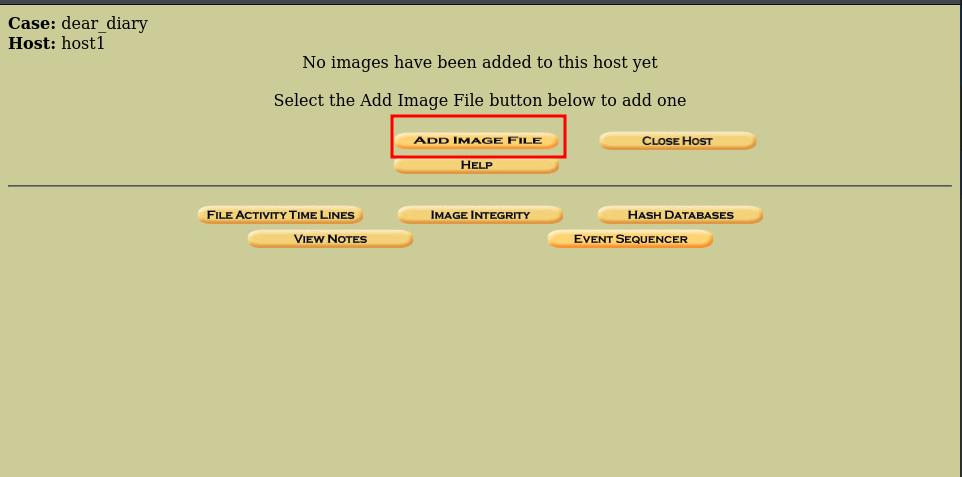

`step 8: add image location and click on Next`

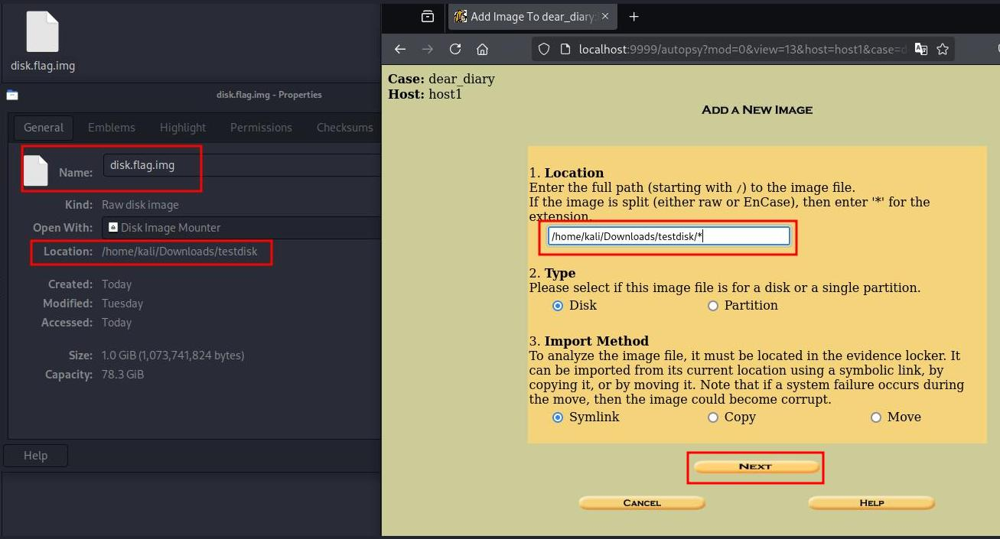

`step 9: re-verify details and partition table for analysis`

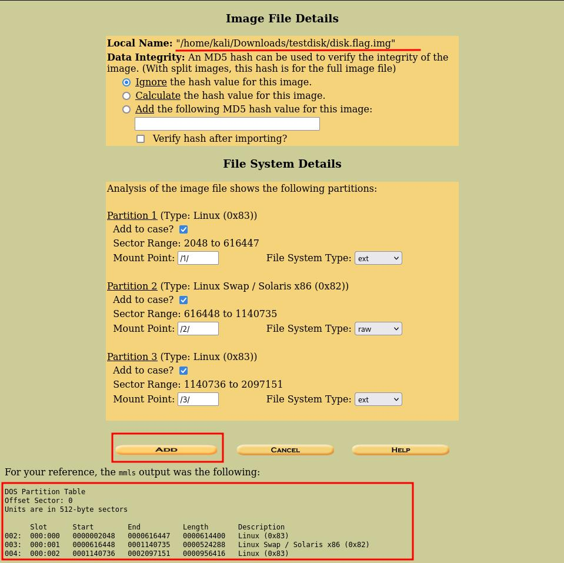

`step 10: analzye disk image file`

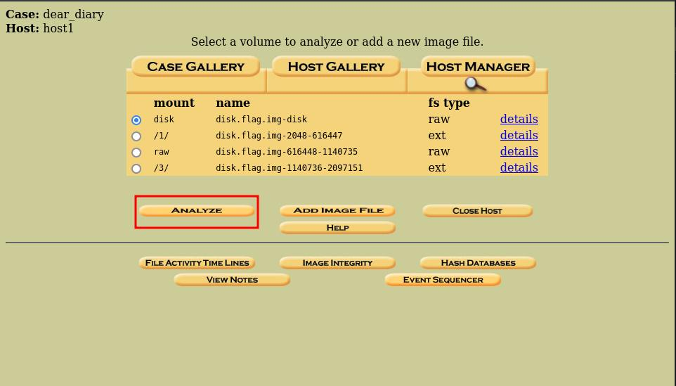

`step 11: click on keywork search`

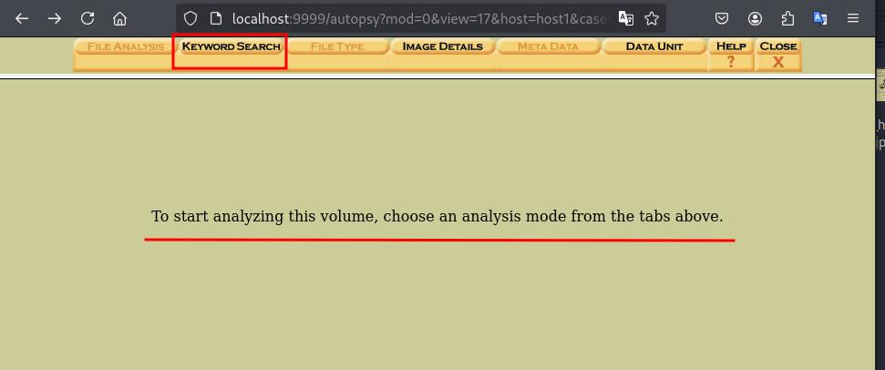

Note: since we don't know about this img file 
analyze vol by vol

`step 12 analyze volume 1: `

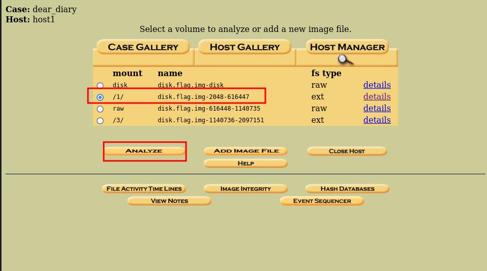

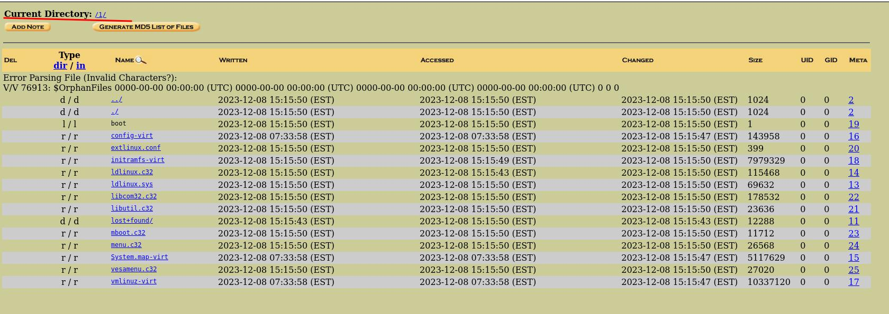

`step 13: analyze vol 3 and check root folder`

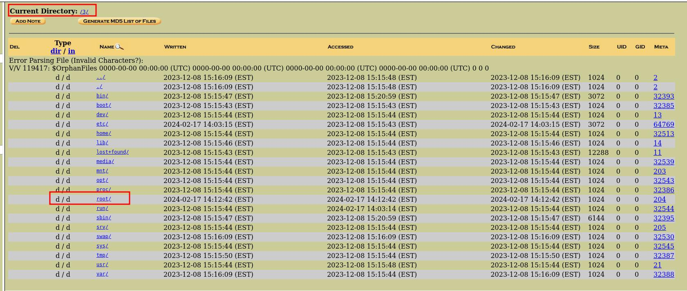

`step 14: innocuous file `

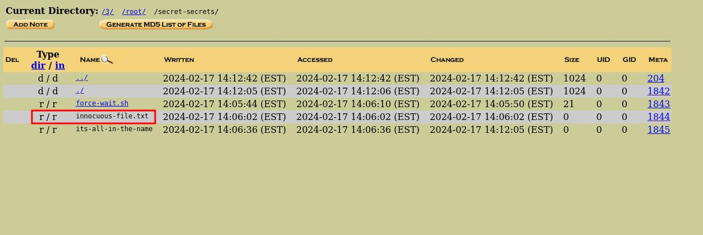

`step 15: go back to keyword search and search .txt file`

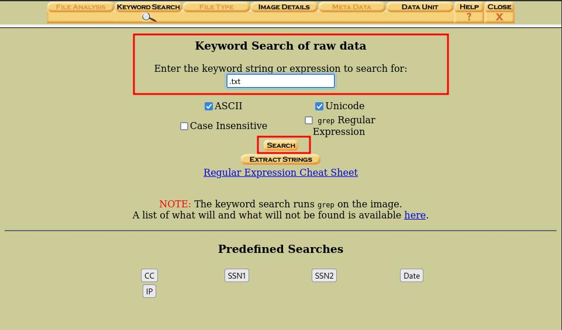

`step 16:find .txt file and search flag here flag part1`

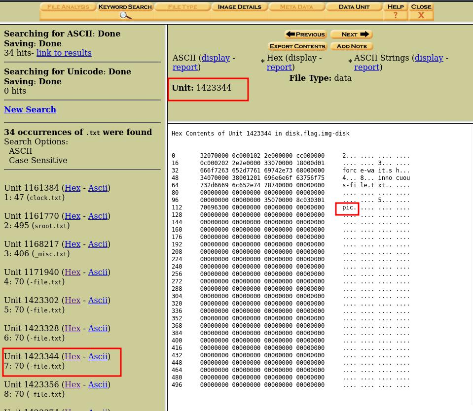

`step 17: search for other flag here flag part2`


`step 18: find the other flag part similary here is complete list and final flag after merging`

```css
Unit 1423344 
7: 70 (-file.txt) => pic

Unit 1423356  
8: 70 (-file.txt) => oCT

Unit 1423374 
9: 70 (-file.txt) => F{1

Unit 1423392  
10: 70 (-file.txt) => _53

Unit 1423410  
11: 70 (-file.txt) => 3_n

Unit 1423422  
12: 70 (-file.txt) => 4m3

Unit 1423440  
13: 70 (-file.txt) => 5_8

Unit 1423452  
14: 70 (-file.txt) => 0d2

Unit 1423470  
15: 70 (-file.txt) => 4b3

Unit 1423488  
16: 70 (-file.txt) => 0}

final flag is picoCTF{1_533_n4m35_80d24b30}
```

Note: another method is [dear\_diary\_internet](dear_diary_internet.md)
