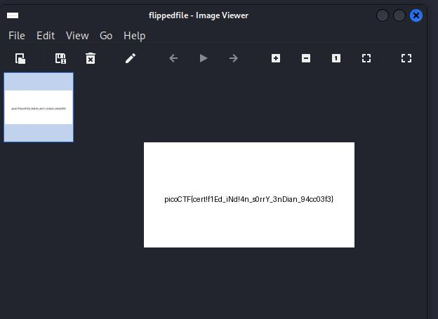

# endianness-v2

Author: Junias Bonou
#Medium #forensics #picoCTF2024 #browser_web_shell 
#### Description

Here's a file that was recovered from a 32-bits system that organized the bytes a weird way. We're not even sure what type of file it is. Download it [here](https://artifacts.picoctf.net/c_titan/114/challengefile) and see what you can get out of it

##### Solution:

using Exiftool  get information of file


the file is jpeg file 
using [haxed.it](https://hexed.it/) open the file 

**Header Bytes**


**Tailer Bytes**


import to Note Down

	JPG Header : FF D8 FF E0  
	JPG Tailer: FF D9

but file header and tailer are

	JPG Header : E0 FF D8 FF   
	JPG Tailer:  D9 FF

So every 4 bytes is flipped.
so using python code flipped every 4 bytes

```python
def flip_4_bytes(input_file, output_file):
    with open(input_file, 'rb') as f:
        data = f.read()
        
    # Create a bytearray for mutable bytes
    flipped_data = bytearray()
    
    # Iterate over the data in chunks of 4 bytes
    for i in range(0, len(data), 4):
        # Grab the 4-byte chunk
        chunk = data[i:i+4]
        # Flip the bytes and append to the result
        flipped_data.extend(chunk[::-1])
    
    # Write the flipped data to a new file
    with open(output_file, 'wb') as f:
        f.write(flipped_data)

# Usage
flip_4_bytes('challengefile', 'flippedfile')

```

after running  this code all 4 bytes flipped and flag show on image



flag is `picoCTF{cert!f1Ed_iNd!4n_s0rrY_3nDian_94cc03f3}`
