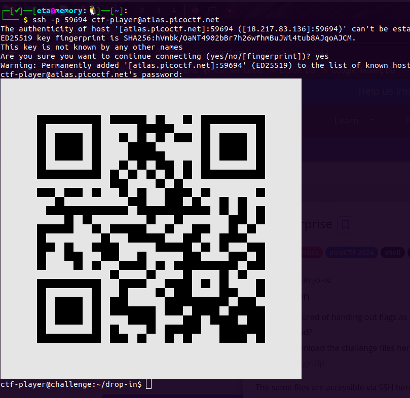

# Scan Surprise

Author: Jeffery John
#easy #forensics #picoCTF2024 #shell #browser_web_shell #qr_code
#### Description

I've gotten bored of handing out flags as text. Wouldn't it be cool if they were an image instead? You can download the challenge files here:

- [challenge.zip](https://artifacts.picoctf.net/c_atlas/2/challenge.zip)

Additional details will be available after launching your challenge instance.
The same files are accessible via SSH here: `ssh -p 59694 ctf-player@atlas.picoctf.net` Using the password `1ad5be0d`. Accept the fingerprint with `yes`, and `ls` once connected to begin. Remember, in a shell, passwords are hidden!

##### Solution: 
use this url : `https://zxing.org/w/decode.jspx`
# Decode Succeeded

|                    |                                                                                                                 |
| ------------------ | --------------------------------------------------------------------------------------------------------------- |
| Raw text           | picoCTF{p33k_@_b00_b5ce2572}                                                                                    |
| Raw bytes          | 41 c7 06 96 36 f4 35 44   67 b7 03 33 36 b5 f4 05 f6 23 03 05 f6 23 56 36   53 23 53 73 27 d0 ec 11 ec 11 |
| Barcode format     | QR_CODE                                                                                                         |
| Parsed Result Type | EMAIL_ADDRESS                                                                                                   |
| Parsed Result      | picoCTF{p33k_@_b00_b5ce2572}                                                                                    |

open google lens from android phone and scan this bar-code to get flag
