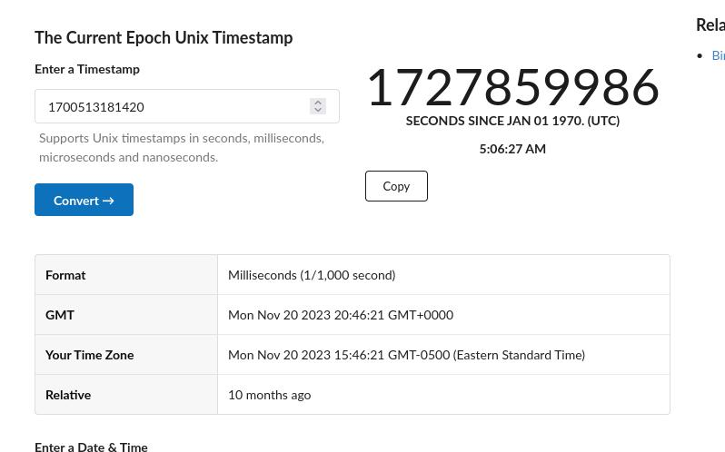
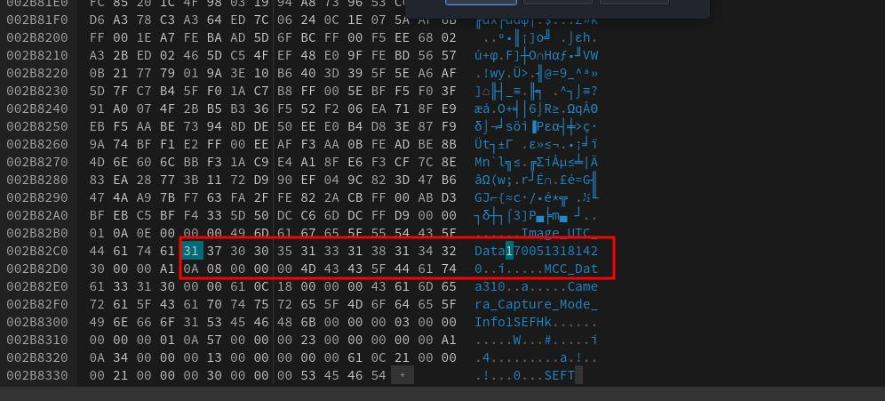
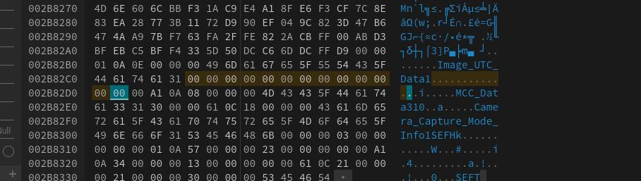

### Blast from the past

Author: syreal
#Medium #forensics #picoCTF2024 #browserwebshell #metadata
As of March 13th, the last check now accepts more formats.

#### Description

The judge for these pictures is a real fan of antiques. Can you age this photo to the specifications? Set the timestamps on this picture to `1970:01:01 00:00:00.001+00:00` with as much precision as possible for each timestamp. In this example, `+00:00` is a timezone adjustment. Any timezone is acceptable as long as the time is equivalent. As an example, this timestamp is acceptable as well: `1969:12:31 19:00:00.001-05:00`. For timestamps without a timezone adjustment, put them in GMT time (+00:00). The checker program provides the timestamp needed for each. Use this [picture](https://artifacts.picoctf.net/c_mimas/90/original.jpg).

Additional details will be available after launching your challenge instance.

Submit your modified picture here: 
`nc -w 2 mimas.picoctf.net 64678 < original_modified.jpg`
Check your modified picture here: 
`nc mimas.picoctf.net 49936

##### Solution:

```css
┌──(kali㉿kali)-[~/Downloads/pico_ctf_lab]
└─$ exiftool original.jpg        
ExifTool Version Number         : 12.76
File Name                       : original.jpg
Directory                       : .
File Size                       : 2.9 MB
File Modification Date/Time     : 2024:10:02 04:43:30-04:00
File Access Date/Time           : 2024:10:02 04:44:06-04:00
File Inode Change Date/Time     : 2024:10:02 04:43:40-04:00
File Permissions                : -rw-rw-r--
File Type                       : JPEG
File Type Extension             : jpg
MIME Type                       : image/jpeg
Exif Byte Order                 : Little-endian (Intel, II)
Image Description               : 
Make                            : samsung
Camera Model Name               : SM-A326U
Orientation                     : Rotate 90 CW
X Resolution                    : 72
Y Resolution                    : 72
Resolution Unit                 : inches
Software                        : MediaTek Camera Application
Modify Date                     : 2023:11:20 15:46:23
Y Cb Cr Positioning             : Co-sited
Exposure Time                   : 1/24
F Number                        : 1.8
Exposure Program                : Program AE
ISO                             : 500
Sensitivity Type                : Unknown
Recommended Exposure Index      : 0
Exif Version                    : 0220
Date/Time Original              : 2023:11:20 15:46:23
Create Date                     : 2023:11:20 15:46:23
Components Configuration        : Y, Cb, Cr, -
Shutter Speed Value             : 1/24
Aperture Value                  : 1.9
Brightness Value                : 3
Exposure Compensation           : 0
Max Aperture Value              : 1.8
Metering Mode                   : Center-weighted average
Light Source                    : Other
Flash                           : On, Fired
Focal Length                    : 4.6 mm
Sub Sec Time                    : 703
Sub Sec Time Original           : 703
Sub Sec Time Digitized          : 703
Flashpix Version                : 0100
Color Space                     : sRGB
Exif Image Width                : 4000
Exif Image Height               : 3000
Interoperability Index          : R98 - DCF basic file (sRGB)
Interoperability Version        : 0100
Exposure Mode                   : Auto
White Balance                   : Auto
Digital Zoom Ratio              : 1
Focal Length In 35mm Format     : 25 mm
Scene Capture Type              : Standard
Compression                     : JPEG (old-style)
Thumbnail Offset                : 1408
Thumbnail Length                : 64000
Image Width                     : 4000
Image Height                    : 3000
Encoding Process                : Baseline DCT, Huffman coding
Bits Per Sample                 : 8
Color Components                : 3
Y Cb Cr Sub Sampling            : YCbCr4:2:0 (2 2)
Time Stamp                      : 2023:11:20 15:46:21.420-05:00
MCC Data                        : United States / Guam (310)
Aperture                        : 1.8
Image Size                      : 4000x3000
Megapixels                      : 12.0
Scale Factor To 35 mm Equivalent: 5.4
Shutter Speed                   : 1/24
Create Date                     : 2023:11:20 15:46:23.703
Date/Time Original              : 2023:11:20 15:46:23.703
Modify Date                     : 2023:11:20 15:46:23.703
Thumbnail Image                 : (Binary data 64000 bytes, use -b option to extract)
Circle Of Confusion             : 0.006 mm
Field Of View                   : 71.5 deg
Focal Length                    : 4.6 mm (35 mm equivalent: 25.0 mm)
Hyperfocal Distance             : 2.13 m
Light Value                     : 4.0
```

or

```css
┌──(kali㉿kali)-[~/Downloads/pico_ctf_lab]
└─$ exiftool -time:all -G1 -a -s original.jpg
[System]        FileModifyDate                  : 2024:10:02 04:43:30-04:00
[System]        FileAccessDate                  : 2024:10:02 04:43:40-04:00
[System]        FileInodeChangeDate             : 2024:10:02 04:43:40-04:00
[IFD0]          ModifyDate                      : 2023:11:20 15:46:23
[ExifIFD]       DateTimeOriginal                : 2023:11:20 15:46:23
[ExifIFD]       CreateDate                      : 2023:11:20 15:46:23
[ExifIFD]       SubSecTime                      : 703
[ExifIFD]       SubSecTimeOriginal              : 703
[ExifIFD]       SubSecTimeDigitized             : 703
[Samsung]       TimeStamp                       : 2023:11:20 15:46:21.420-05:00
[Composite]     SubSecCreateDate                : 2023:11:20 15:46:23.703
[Composite]     SubSecDateTimeOriginal          : 2023:11:20 15:46:23.703
[Composite]     SubSecModifyDate                : 2023:11:20 15:46:23.703
```

According to rule `Set the timestamps on this picture to 1970:01:01 00:00:00.001+00:00 with as`

```css
┌──(kali㉿kali)-[~/Downloads/pico_ctf_lab]
└─$ exiftool -AllDates="1970:01:01 00:00:00.001" original.jpg
    1 image files updated

┌──(kali㉿kali)-[~/Downloads/pico_ctf_lab]
└─$ exiftool -time:all -G1 -a -s original.jpg                
[System]        FileModifyDate                  : 2024:10:02 04:48:32-04:00
[System]        FileAccessDate                  : 2024:10:02 04:48:33-04:00
[System]        FileInodeChangeDate             : 2024:10:02 04:48:32-04:00
[IFD0]          ModifyDate                      : 1970:01:01 00:00:00
[ExifIFD]       DateTimeOriginal                : 1970:01:01 00:00:00
[ExifIFD]       CreateDate                      : 1970:01:01 00:00:00
[ExifIFD]       SubSecTime                      : 703
[ExifIFD]       SubSecTimeOriginal              : 703
[ExifIFD]       SubSecTimeDigitized             : 703
[Samsung]       TimeStamp                       : 2023:11:20 15:46:21.420-05:00
[Composite]     SubSecCreateDate                : 1970:01:01 00:00:00.703
[Composite]     SubSecDateTimeOriginal          : 1970:01:01 00:00:00.703
[Composite]     SubSecModifyDate                : 1970:01:01 00:00:00.703

```

```css

┌──(kali㉿kali)-[~/Downloads/pico_ctf_lab]
└─$ exiftool -SubSecModifyDate="1970:01:01 00:00:00.001" -SubSecDateTimeOriginal="1970:01:01 00:00:00.001" -SubSecCreateDate="1970:01:01 00:00:00.001" original.jpg
    1 image files updated

┌──(kali㉿kali)-[~/Downloads/pico_ctf_lab]
└─$ exiftool -time:all -G1 -a -s original.jpg                                                                                                                      
[System]        FileModifyDate                  : 2024:10:02 04:52:36-04:00
[System]        FileAccessDate                  : 2024:10:02 04:52:36-04:00
[System]        FileInodeChangeDate             : 2024:10:02 04:52:36-04:00
[IFD0]          ModifyDate                      : 1970:01:01 00:00:00
[ExifIFD]       DateTimeOriginal                : 1970:01:01 00:00:00
[ExifIFD]       CreateDate                      : 1970:01:01 00:00:00
[ExifIFD]       SubSecTime                      : 001
[ExifIFD]       SubSecTimeOriginal              : 001
[ExifIFD]       SubSecTimeDigitized             : 001
[Samsung]       TimeStamp                       : 2023:11:20 15:46:21.420-05:00
[Composite]     SubSecCreateDate                : 1970:01:01 00:00:00.001
[Composite]     SubSecDateTimeOriginal          : 1970:01:01 00:00:00.001
[Composite]     SubSecModifyDate                : 1970:01:01 00:00:00.001
     

```

Note : [Samsung]       TimeStamp                       : 2023:11:20 15:46:21.420-05:00 this is right protected you can't change
now lets test on server it work or not

for uploading
`nc -w 2 mimas.picoctf.net 63213 < original.jpg `
```css
┌──(kali㉿kali)-[~/Downloads/pico_ctf_lab]
└─$nc -w 2 mimas.picoctf.net 63213 < original.jpg         
```

and for verify  `nc mimas.picoctf.net 64092`
```css
  
┌──(kali㉿kali)-[~/Downloads/pico_ctf_lab]
└─$ nc mimas.picoctf.net 64092
MD5 of your picture:
eb5ae92ce9f801b9d1aa8e4c800e9705  test.out

Checking tag 1/7
Looking at IFD0: ModifyDate
Looking for '1970:01:01 00:00:00'
Found: 1970:01:01 00:00:00
Great job, you got that one!

Checking tag 2/7
Looking at ExifIFD: DateTimeOriginal
Looking for '1970:01:01 00:00:00'
Found: 1970:01:01 00:00:00
Great job, you got that one!

Checking tag 3/7
Looking at ExifIFD: CreateDate
Looking for '1970:01:01 00:00:00'
Found: 1970:01:01 00:00:00
Great job, you got that one!

Checking tag 4/7
Looking at Composite: SubSecCreateDate
Looking for '1970:01:01 00:00:00.001'
Found: 1970:01:01 00:00:00.001
Great job, you got that one!

Checking tag 5/7
Looking at Composite: SubSecDateTimeOriginal
Looking for '1970:01:01 00:00:00.001'
Found: 1970:01:01 00:00:00.001
Great job, you got that one!

Checking tag 6/7
Looking at Composite: SubSecModifyDate
Looking for '1970:01:01 00:00:00.001'
Found: 1970:01:01 00:00:00.001
Great job, you got that one!

Checking tag 7/7
Timezones do not have to match, as long as it's the equivalent time.
Looking at Samsung: TimeStamp
Looking for '1970:01:01 00:00:00.001+00:00'
Found: 2023:11:20 20:46:21.420+00:00
Oops! That tag isn't right. Please try again.

```

Timezones do not have to match, as long as it's the equivalent time.
Looking at Samsung: TimeStamp
now to fix this we need to change the Timestamp
using String command and hexeditor it would be achieved

```css
┌──(kali㉿kali)-[~/Downloads/pico_ctf_lab]
└─$ strings original.jpg

you will get lot of text but we are intrested in
Image_UTC_Data1700513181420
```

this [website](https://www.unixtimestamp.com/) is useful


same as `[Samsung]       TimeStamp                       : 2023:11:20 15:46:21.420-05:00`

now use hexeditor to fix this to edit original.jpg



modify data



after editing in hexeditor save (ctrl + s) it will save as original(1).jpg  which is look like original\(1\).jpg 

```css
┌──(kali㉿kali)-[~/Downloads]
└─$ exiftool -time:all -G1 -a -s original\(1\).jpg 
[System]        FileModifyDate                  : 2024:10:02 06:44:17-04:00
[System]        FileAccessDate                  : 2024:10:02 06:44:17-04:00
[System]        FileInodeChangeDate             : 2024:10:02 06:44:18-04:00
[IFD0]          ModifyDate                      : 1970:01:01 00:00:00
[ExifIFD]       DateTimeOriginal                : 1970:01:01 00:00:00
[ExifIFD]       CreateDate                      : 1970:01:01 00:00:00
[ExifIFD]       SubSecTime                      : 001
[ExifIFD]       SubSecTimeOriginal              : 001
[ExifIFD]       SubSecTimeDigitized             : 001
[Samsung]       TimeStamp                       : 1969:12:31 19:00:00.001-05:00
[Composite]     SubSecCreateDate                : 1970:01:01 00:00:00.001
[Composite]     SubSecDateTimeOriginal          : 1970:01:01 00:00:00.001
[Composite]     SubSecModifyDate                : 1970:01:01 00:00:00.001

```

```css
┌──(kali㉿kali)-[~/Downloads]
└─$ nc -w 2 mimas.picoctf.net 64678 < original\(1\).jpg 

┌──(kali㉿kali)-[~/Downloads]
└─$ nc mimas.picoctf.net 49936
MD5 of your picture:
5ad8a6e01e19d24121349d3012eac471  test.out

Checking tag 1/7
Looking at IFD0: ModifyDate
Looking for '1970:01:01 00:00:00'
Found: 1970:01:01 00:00:00
Great job, you got that one!

Checking tag 2/7
Looking at ExifIFD: DateTimeOriginal
Looking for '1970:01:01 00:00:00'
Found: 1970:01:01 00:00:00
Great job, you got that one!

Checking tag 3/7
Looking at ExifIFD: CreateDate
Looking for '1970:01:01 00:00:00'
Found: 1970:01:01 00:00:00
Great job, you got that one!

Checking tag 4/7
Looking at Composite: SubSecCreateDate
Looking for '1970:01:01 00:00:00.001'
Found: 1970:01:01 00:00:00.001
Great job, you got that one!

Checking tag 5/7
Looking at Composite: SubSecDateTimeOriginal
Looking for '1970:01:01 00:00:00.001'
Found: 1970:01:01 00:00:00.001
Great job, you got that one!

Checking tag 6/7
Looking at Composite: SubSecModifyDate
Looking for '1970:01:01 00:00:00.001'
Found: 1970:01:01 00:00:00.001
Great job, you got that one!

Checking tag 7/7
Timezones do not have to match, as long as it's the equivalent time.
Looking at Samsung: TimeStamp
Looking for '1970:01:01 00:00:00.001+00:00'
Found: 1970:01:01 00:00:00.001+00:00
Great job, you got that one!

You did it!
picoCTF{71m3_7r4v311ng_p1c7ur3_83ecb41c}

```