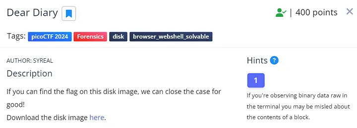
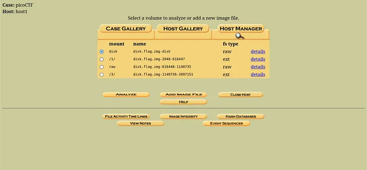
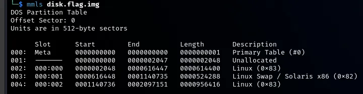
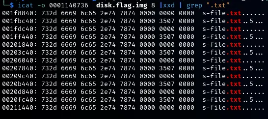
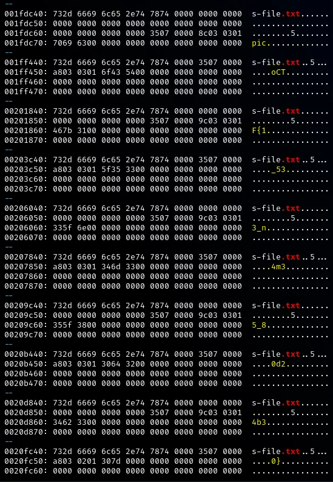

# Dear Diary


**Dear Diary challenge** (Source: picoCTF.org)

In this challenge, the picoCTF team has saved the best for last. By “_best_” we mean not necessarily the most difficult, but rather the most interesting in terms of forensics: _Disk Forensics_.

You have been provided with a disk image which you first need to decompress (GZ format) and then analyze to find the flag within the files of the disk image.

With the challenge task hinting at “_closing the case for good_” we deduce that they are leading us down the path of using **Autopsy** on Linux, creating a new forensics case and analyzing the disk before closing the case.

Indeed many players went down that route and it was a straightforward task. Create a case, attach the image, and use the search function. Done!




Autopsy on Linux

For some players, the hardest part about that solution was getting Autopsy up and running on their Linux machines. I’m not sure what hurdles they faced but I had autopsy running just fine on my Kali 2024 virtual machine.

> However, we don’t want our final challenge to be that easy, do we? We won’t learn new and exciting things if we choose the quickest and easiest path always!

Let’s do it the old-skool way on the Linux console, the _Maverick_ way!

We begin by extracting the image first.

```css
gunzip disk.flag.img.gz
```

To glean more information about this image, we can start with file analysis.

```css
$ file disk.flag.img   
```
  
disk.flag.img: DOS/MBR boot sector; partition 1 : ID=0x83, active, start-CHS (0x0,32,33), end-CHS (0x26,94,56), startsector 2048, 614400 sectors; partition 2 : ID=0x82, start-CHS (0x26,94,57), end-CHS (0x47,1,58), startsector 616448, 524288 sectors; partition 3 : ID=0x83, start-CHS (0x47,1,59), end-CHS (0x82,138,8), startsector 1140736, 956416 sectors

The output of the `file` the command provides information about the disk image's partitions. Let's break down the output:

**Partition 1:**

- ID=0x83: **Linux partition**
- Active: This indicates that it’s the active partition.
- Start sector: 2048
- Number of sectors: 614400

**Partition 2:**

- ID=0x82: **Linux swap** **partition**
- Start sector: 616448
- Number of sectors: 524288

**Partition 3:**

- ID=0x83: **Linux partition**
- Start sector: 1140736
- Number of sectors: 956416

So we have two Linux partitions we can focus on. We’ll ignore the “_swap_” partition as it is a virtual memory partition.

> **Swap partition** is a dedicated portion of a hard drive or SSD used by the operating system as virtual memory, enabling it to temporarily store and retrieve data when physical RAM is full.

Let’s continue with some more analysis before we mount the image and inspect its contents. Below are some example commands you can use for your disk image analysis.

- `**mmls**`: is a tool that is part of The Sleuth Kit, commonly used for analyzing disk images and partition tables. Specifically, _mmls_ is used to display the layout of partitions within a disk image or physical disk.

Display the layout of partitions within a disk image:

```css
mmls disk.flag.img
```

!

The **mmls** command displays the layout of partitions within the disk image

Next, we would like to have a directory listing of Partitions 1 and 3. Remember that Partition 1’s start sector is 2048 and Partition 3’s start sector is 1140736. We’ll be using these values going forward as the “_offset_” value.

- `**fls**`: a command-line tool used in digital forensics for listing files and directories within a file system. It is part of The Sleuth Kit (TSK) suite.
- `**-o <offset>**`: specifies the starting offset within a disk image or a physical disk where the analysis should begin.

Directory listing for **Partition 1:**
```css
$ fls -o 2048  disk.flag.img   
  
d/d 11: lost+found  
r/r 13: ldlinux.sys  
r/r 14: ldlinux.c32  
r/r 16: config-virt  
r/r 17: vmlinuz-virt  
r/r 18: initramfs-virt  
l/l 19: boot  
r/r 21: libutil.c32  
r/r 20: extlinux.conf  
r/r 22: libcom32.c32  
r/r 23: mboot.c32  
r/r 24: menu.c32  
r/r 15: System.map-virt  
r/r 25: vesamenu.c32  
V/V 76913:      $OrphanFiles
```

Directory listing for **Partition 3**:

```css
$ fls -o 0001140736  disk.flag.img  
d/d 32513:      home  
d/d 11: lost+found  
d/d 32385:      boot  
d/d 64769:      etc  
d/d 32386:      proc  
d/d 13: dev  
d/d 32387:      tmp  
d/d 14: lib  
d/d 32388:      var  
d/d 21: usr  
d/d 32393:      bin  
d/d 32395:      sbin  
d/d 32539:      media  
d/d 203:        mnt  
d/d 32543:      opt  
d/d 204:        root  
d/d 32544:      run  
d/d 205:        srv  
d/d 32545:      sys  
d/d 32530:      swap  
V/V 119417:     $OrphanFiles
```

> Remember that `**-o**`is used for the offset or start sector of a partition. To specify certain files or directories, you have to use the inode numbers. In the output above, we are interested in examining the **/root** folder with the **inode** number `**204**`.

With our current information, **Partition 3** seems like the more interesting choice. Let’s continue listing the directory listing.

```css
$ fls -o 0001140736 disk.flag.img 204  
r/r 1837:       .ash_history  
d/d 1842:       secret-secrets   
```                                                                                                                                                                                            

The **/root** folder has an interesting sub-folder named “**secret-secrets**”. Let’s explore that one further by using its offset of 1842.

```css
$ fls -o 0001140736 disk.flag.img 1842  
r/r 1843:       force-wait.sh  
r/r 1844:       innocuous-file.txt  
r/r 1845:       its-all-in-the-name
```
We have some interesting files under the**/root/secret-secrets** directory.

- innocuous-file.txt
- its-all-in-the-name

> **Disclaimer**: Alongside **The Sleuth Kit (TSK)**, I have used several other tools to verify my findings and also learn how to solve the problem in different ways. These tools include the **Forensic Toolkit (FTK)**, **Autopsy and Foremost**.  
> I recommend exploring them to see what works best for you.

Let’s explore them more.

icat -o 0001140736  disk.flag.img 8 | strings 

Let’s break this command down.

- `icat`: extract the content of a specific block or sector from a disk image.
- `-o 0001140726`: specifies the offer sectors within the disk image. In other words, the starting point from which _icat_ will extract data.
- `8`: the number of sectors to extract starting from the specified offset..
- `| strings`: pipe to _strings_ which will extract printable strings.

The command above will extract the content of 8 sectors from the disk image, starting from the specified offset, and then filter out and display any printable strings present in that extracted data.

> **How did we arrive at 8 sectors?** The choice to analyze 8 sectors stems from the disk image’s 512-byte sector size, enabling efficient examination while capturing initial file system structures. This approach provides a manageable sample size for exploration, aligning with common practices in disk forensics and analysis.

Time to do a bit more digging. I have used several keywords to search the output such as “_.txt_”, “_flag_” and “_file_”. We’ll potentially discover more interesting files.

```css
$ icat -o 0001140736  disk.flag.img 8 | strings | sort | uniq | grep "file"  
  
base.files  
bootchart.files  
btrfs.files  
cachefiles  
cachefiles.ko.gz  
cryptkey.files  
cryptsetup.files  
dhcp.files  
ewaitfile  
filelayout  
flexfilelayout  
https.files  
innocuous-file.txt  
keymap.files  
lvm.files  
nbd.files  
network.files  
nfs_layout_flexfiles.ko.gz  
nfs_layout_nfsv41_files.ko.gz  
original-filename  
profile  
profile.d  
raid.files  
wireguard.files  
xfs.files  
zfs.files
```

The entry “**original-filename**” stood out for me as well as the original “**innocuous-file.txt”** we found earlier. Let’s view the contents in Hex.

```css
icat -o 0001140736  disk.flag.img 8 |xxd | grep ".txt"
```



Hex view of Partition 3’s contents

Using **_icat_**, we read data from sector 8 of partition 3 in the disk image starting from the offset _0001140736_, then converted the output to hexadecimal format using **_xxd_**, and finally searched for lines containing “_.txt_” using **_grep_**.

After some more experimentation, we have expanded our **_grep_** search to display 3 lines (`**-A3** )`of context after each match.

```css
icat -o 0001140736  disk.flag.img 8 |xxd |grep ".txt" -A3
```



The fragmented flag is now visible to us

As you glance through the results, you’ll spot fragments of the flag emerging (highlighted in yellow). Piece them together to reveal the full flag.

As mentioned earlier, this task could be completed more swiftly and effortlessly with tools like Autopsy and FTK. However, we opted for the challenging, I mean, educational route to explore additional tools along the way!

Before we conclude, here’s a roundup of all the handy tools for investigations like this one. Take note of them and consider exploring them further, as they might prove useful in future challenges.

- **file**: A command-line tool used to determine the file type of a specified file or files.
- **mmls**: A command-line tool used to display the layout of partitions within a disk image.
- **blkls**: A command-line tool used to list file system data units (e.g., blocks) within a disk image.
- **fls**: A command-line tool used to list files and directories within a file system.
- **fstat**: A command-line tool used to display file system metadata information.
- **istat**: A command-line tool used to display metadata information for a specific inode.
- **ils**: A command-line tool used to list information about allocated and deleted files within a file system.
- **The Sleuth Kit (TSK)**: A collection of command-line digital forensic tools for analyzing disk images and file systems.
- **Forensic Toolkit (FTK)**: A digital forensics software application for collecting, analyzing, and presenting digital evidence.
- **Autopsy**: An open-source digital forensic platform for analyzing disk images and investigating digital incidents.
- **Foremost**: A command-line tool for file carving, used to extract files from disk images and data streams based on file headers and footers.

> **Flag**: picoCTF{1_533_n4m35_80d24b30}


