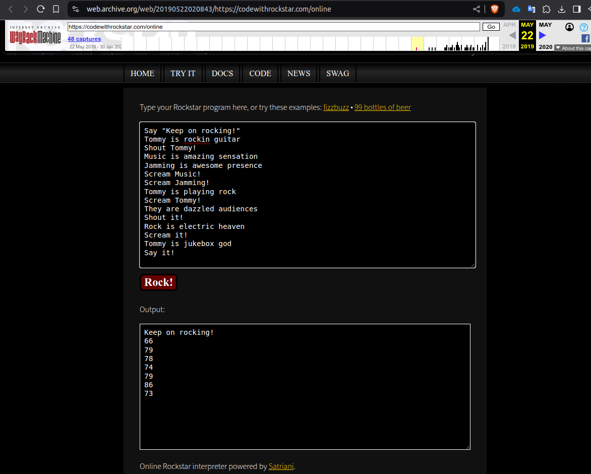
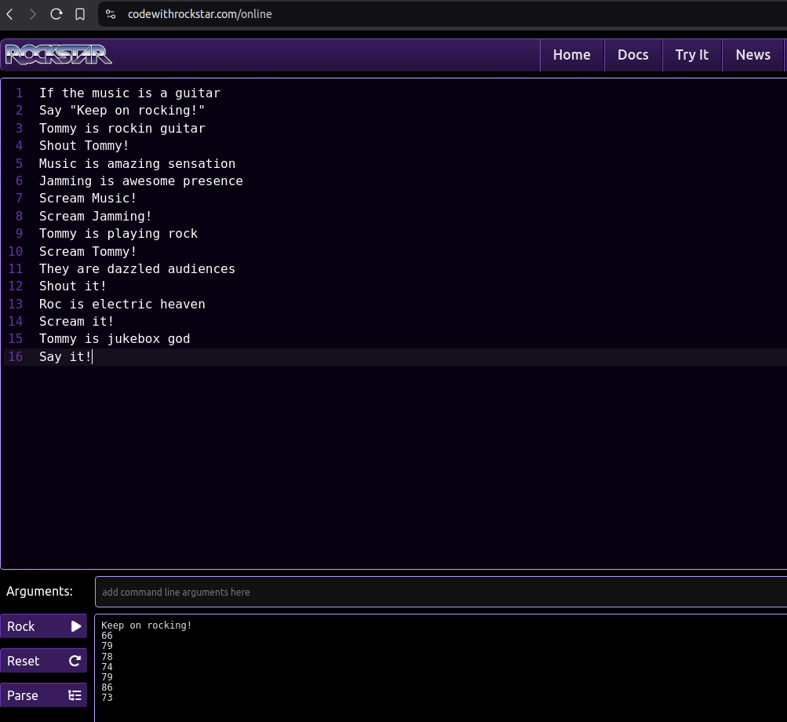

### 1_wanna_b3_a_r0ck5tar

#Medium #General-skills #picoCTF2019 
Author: Alex Bushkin

The Rockstar language has changed since this problem was released! Use this Wayback Machine URL to use an older version of Rockstar, [here](https://web.archive.org/web/20190522020843/https://codewithrockstar.com/online).

#### Description

I wrote you another [song](https://jupiter.challenges.picoctf.org/static/62f0cc3605aaf108a4f743b5b7f0dac4/lyrics.txt). Put the flag in the picoCTF{} flag format

##### Solution:

song lyrics is 

```css
Rocknroll is right              
Silence is wrong                
A guitar is a six-string        
Tommy's been down               
Music is a billboard-burning razzmatazz!
Listen to the music             
If the music is a guitar                  
Say "Keep on rocking!"                
Listen to the rhythm
If the rhythm without Music is nothing
Tommy is rockin guitar
Shout Tommy!                    
Music is amazing sensation 
Jamming is awesome presence
Scream Music!                   
Scream Jamming!                 
Tommy is playing rock           
Scream Tommy!       
They are dazzled audiences                  
Shout it!
Rock is electric heaven                     
Scream it!
Tommy is jukebox god            
Say it!                                     
Break it down
Shout "Bring on the rock!"
Else Whisper "That ain't it, Chief"                 
Break it down 
```

```css
Tommy is rockin guitar
Shout Tommy!
Music is amazing sensation 
Jamming is awesome presence
Scream Music!                   
Scream Jamming!
Tommy is playing rock           
Scream Tommy!       
They are dazzled audiences                  
Shout it!
Rock is electric heaven                     
Scream it!
Tommy is jukebox god            
Say it!                                     
```

put this lyrics into [wayback machine](https://web.archive.org/web/20190522020843/https://codewithrockstar.com/online)

```css
66
79
78
74
79
86
73
```



```css
┌─[✔]──[alpha@speed:🍑]──[~]:
└──╼ $ python3
Python 3.10.12 (main, Jan 17 2025, 14:35:34) [GCC 11.4.0] on linux
Type "help", "copyright", "credits" or "license" for more information.
>>> ascii = """66
... 79
... 78
... 74
... 79
... 86
... 73"""
>>> for c in ascii.split():
...     print(chr(int(c)), end='')
... 
BONJOVI>>> 

```

`Rock is electric heaven ` change to `Tommy is electric heaven` i don't know they have problem with `Rock`word change `Rock` to any word it will work fine in current [website](https://codewithrockstar.com/online) no need to use wayback machine 


```css
If the music is a guitar                  
Say "Keep on rocking!"   
Tommy is rockin guitar
Shout Tommy!
Music is amazing sensation 
Jamming is awesome presence
Scream Music!                   
Scream Jamming!
Tommy is playing rock           
Scream Tommy!       
They are dazzled audiences                  
Shout it!                                 
Tommy is electric heaven                     
Scream it!
Tommy is jukebox god            
Say it!
```

```css
Keep on rocking! 
66 
79 
78 
74 
79 
86 
73
```

