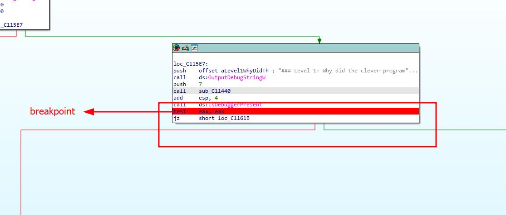
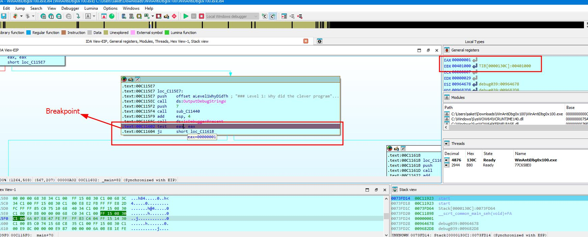
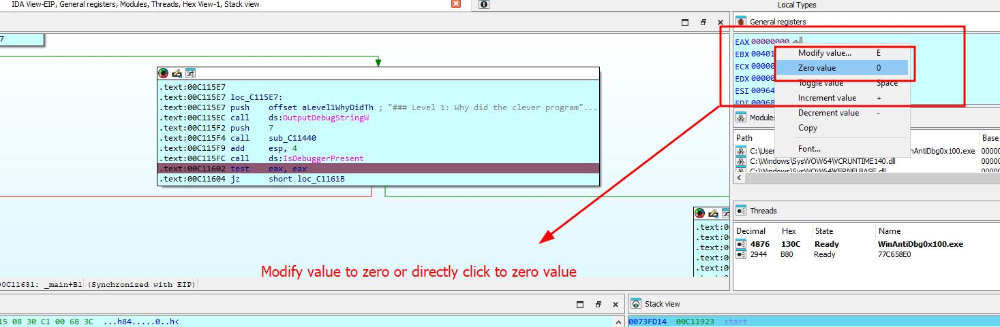
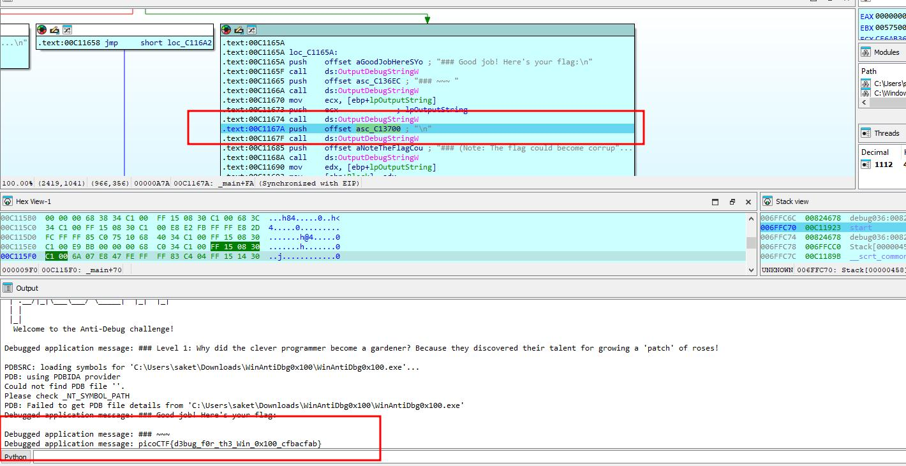

### WinAntiDbg0x100

Author: Nandan Desai
#Medium #Reverse_Engineering #picoCTF2024 #windows
#### Description

This challenge will introduce you to 'Anti-Debugging.' Malware developers don't like it when you attempt to debug their executable files because debugging these files reveals many of their secrets! That's why, they include a lot of code logic specifically designed to interfere with your debugging process. Now that you've understood the context, go ahead and debug this Windows executable! This challenge binary file is a Windows console application and you can start with running it using `cmd` on Windows. Challenge can be downloaded [here](https://artifacts.picoctf.net/c_titan/55/WinAntiDbg0x100.zip). Unzip the archive with the password `picoctf`

##### Solution:
Use debugger to solve this challenge , here i am using IDA 
select main from function and add a breakpoint click on  test where jz(jump if zero) set as breakpoint and debug program

as you see the  eax value is not zero so we don't able to get flag to get flag set eax value to zero

modify eax value and set it to zero 

and use function key + f8  to step over the instruction after pressing multiple time fn+f8 key you will get flag

flag is `picoCTF{d3bug_f0r_th3_Win_0x100_cfbacfab}`
