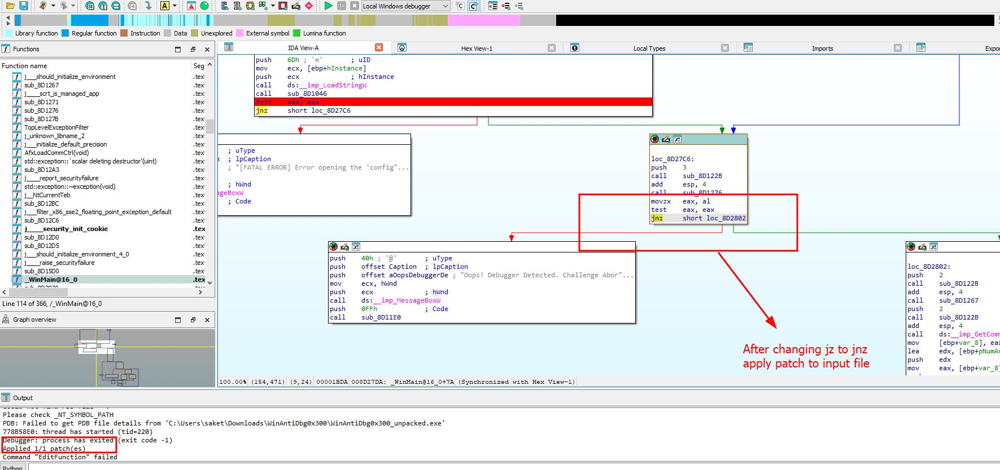

### WinAntiDbg0x300

Author: Nandan Desai
#Medium #Reverse_Engineering #picoCTF2024 #windows
#### Description

This challenge is a little bit invasive. It will try to fight your debugger. With that in mind, debug the binary and get the flag! This challenge executable is a GUI application and it requires admin privileges. And remember, the flag might get corrupted if you mess up the process's state. Challenge can be downloaded [here](https://artifacts.picoctf.net/c_titan/121/WinAntiDbg0x300.zip). Unzip the archive with the password `picoctf` If you get "VCRUNTIME140D.dll" and "ucrtbased.dll" missing error, then that means the Universal C Runtime library and Visual C++ Debug library are not installed on your Windows machine. The quickest way to fix this is:

- Download Visual Studio Community installer from https://visualstudio.microsoft.com/vs/community/
- After the installer starts, first select 'Desktop development with C++' and then, in the right side column, select 'MSVC v143 - VS 2022 C++ x64/x86 build tools' and 'Windows 11 SDK' packages.

This will take ~30 mins to install any missing DLLs.

##### Solution:
Use debugger to solve this challenge , here i am using IDA 
when you will add `exe` file to IDA it give Warning message IAT is located outside of memory range

once you click on ok you will notice this exe fie is UPX packed
 
 to unpacked used UPX tool 
 command to unpacked file `upx.exe -d file.exe -o file_unpaked.exe` 
 or simply `upx.exe -d file.exe`
 these command will unpacked the file
 
 after unpacking load exe file to IDA 
 we have two important function Winmain@16 and startAddress_0
 here screenshot of function Winmain@16 
 
 Here screenshot of StartAddress_0
 
 
 now click on startAddress_0 and add breakpoint and start debug
 
 once you run you will see a pop message `Oops! Debugger Detected`
 
 from main function `Oops! Debugger Detected` this message  printed 
 to fix this add breakpoint and start debugging
 `.text:008D27DA                 jz     short loc_8D2802` this location is responsible for message printed `Oops! Debugger Detected`
 to fix this just change jz to jnz
 
 after changing from jz to jnz apply patch and save the file input
 
Now again go to startAddress_0 and add breakpoint and start debugging
 `.text:00A837C7                 jz     short loc_A83E0` this location will give error change jz to jnz
 
 after changing jz to jnz program is ready to print flag
 here the screenshot how flag will print
 
 once you reached the location flag will appear as pop up to copy flag continue debug to print flag on output terminal of IDA
 
 here flag is printed in output of the  IDA terminal
 
 flag is `picoCTF{Wind0ws_antid3bg_0x300_daad7155}`
 