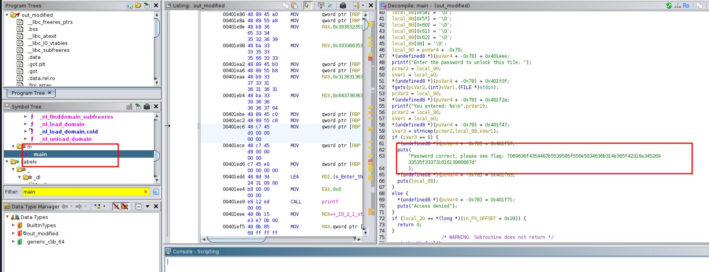
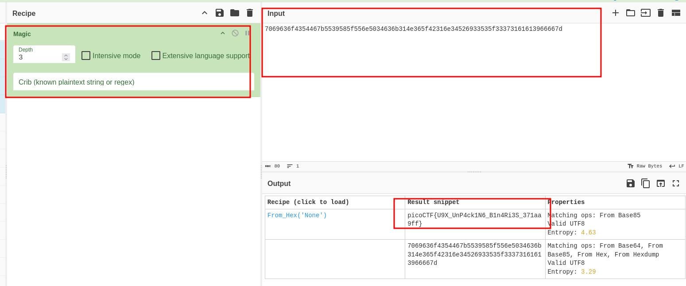

### packer

Author: Mubarak Mikail
#Medium #Reverse_Engineering #picoCTF2024 #browser_web_shell 
#### Description

Reverse this linux executable? [binary](https://artifacts.picoctf.net/c_titan/21/out)


##### Solution:
Run strings command you see file is UPX type

```css
┌──(kali㉿kali)-[~/Downloads]
└─$ strings out
...
....
UPX!
UPX!
```

UPX is an advanced executable file compressor. UPX will typically reduce the file size of programs and DLLs by around 50%-70%, thus reducing disk space, network load times, download times and other distribution and storage costs

to decompress UPX file 

```css
┌──(kali㉿kali)-[~/Downloads]
└─$ upx -d out -o out_modified
                       Ultimate Packer for eXecutables
                          Copyright (C) 1996 - 2024
UPX 4.2.4       Markus Oberhumer, Laszlo Molnar & John Reiser    May 9th 2024

        File size         Ratio      Format      Name
   --------------------   ------   -----------   -----------
[WARNING] bad b_info at 0x4b718

[WARNING] ... recovery at 0x4b714

    877724 <-    336520   38.34%   linux/amd64   out_modified

Unpacked 1 file.

```

now use ghidra/ida reverse engineering tool to debug file

[
go to main section of function you will see de-compile main code and you will get flag which is in hex format

```css
Password correct, please see flag: 7069636f4354467b5539585f556e5034636b314e365f42316e34526933535f33373161613966667d
```

```css
┌──(kali㉿kali)-[~/Downloads]
└─$ echo "7069636f4354467b5539585f556e5034636b314e365f42316e34526933535f33373161613966667d" | xxd -r -p

picoCTF{U9X_UnP4ck1N6_B1n4Ri3S_371aa9ff}                                                                                                                                                                                                                                        
```

using python

```css

┌──(kali㉿kali)-[~/Downloads]
└─$ python3 -c 'print(bytes.fromhex("7069636f4354467b5539585f556e5034636b314e365f42316e34526933535f33373161613966667d").decode("utf-8"))'

picoCTF{U9X_UnP4ck1N6_B1n4Ri3S_371aa9ff}

```

or use cyberchef online tool to decode the hex file




