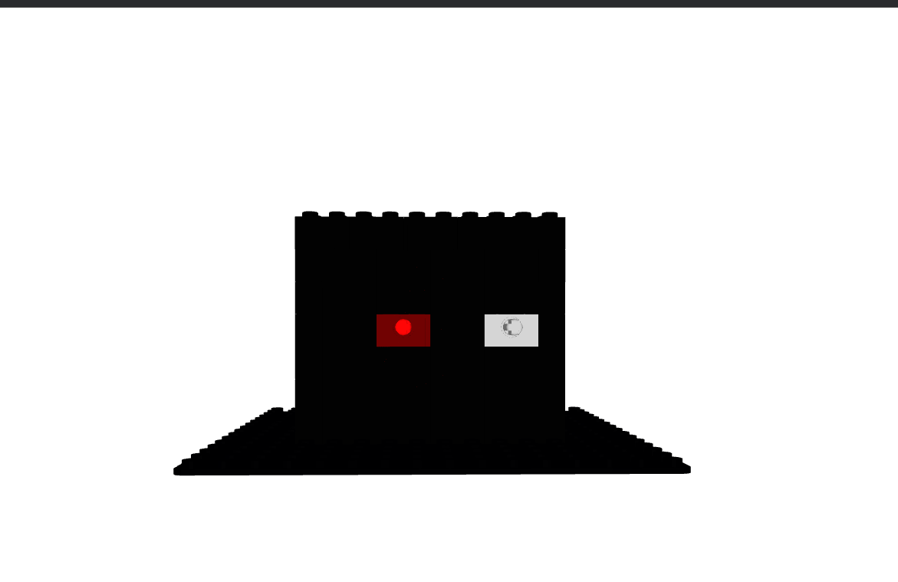
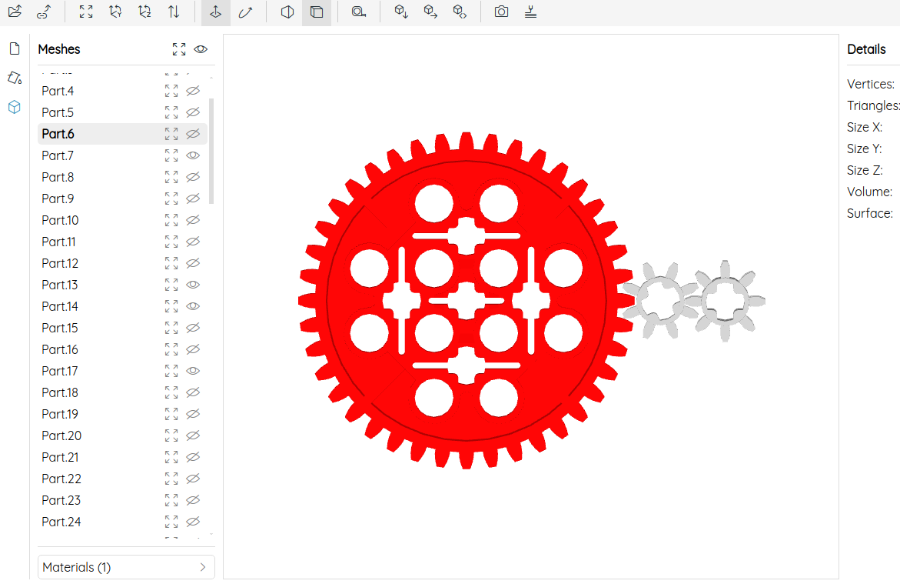

### Virtual Machine 0

#Medium #Reverse_Engineering #picoCTF #2023 #Analog

Author: LT 'syreal' Jones

#### Description

Can you crack this black box?We grabbed this design doc from enemy servers: [Download](https://artifacts.picoctf.net/c/359/Virtual-Machine-0.zip). We know that the rotation of the red axle is input and the rotation of the blue axle is output. The following input gives the flag as output: [Download](https://artifacts.picoctf.net/c/359/input.txt).

##### Solution:
Unzipping `Virtual-Machine-0.zip`, gives us `Virtual-Machine-0.dae`. We can open a [COLLADA](https://en.wikipedia.org/wiki/COLLADA) file using [online Tool](https://3dviewer.net/). 



Using the tools , we can dismantle the items around to reveal the two `red` and `gray` gear.



Since for giving input we had to rotate the axle, and since there are 40 teeths on red gear and 8 teeths on grey gear, in one rotation of the red axle, the blue gear would rotate by 5 times. That meant, the given input had to be multiplied by 5
we have input file.txt

```css
39722847074734820757600524178581224432297292490103995912415595360101562905
```
 
 to achieve the flag we need few steps to follow
 using python we can solve easily
```python
>>> x=39722847074734820757600524178581224432297292490103995912415595360101562905
>>> x*5
198614235373674103788002620892906122161486462450519979562077976800507814525
>>> print(hex(198614235373674103788002620892906122161486462450519979562077976800507814525))
0x7069636f4354467b67333472355f30665f6d3072335f34346166313565627d
>>> print(bytes.fromhex("7069636f4354467b67333472355f30665f6d3072335f34346166313565627d").decode('utf-8'))
picoCTF{g34r5_0f_m0r3_44af15eb}
>>> 
```

or

```python
x = 39722847074734820757600524178581224432297292490103995916782275668358702105
x = x * 5
hex_x = hex(x)
flag = bytes.fromhex(hex_x[2:]).decode('ascii')
print(flag)
```

```css
┌─[✔]──[alpha@speed:🍇]──[~/Videos]:
└──╼ $ python3 test.py 
picoCTF{g34r5_0f_m0r3_5ca97824}
```