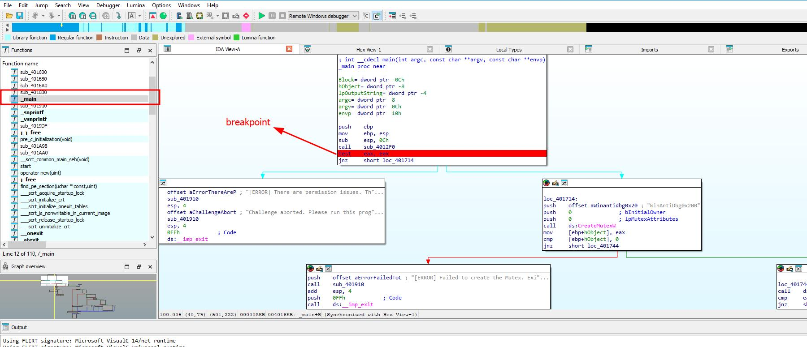
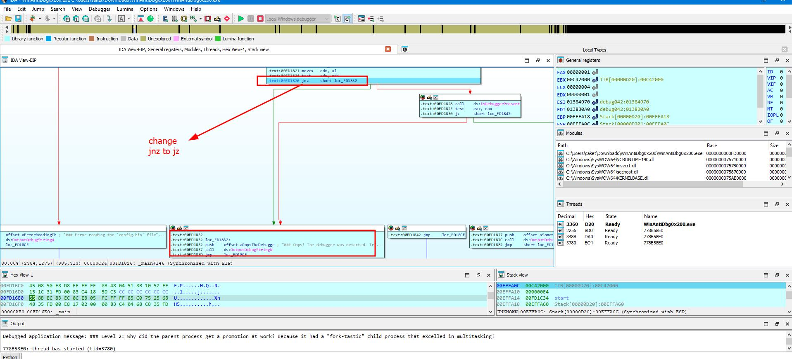
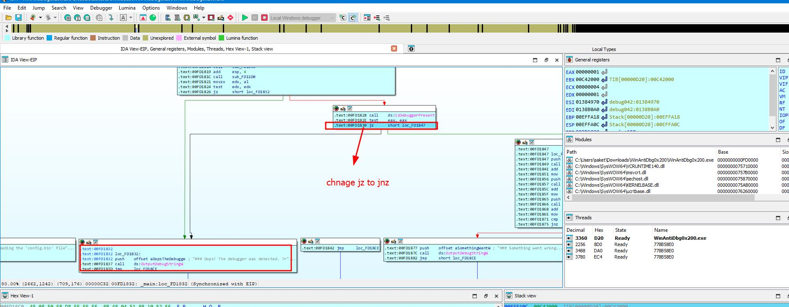
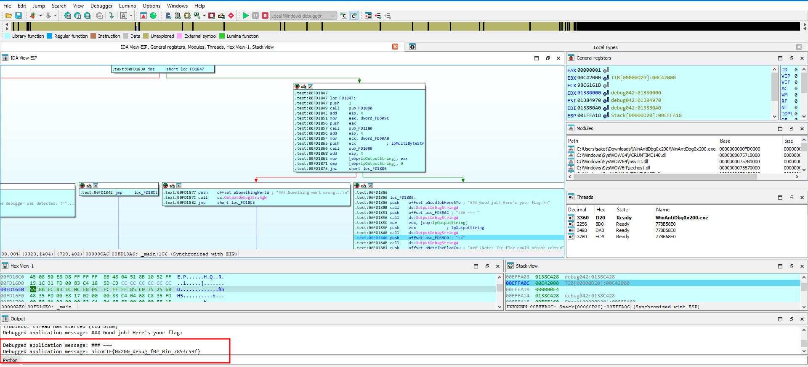

### WinAntiDbg0x200

Author: Nandan Desai
#Medium #Reverse_Engineering #picoCTF2024 #windows
#### Description

If you have solved WinAntiDbg0x100, you'll discover something new in this one. Debug the executable and find the flag! This challenge executable is a Windows console application, and you can start by running it using Command Prompt on Windows. This executable requires admin privileges. You might want to start Command Prompt or your debugger using the 'Run as administrator' option. Challenge can be downloaded [here](https://artifacts.picoctf.net/c_titan/147/WinAntiDbg0x200.zip). Unzip the archive with the password `picoctf`

##### Solution:
Use debugger to solve this challenge , here i am using IDA 
select main from function and add a breakpoint click on  test  set as breakpoint and debug program

at point  `.text:00FD1826                 jnz     short loc_FD1832`
it will jump to location `FD1832` which give output `Oops! The debugger was detected. Try to bypass`
so change jnz to jz

after changing `.text:00FD1826                 jnz     short loc_FD1832`
to `.text:00FD1826                 jz     short loc_FD1832`

after few instruction again  another address`.text:00FD1840                 jz     short loc_FD1847` need to change
at location `FD1847` output will print `Oops! The debugger was detected. Try to bypass`
change jz to jnz

after changing `.text:00FD1840                 jz     short loc_FD1847`
to `.text:00FD1840                 jnz     short loc_FD1847`
it will point to different location and flag will print

flag is : `picoCTF{0x200_debug_f0r_Win_7853c59f}`
