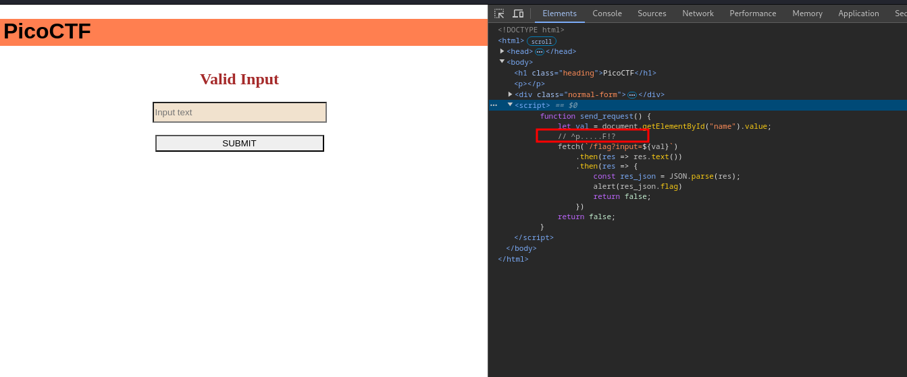
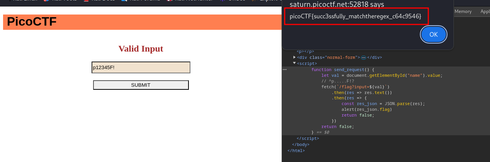

### MatchTheRegex

#Medium #web_exploitation #picoCTF2023

Author: Sunday Jacob Nwanyim

#### Description

How about trying to match a regular expression The website is running [here](http://saturn.picoctf.net:62861/).

##### Solution:




```js
function send_request() {
		let val = document.getElementById("name").value;
		// ^p.....F!?
		fetch(`/flag?input=${val}`)
			.then(res => res.text())
			.then(res => {
				const res_json = JSON.parse(res);
				alert(res_json.flag)
				return false;
			})
		return false;
	}


```

```css
	// ^p.....F!? => this is regex file
		p12345F!
```



flag is `picoCTF{succ3ssfully_matchtheregex_c64c9546}`

Note: string can p12345F! or p33322F! (5 digit number required)