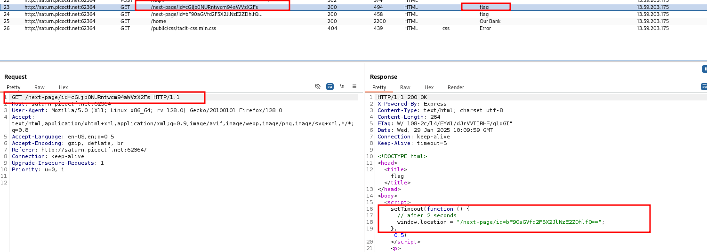
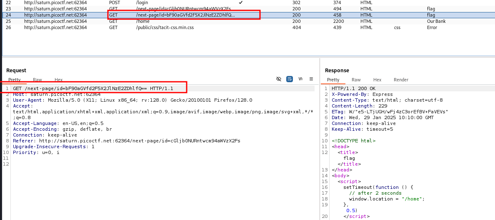
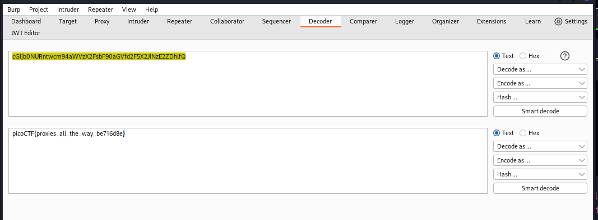

### findme

#Medium #web_exploitation #picoCT2023 
Author: Geoffrey Njogu

#### Description

Help us test the form by submiting the username as `test` and password as `test!` The website running [here](http://saturn.picoctf.net:49674/).

##### Solution:
first of all use burpsuite and then login to website and see list of event happening behind the scene


```css
GET /next-page/id=cGljb0NURntwcm94aWVzX2Fs HTTP/1.1
```



```css
GET /next-page/id=bF90aGVfd2F5X2JlNzE2ZDhlfQ==
```

we have two ids 
1st is `cGljb0NURntwcm94aWVzX2Fs`
2nd is `bF90aGVfd2F5X2JlNzE2ZDhlfQ`

now use base64 decoder to decode these ids

```css
cGljb0NURntwcm94aWVzX2Fs => picoCTF{proxies_al
bF90aGVfd2F5X2JlNzE2ZDhlfQ => l_the_way_be716d8e}

combine both ids 
cGljb0NURntwcm94aWVzX2FsbF90aGVfd2F5X2JlNzE2ZDhlfQ => picoCTF{proxies_all_the_way_be716d8e}
```

