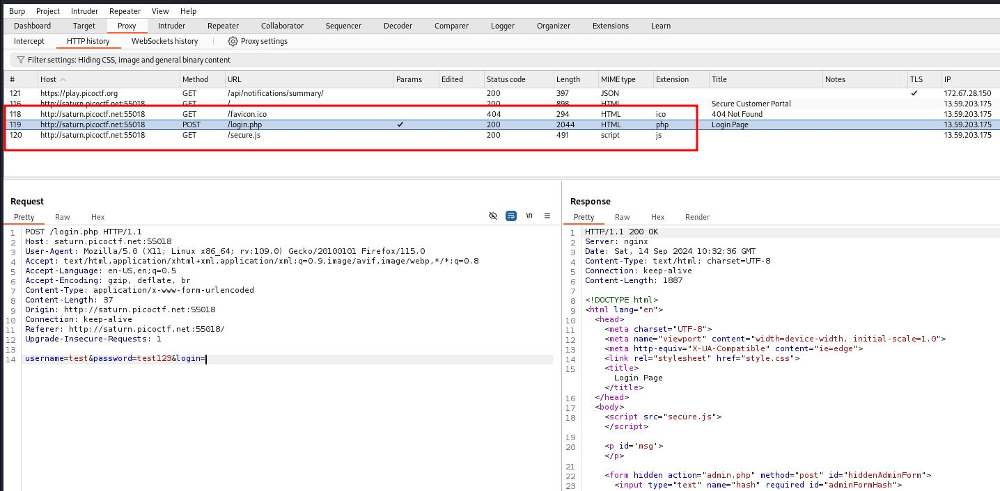

### Local Authority

Author: LT 'syreal' Jones
#easy #web_exploitation #picoCTF2022 #inspector
#### Description

Can you get the flag?

Additional details will be available after launching your challenge instance.

Go to this [website](http://saturn.picoctf.net:60845/) and see what you can discover.

##### Solution:
open web-page and you will see login page enter any number
username=test
password=test123

in burpsuite you will see `secure.js` file appear where you will get 
username === 'admin' && password === 'strongPassword098765'

enter username and password on webpage you will get flag `picoCTF{j5_15_7r4n5p4r3n7_a8788e61}`