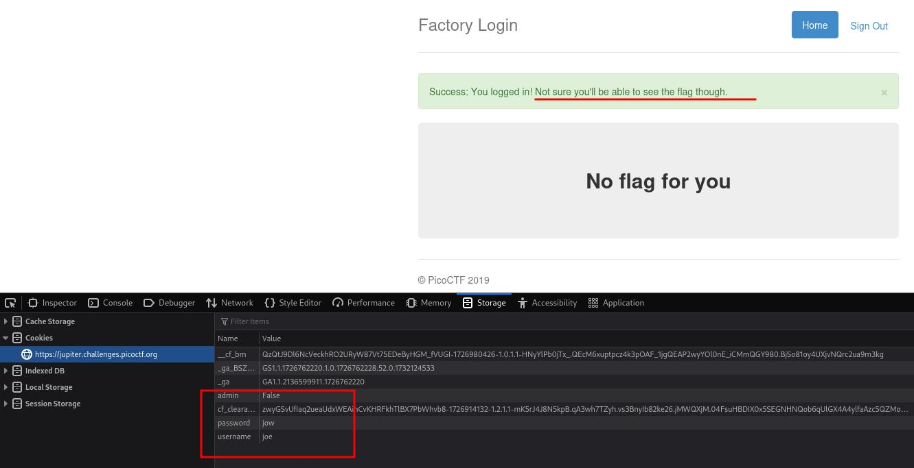
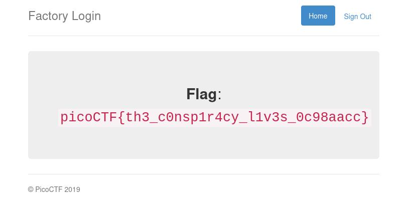
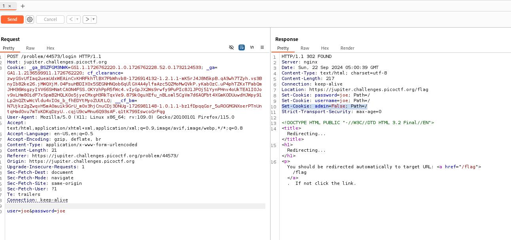
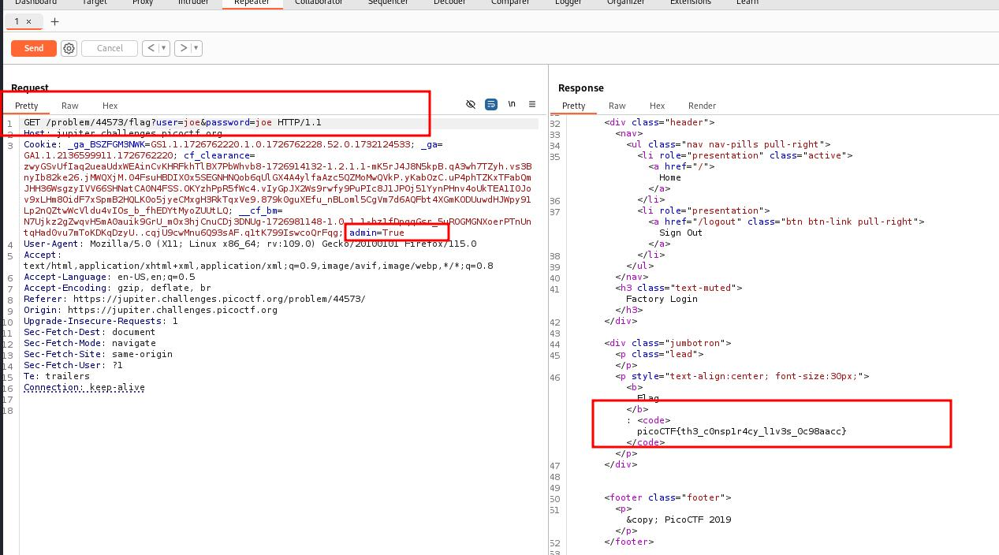

### logon

Author: bobson
#easy #web_exploitation #picoCTF2019 
#### Description

The factory is hiding things from all of its users. Can you login as Joe and find what they've been looking at? `https://jupiter.challenges.picoctf.org/problem/44573/` ([link](https://jupiter.challenges.picoctf.org/problem/44573/)) or http://jupiter.challenges.picoctf.org:44573

##### Solution:
```css
login the account using joe like 
username = joe 
password = joe
```

after login go on cookies section and see the details



if you notice admin = False change to True and reload the page
you will get flag  `picoCTF{th3_c0nsp1r4cy_l1v3s_0c98aacc}`



another method is using Burpsuite 



change post request to get request and add flag request to  /problem/44573/flag and set admin=True

